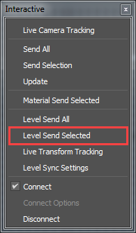
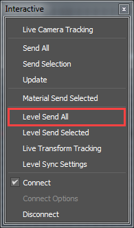

# Send assets from 3ds Max with Level Sync

## To send selected assets from 3ds Max with Level Sync

2.	In 3ds Max, tag the assets you want to send to {{ProductName}}. See ~{ Level Sync with 3ds Max }~.

3.	Select **Interactive > Level Send Selected**.

	

4.	(Optional) In the **Send Level** window that appears, turn on **Send Missing Assets** to ensure assets that are missing from the project are included in the export.

5.	Click **Send and Close**

	All selected assets are sent to the {{ProductName}} editor and appear in the current level.

## To send all assets from 3ds Max with Level Sync

2.	In 3ds Max, select **Interactive > Level Send All**.

	

	The assets are sent to the {{ProductName}} editor and appear in the current level. A new folder with the same name as your scene in 3ds Max is created.
