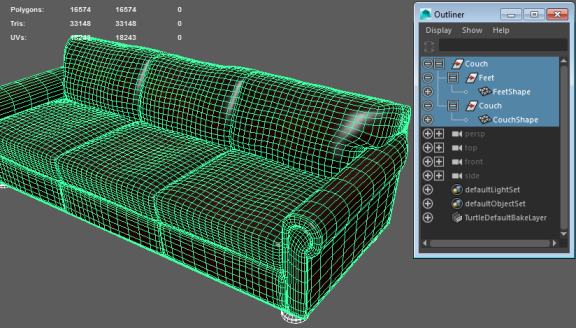

# Receive assets from Maya, Maya LT, or 3ds Max

With the {{ProductName}} engine and Maya, Maya LT, or 3ds Max on the same system, you can export scenes directly to your {{ProductName}} project with no polygon count restriction.

To send assets to {{ProductName}}:

1.  Open {{ProductName}} and load the project where you plan to use the assets.
{{#if MaxInteractive}}

2.  In 3ds Max, select **Interactive > Connect** from the menu bar.
3.  Do one of the following:

    -   If you want to export all assets in the scene, select **Interactive > Send All **.
    -   If you want to export only selected assets, select **Interactive > Send Selection**.

    The Save dialog appears.

4.  Select or create the folder where you want the assets to save as a FBX file.
5.  Enter a File name and click **Save**.

  **Note:** The transfer may take a few minutes.
{{/if}}
{{#if MayaInteractive}}

2.  In Maya (or Maya LT), do either of the following depending on whether you want to export the whole scene, or only selected objects:

    -   Select File > Send to Interactive > All
    -   Select File > Send to Interactive > Selected.

	  

3. To overwrite materials that may already be in Maya Interactive, set whether **Overwrite Materials** is on for this export in the Send to Interactive Options.

	**Note:** This is important if you have previously sent this mesh and its materials to Maya Interactive. When Overwrite Materials is off, materials are only created if they are missing in Maya Interactive, but they are not updated if they already exist. This can be useful if you have made changes to the material in Maya Interactive and you do not want Maya to overwrite them as you update the mesh.

	**Tip:** When exporting materials, if you enter a name for your material in the Engine Resource attribute in the StingrayPBS Attribute Editor, this name will be used as the material name in Maya Interactive. For example, if you enter *myStingrayPBS* in Engine Resource, then select File > Send to Stingray, this material is called *myStingrayPBS.material* in Interactive.

4. In the file browser that appears, navigate to where you want to save the FBX file within your interactive project, enter a new filename if needed, and click **Export All** or **Export Selection**.

	For example: \MyGameProjects\basic_project_01\content\models\props.
{{/if}}
5. In the **Import FBX** options window that appears, set options to import your asset with textures and materials. See ~{ Import a model with textures and materials }~.
6. Click **Import**.

	The assets export to your interactive project, into the specified directory. The FBX file is available immediately in the **Asset Browser**, and you can place the imported assets into your level. Any materials associated with the imported objects are created as separate files alongside the asset in the project folder.

  {{#if MayaInteractive}}
	 

	 A green "Connected to Interactive" message displays at the bottom right in Maya, and the Connect option (**Interactive > Connect**) is also enabled.  {{/if}}

	{{#if MaxInteractive}}
7. If you continue to work on the asset(s) in 3ds Max, select **Interactive > Update** at any time to refresh the asset(s) in 3ds Max Interactive.

  {{/if}}
