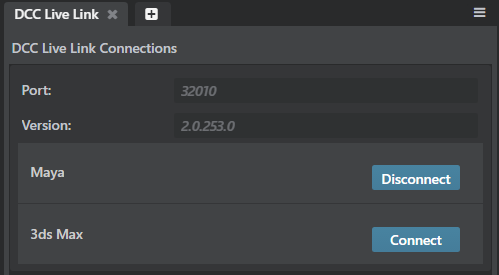

# Connect to a DCC tool

You can use the following ways to connect or send assets between the interactive editor and your DCC tool, depending on whether you want to establish a live link (seeing updates in the editor as you edit the asset in your DCC tool), or whether you want to launch and edit the original source scene in your DCC.

### DCC Live Link to establish a connection to DCC tools

-	**Window > DCC Live Link**

If you have different versions of the DCC tools like 3ds Max and Maya installed on the same system, use the **DCC Live Link** option in the interactive editor to connect with the DCC tools.

The **DCC Live Link** displays the default port and the plugin version used to connect to the different DCC editors. If your DCC fails to connect to {{ProductName}} when you initiate a connection from the DCC tool, select **Interactive > Connect Options** (in 3ds Max) or **Interactive > Connect > ** (in Maya) to connect to the interactive using the default port.

### To establish a live editing link between {{ProductName}} and your DCC tool:

1. Right-click an asset in the **Asset Browser** and select **Send to** > *Product Name*.

	This launches the asset in your DCC tool of choice. A small green "Connected to Interactive" message displays near the bottom of the interface (in Maya) or Connect is enabled in the Interactive menu (in 3ds Max).

2. Make any edits you want in the DCC tool.

3. Click **Update** next to the "Connected to Interactive" message in Maya to send any updates to the interactive editor. In 3ds Max, click **Interactive > Update**.

### To edit the original source scene in your DCC tool:

1. Right-click an asset in the **Asset Browser** and select **Open Source Asset**.

	The editor detects where the original scene was created, and launches the appropriate DCC tool. You're prompted to manually select an application if the editor can't determine the file origin.

	>	**Note:** If you have both Maya and Maya LT installed, the editor uses Maya to launch FBX files. Maya LT only launches if the original scene is an .mlt file.

2. Make any edits you want in the DCC tool.

3. When you're ready to reload the asset in the interactive editor, export as an FBX file using **File > Export** options, the **Game Exporter**, or **File > Send to Interactive**.

4. Press F5 to refresh the editor if necessary.

---
Related topics:
- ~{ Connect DCC tool and {{ProductName}} viewports }~
---
