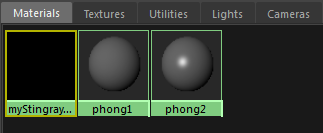
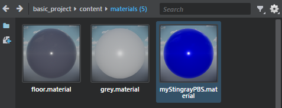

# Receive materials from Maya, Maya LT, or 3ds Max

With the DCC Link plug-in installed, you can import Stingray Physically Based Shaders (PBS) directly to your project. When you receive your material from Maya, Maya LT, or 3ds Max, the look of the shader and the graph remains the same, including all of the input connections and nodes.

**To import a Stingray PBS material to your {{ProductName}} project**

1. In the interactive editor, establish a connection with Maya, Maya LT, or 3ds Max. See ~{ Send assets to a DCC tool }~.

2. In your DCC tool, create a new StingrayPBS shader. See ~{ ShaderFX shader graphs }~.

3. In the **Attribute Editor** (Maya/Maya LT), or **Material Parameter Editor** (3ds Max) enter a path and a name for the material in the **Engine Resource** attribute.

	For example, if you want the material, named myPBS, to be stored in the materials folder of the project you currently have open in the interactive editor, enter `content/materials/myPBS` in the **Engine Resource** attribute.

	> **Note:** The name you enter in the DCC tool is also used as the material name in {{ProductName}}. For example, if you enter myPBS in the **Engine Resource** attribute, the material is called myPBS.material in {{ProductName}}.

4. Do one of the following to send the material:

	-	(Maya/Maya LT) In the **Hypershade** (**Windows > Material/Texture Baking Editors > Hypershade**), select the StingrayPBS material, then select **File > Send to Interactive > Selection** from the main menu bar.

		

	-	(3ds Max) Select the object with materials you want to send to {{ProductName}}, then select **Interactive > Material Send Selected** from the main menu bar.

	The material is sent to the interactive editor and appears in the **Asset Browser**. Its shader graph remains the same after the transfer.

	

5. In the interactive editor, you can edit material attributes using the **Property Editor**, or click **Make Unique** to edit the graph in the **Shader Graph Editor**.

---
Related topics:
- ~{ Import a model with textures and materials }~
- ~{ Receive assets from Maya or Maya LT }~
- ~{ Interop with Maya, Maya LT, or 3ds Max }~
---
