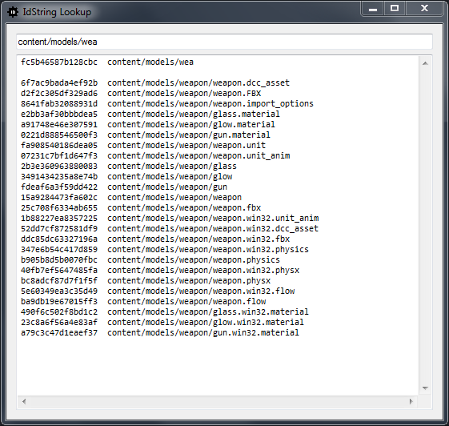

# About compiled resource names

When the Stingray engine compiles your project's source data for runtime use, it renames each resource using a 64-bit hash function. This produces a set of resource IDs, which the engine uses to identify and look up the compiled data at runtime.

For example, a resource named `content/levels/city/taxi.unit` in the source data folder is written to a file named `9d01c901e9e2827f` in the compiled data folder.

This way of identifying resources is more efficient for the engine to use at runtime, and saves memory in comparison to identifying resources by string IDs.

Since you never need to work with compiled data directly in the Stingray editing tools, the file naming should mostly remain "under the hood". However, you may occasionally need to make a connection between a compiled resource and its original source resource. You can do that in either of the ways described in the following sections.

## Using the ID Lookup tool

Stingray provides a small tool for translating between source resource names and their compiled IDs.

You can get to this tool through the external console, which you will find at `tools\console.exe` within your Stingray installation directory. You can also launch the external console from the main Stingray editor by choosing **Window > External Console** from the main menu.

Once you have the external console running, select **Tools > Id Lookup** from its main menu.

You can look up a resource ID by entering its name in the text field at the top, or look up a resource name by entering its ID.

-	The first line in the results always shows the ID that would be generated by treating the text you enter as a resource name.
-	The subsequent lines show the result of trying to match the text you enter against all of the resource names and IDs in your current Stingray project.

## Using the debug file index

When Stingray compiles your project's resources, it writes a file into the compiled data folder called `debug_file_index.sjson`. This file contains a mapping between each resource in your project folder and the compiled file generated for that resource.
