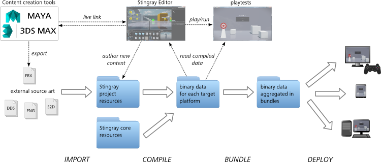
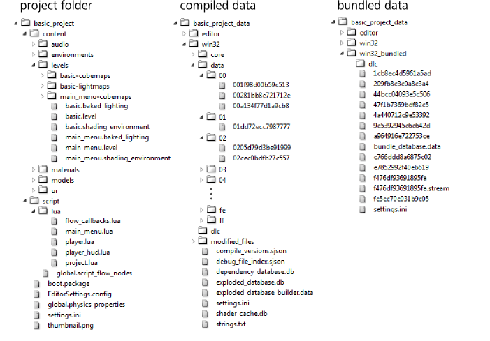

# About the content lifecycle

You'll probably notice a lot of *compiling* happening as you get started in {{ProductName}}. When you create a new project, you may have to wait a bit while the editor does some compiling, and as you work in the editor you'll frequently see messages about resources being compiled.

If this is your first time working with an interactive engine, this may sound mysterious -- what is all this compiling and why does it have to happen?

The answer has to do with the way the different kinds of assets that make up a project move through different stages on their journey from their creation to the time they are loaded and used in the project at runtime.

This page gives an in-depth look at how this *pipeline* works: how the parts of an interactive 3D app get created and built into the final experience.

## The big picture

## External assets

Many of the pieces of content that you use in a project are originally created by texture artists, modelers, animators using external content creation tools such as Maya, Maya LT, or 3ds Max. At this "source art" stage, {{ProductName}} places no requirements whatsoever on file formats, where or how these assets are stored and shared. You can use whatever works for your organization.

(Note that for 3D assets imported through FBX files, the **Asset Browser** offers a shortcut that can open a source art file in the design application that originally created it. If you want to take advantage of this capability for your project, you may have some additional configuration to do. See ~{ Enable {{ProductName}} Live Link }~.)

## Importing and authoring data

Eventually, in order for an external asset to get used in your interactive experience, you need to import it into a project through one of the file formats that {{ProductName}} supports. Importing the asset typically creates a new data resource in the project's source directory. See also the topics under ~{ Importing assets }~.

Similarly, any assets that you author in the interactive editing tools, such as levels, units, and shading environments, are also saved to your project source folder.

Each of these source assets, whether external or authored in the {{ProductName}} editor, is saved in an "intermediate" format that is chosen for stability, compatibility and flexibility rather than for maximum efficiency. For example, most resources use the plain-text human-readable SJSON format as their intermediate storage format, though some use binary formats (such as DDS textures).

In some cases, the imported data file is kept as well, allowing you to return to tweak the asset in an external tool. For example, you can easily open an imported FBX file in Maya or 3ds Max in order to make edits to an imported file and see the results of those edits immediately in the context of your other content. For details, see ~{ Enable {{ProductName}} Live Link }~.

## Compiling the data

Before your resources can be loaded and used by the interactive engine, they need to be compiled to a binary format that is specific to the target platform on which the engine app will run. This compilation step optimizes the data for each particular platform, maximizing the efficiency of the runtime engine.

Most of what you see in the interactive editor is actually provided by an instance of the engine that runs behind the scenes. So, as you work in the editor, the resources you modify and create are constantly being compiled for Windows behind the scenes, in order to keep the compiled data up-to-date with your latest changes to the source material. For other target platforms, the compiled data is updated any time you playtest or deploy your app for that platform.

Typically, each time you compile your data, the engine only needs to compile resources that have been added or modified since the last time the project was compiled for that platform. This incremental compilation means that the compilation step can run very rapidly as you're working.

By default, each project is always compiled to a separate directory, next to the project source directory, with the suffix `_data`. Each target platform gets its own sub-directory such as: `win32`, `android`, `ios`. This platform-specific compiled data directory contains all the same resources as the source directory, but each compiled file is named using an alphanumeric hash based on its original name and stored under the `data` sub-directory. Note that any *.ini* files, such as the project's master *settings.ini* file, are not compiled or renamed.

The compiled data for your project also includes compiled versions of the "core" resources from the installation directory. This includes the Lua files that make up the Appkit, as well as other default content. For more information on the core content, see also ~{ Working with core resources }~.

## Bundling the data

Although the compilation step prepares your resources for use on the target platform, loading their individual data files from the compiled directory one-by-one is slow, since the operating system has to load small files from many different locations on the hard disk, DVD, or other media that stores the compiled project content. In addition, as the number of resources in the project grows, you need to be able to easily control when different resources should be present in memory, without the tedious and error-prone process of controlling each resource individually.

To solve these two problems, you divide your resources into bundles called *resource packages*. You define these packages in data resources within your project's source folder, alongside your other data resources. When you deploy a build of your app for a target platform, the engine *bundles* your compiled data together into larger-scale chunks, each of which corresponds to one of the resource packages you define. You determine in your gameplay code when these bundles get loaded in and out of memory. Since each bundle is a single file, each one gets stored in a contiguous block of the hard drive or DVD. This makes the bundles load much more quickly than using compiled data directly.

For more on resource packages and bundles, see ~{ Loading and unloading content at runtime }~.

Bundling is not an incremental process that happens in the background while you work. It usually happens only when you *deploy* your project using the **Deployer** panel in the editor. See also ~{ Deploying and building }~.

## Data layout comparison

This image shows a side-by-side comparison of the content layout in the project folder, compiled data and bundled data. Note that the compiled data is platform-specific, and contains a compiled data file for each resource in the original project folder (and the core resource folder, not shown here). In the bundled data folder there are far fewer data files, since each one is a bundle that aggregates many of the compiled data files together into a single file.
