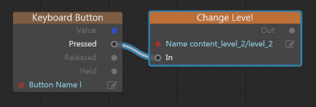

# Example: Loading and unloading one resource package per level

This procedure walks you through the process of creating and using resource packages to swap content for different levels in and out of memory.

Even if you eventually plan to use a different strategy for dividing up your resources into packages, you might want to follow along through this procedure first in order to get more familiar with how the packaging system works.

## Step 1. Create levels

In this step, you'll create two new levels that you'll swap back and forth in the engine.

1.	Start a new project from the `empty` template.

1.	Create a new folder at the root level, called `content_level_1`.

1.	Import some new assets into that `content_level_1` folder.

1.	Create a new level, place some of the assets you added to the `content_level_1` folder into the level, and save the level as `content_level_1/level_1.level`.

1.	Repeat steps 2 to 4 for a second level, but call it `content_level_2`. Import and place a different set of content, so that you can tell when your different levels are loaded. If you make one level significantly heavier than the other by including more large units, it will be easier to confirm later on that the resource swapping is working.

1.	Edit your `script/lua/project.lua` file. At line 11, change:

	`empty = "content/levels/empty"`

	to:

	`empty = "content_level_1/level_1"`

	This will make your new `level_1` load in when you run the project, instead of the empty level that comes pre-made with the template.

1.	Finally, we're going to make a temporary change in the project's `main.package` so that both new levels will be loaded into memory at the start of the project. Open the `main.package` file that you'll find at the root of your project in the Script Editor or in a text editor. Change line 2 from:

	`"content/levels/*"`

	to

	`"*"`

Now, when you run your project, it should start with the new `level_1.level` that you created above.

## Step 2. Swap the levels in Level Flow

In this step, you'll set up some basic Level Flow to swap between your two levels in response to the player. To keep it simple, these instructions trigger the change when the player presses the `l` key;  you could use a different trigger if you prefer.

1.	Open `level_1`, and open the Level Flow editor.

1.	Add an **Input > Keyboard Button** node to the graph. Set its **Button Name** value to the key you want to trigger the change. For example, the image above uses `l`.

1.	Add a **Level > Change Level** node to the graph. Set its **Name** value to point to `content_level_2/level_2.level`.

1.	Connect the **Pressed** output of the **Keyboard Button** node to the **In** port of the **Change Level** node.

1.	Save the level.

1.	Repeat all the steps above for `level_2`, but set its **Change Level** node to change back to `level_1`.

Test your level, or run your project and choose **START** from the main menu. You should now be able to swap between the two content levels by pressing the `l` key.

## Step 3. Disable auto-loading

Now that you have the two levels set up and working, it's time to stop auto-loading your project's `.level` resources so that you can introduce your other resource packages into the mix.

Open your project's `main.package` in the Script Editor panel, or in your favorite text editor. Delete *all* of the contents, and replace them with this one line:

`* = ["core/*"]`

Now, when you run your project, only the core resources are loaded in at startup. Your level resources, and the units used in those levels, are not loaded into memory. If you try to run the project, you should get an error:

>	`empty_project_for_packages / Lua: core/appkit/lua/simple_project.lua:101: Level not loaded: content_level_1/level_1. Make sure name is correct and the level is referenced by a loaded package.`

Note that your levels *will* load successfully when you do **Test Level** in the editor. In **Test Level** mode, resources are always auto-loaded when they are needed. You need to use **Run Project** in order to really test resource package loading.

## Step 4. Set up the resource package files

In this step, you'll create two packages that will gather up the resources used in each of your content levels.

1.	Create a new text file called `content_level_1/level_1.package`.

1.	Put the following line in the file:

	`* = ["content_level_1/*"]`

	This line makes this package include all resources of all types inside the `content_level_1/` folder of your project.

1.	Repeat the same steps for `content_level_2`.

1.	Open the `boot.package` file at the root of your project folder, and add in references to your new *.package* resource files at line 20, so that the `package` array looks like this:

	~~~{sjson}
	package = [
		"content_level_1/level_1"
		"content_level_2/level_2"
		"loading_screen"
		"main"
	]
	~~~

For more information about the *.package* file format, see ~{ Defining resource packages }~. For more on the boot package, see ~{ About the boot package }~.

## Step 5. Add code to load and unload packages

Now you have two levels, each with its own package of resources. In this step, you'll update your level loading code to first load the resource package for the level into memory. You'll also update your level *unloading* code to unload the resource package from memory when the level and its resources aren't needed anymore.

The `empty` template project uses the Appkit's `SimpleProject` Lua class. By default, the `SimpleProject` handles loading and unloading levels, but assumes that the necessary resources are already present in memory and ready for use. We'll have to extend the `SimpleProject` code to build in support for loading and unloading the packages.

For background about the Appkit and the `SimpleProject` class, see also the topics under ~{ Starting Lua from a template: Using the Appkit }~.

1.	Copy the `core/appkit/lua/simple_project.lua` file to `script/lua/simple_project.lua` within your project's source folder.

	You could modify the code in this file directly in your core resources, but it's safer to make a copy of the file and bring it in to your project instead. See also the discussions under ~{ Working with core resources }~ and ~{ Customizing the Appkit }~.

1.	Open your project's `script/lua/project.lua` file, and change its `require` statement at line 15 to point to the new location of the `simple_project.lua` file:

	`local SimpleProject = require 'script/lua/simple_project'`

1.	Open the `script/lua/simple_project.lua` file.

1.	Declare a new variable to store the resource package object for your current level:

	`SimpleProject.resource_package = SimpleProject.resource_package or nil`

	Add this in around line 51, where the other `SimpleProject` member variables are initialized.

1.	Update the `load_level` function by adding in the following code at the start of the function, around line 115:

	~~~{lua}
	if stingray.Application.can_get("package", resource_name) then
		SimpleProject.resource_package = stingray.Application.resource_package(resource_name)
		stingray.ResourcePackage.load(SimpleProject.resource_package)
		stingray.ResourcePackage.flush(SimpleProject.resource_package)
	end
	~~~

	Each time a level is loaded, this code looks for a *.package* resource with the same name. If it finds one, it loads it into memory and sets the `SimpleProject.resource_package` variable to point to it.

1.	Update the `unload_level` function by adding in the following code at the *end* of the function, around line 106:

	~~~{lua}
	if SimpleProject.resource_package ~= nil then
    	stingray.ResourcePackage.unload(SimpleProject.resource_package)
	    stingray.Application.release_resource_package(SimpleProject.resource_package)
	    SimpleProject.resource_package = nil
    end
	~~~

	Each time a level is unloaded, this code disposes of the resource package that was loaded for that level, if any.

1.	Save all files.

Note that the code shown above loads the packages immediately, blocking the update loop from continuing until the resources are all loaded. If your resource packages get very large, or you are reading data from a very slow medium, you will likely want to use an *asynchronous* loading model instead. See also ~{ Loading and unloading packages }~ for more code examples.

## Step 6. Test the system

In this step, we'll test to make sure that the memory actually consumed by the engine is changing at runtime as expected.

1.	Run your project.

1.	In the ~{ Status Bar }~ of the editor, select your running project from the drop-down list, and issue the `perfhud memory` command to the engine. See also ~{ Send commands from the Status bar }~.

	The engine viewport should be overlaid with a summary of its current memory usage.

1.	Switch back to the engine app. Press the `l` key to swap back and forth between levels. You should see the memory consumption go up and down each time the levels are swapped. This indicates that the resources are being loaded in and out of memory as expected.

1.	You can also confirm that the system is working as expected by issuing the `memory_resources list unit` command to print a list of all units currently in memory. When `level_1` is loaded, the output from that command should include only resources in the `core`, `content`, and `content_level_1` folders, but nothing from the `content_level_2` folder.

See also the list of all ~{ Console commands }~.
