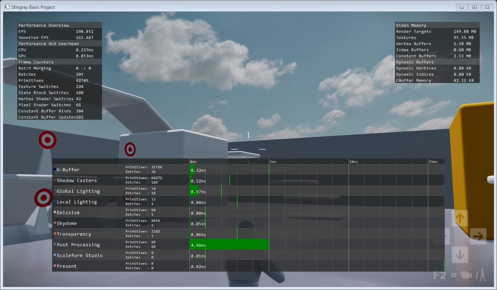

# Ways to get runtime feedback

{{ProductName}} provides several different ways for you to get feedback about what is happening in the engine while your project is running. You will probably find it necessary to use many if not all of these methods at different times during your development. Each one may be more convenient than the others, depending on how your gameplay is written, what subsystems of the engine you need to get feedback about, and what kind of information you hope to get.

## The **Log Console**

The **Log Console** shows you all the errors, warnings and information messages written to the log by all connected instances of the engine. It's a good idea to get in the habit of watching the log to keep an eye on the engine's activity. When something goes wrong, this log is the first place to look for a hint.

See ~{ Log Console }~.

## In-viewport HUDs

The engine has some built-in systems that display diagnostic messages and render debug information in the same 3D viewport that renders your project content. You can use these systems to print performance statistics, visualize performance as a graph, or to debug subsystems like physics and particles.

You toggle the display of these diagnostic systems by sending console commands to the engine from the Status bar of the editor, or from the **External Console** application (**Window > External Console**).

For details, see ~{ Send commands from the Status bar }~.

For a list of all console commands, see ~{ Console commands }~. In particular, look for the useful `perfhud`, `graph`, and `physics` commands.

### HUDs in the editor

While you're working in the interactive editor, you can turn the HUDs on in your editor viewport. This shows the performance of the instance of the interactive engine that is run internally by the editor, powering the viewport display.

Click **View > Performance Hud** in the viewport's visualization settings, and select the HUD you're interested in.

To debug or view performance statistics of a deployed package, use the **External Console** application and connect to **localhost** instead of the default IP address.

## Print to screen from Flow

If you are using the Appkit, you have access to the **Debug > Print To Screen** Flow node. When this node is evaluated, it prints text that you specify to the engine viewport. The Flow system does not currently have a runtime debugger, but you can use this node to find out the current state of your variables and to detect what paths your graph evaluation follows.

## Print to the log from Flow or Lua

You can print your own debug messages to the log from Flow or Lua. You can view them in the **Log Console** just like any of the other kinds of messages that come from the engine.

-	In Flow, use the **Debug > Debug Print** node. (Unlike the **Debug > Print To Screen** node mentioned above, the **Debug Print** node works regardless of whether or not you use the Appkit in your project.)

-	In Lua, you can call the built-in `print()` function. Messages you send this way will show in the **Log Console** as an information message.

-	You can also use the `stingray.Application.console_send()` function to send an error, warning or information message. For example,

	~~~{lua}
	local message = {
		type="message",
		level="error",
		system="custom",
		message="An error occurred!" }
	stingray.Application.console_send(message)
	~~~

## Use a Lua debugger

You can get a lot of information about what your project's Lua scripts are doing by connecting a debugger to your project. You can set *breakpoints* that automatically pause the engine at specific places in your code, advance the code line-by-line or function-by-function, check and even modify the value of variables, and more. If you're new to debugging code, see ~{ Debugging Lua }~ for some background.

We've developed an extension for [Visual Studio Code](https://code.visualstudio.com/) that makes all this possible in a free, open-source code editor. For specifics about using the Visual Studio Code extension, see [its documentation here](https://marketplace.visualstudio.com/items?itemName=jschmidt42.stingray-debug).
