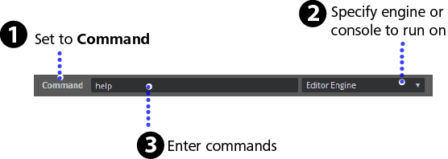

# Send commands from the Status bar

You can use the Status bar at the bottom of the interactive editor to send simple commands to an instance of the engine that you started from the editor. This can be a local instance of the engine on your PC, the Test Engine, or the engine running on a connected console.

For example, you can execute a command that draws a performance HUD in the engine viewport by entering `perfhud artist` or `perfhud network`. You can use other commands to enable and disable the built-in profiling system, toggle the display of performance statistics in the engine viewport, or pause and resume the engine itself.

**To execute commands from the Status bar:**

1. Set the command line toggle to **Command**.
2. Specify where you want to send commands:
     - **Editor Engine**: The instance of the editor running on your local PC.
     - **Test Engine**: Available when you test a level.
     - *\<localhost\>*: When you have multiple local instances of your project set up through the **Connections** panel, you can select those here. (Names that display here depend on what you set up in the **Connections** panel, **localhost** is just the default name given to the first instance.)
3. Enter the command and any required parameters in the command line field, and press Enter.
4. (Optional) Open the ~{ Log Console }~ to view any output from the command.

For a detailed reference of all available commands and parameters, see ~{ Console commands }~.

You can also retrieve brief descriptions of the commands by typing the `help` command in the **Status bar** command line. For brief descriptions of the parameters accepted by a single command, type `help <command>`, where `<command>` is the name of the command you want to execute. Open the **Log Console** window to see the output of the `help` command.

## Using the Visual Studio Code debugger

You can connect Visual Studio Code to any running instance of the engine. Once connected, you can send console commands and Lua scripts to the engine from Visual Studio Code, just as you can from the ~{ Log Console }~.

For details, see [the home page of our Visual Studio Code extension](https://marketplace.visualstudio.com/items?itemName=jschmidt42.stingray-debug).

## Using the External Console

If you need to send console commands to a standalone interactive app that is not connected to the editor, you can use the **External Console** application. From the main menu, select **Window > External Console** (Hotkey: **Alt + 2**).

Connect to **localhost** in the **External Console** application when you want to debug or view performance statistics of a deployed package.

---
Related topics:
-	~{ Log Console }~
-	~{ Status bar }~
-	~{ Console commands }~
-	~{ Using the Connections panel }~
-	~{ Ways to run your project }~
---
