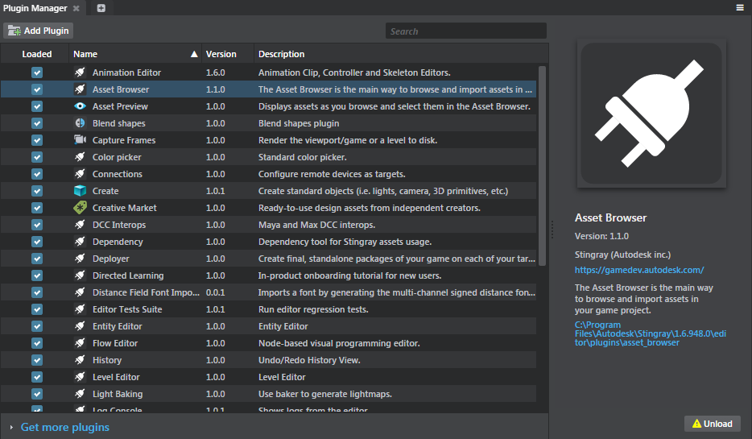
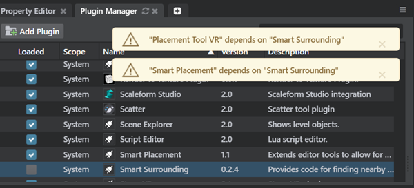

# Add and remove plug-ins using the Plugin Manager

-	**Window > Plugin Manager**

The **Plugin Manager** panel lists each plug-in visible to the interactive editor, along with detailed information and activation status for each. You can use this panel to control which plug-ins are currently active in the editor.

## Unload a plug-in

Unloading a plug-in removes any customizations the plug-in adds to the editor, including menu items, panels, custom actions, additional project resources, and special asset types.

You might want to do this if you know you won't need a given plug-in anymore, if it's causing a problem or interfering with your work, or while you're testing a custom plug-in that you are writing. (However, we don't really recommend unloading any of the standard plug-ins that come installed with {{ProductName}}, since you might miss out on key product features.)

To unload a plug-in, either:

-	Uncheck its checkbox in the **Loaded** column of the list view.
-	Or, select the plug-in in the list view and click the **Unload** button at the bottom right.

>**Important:**  If you unload a plug-in that is dependent on other loaded plug-ins, an error message appears indicating these dependencies.

After you restart the editor, your plug-in remains unloaded until you intentionally load it again.

## Load a plug-in

To load a plug-in that is already listed in the **Plugin Manager**, either:

-	Check its checkbox in the **Loaded** column of the list view.
-	Or, select the plug-in in the list view and click the **Load** button at the bottom right.

>**Important:**  If you load a plug-in that has unloaded plug-in dependences or has loaded dependencies with invalid versions, an error message appears.

## Download a plug-in

To download a new plug-in not listed in the **Plugin Manager**, click **Get more plugins** at the bottom of the list view, then select any of the available plugins and click **Install**. Once downloaded, the plug-in is loaded in the **Plugin Manager**.

## Make a new plug-in visible to the Plugin Manager

If you want to load a new plug-in that you have on your computer but that is not already listed in the **Plugin Manager**, you can install it using either of the following methods:

-	Place the plug-in, along with any other files it requires, into one of the default search folders listed below. Press **F5** to refresh the list.
-	Or, to add a plug-in from any other folder on your computer, click the **Add Plugin** button (top left) and browse to the location of the plug-in's *.stingray_plugin* file.

The new plug-in is added to the **Plugin Manager**, but it isn't immediately loaded. See [Load a plug-in] above.

### Engine plug-in .dll files

If the plug-in you want to install has any *.dll* files that contain plug-ins for the interactive *engine*, you'll need to copy those files manually to the right folder:

-	`engine/<platform>/<config>/plugins`, under your {{ProductName}} installation directory.

Note that the engine has separte folders for different platforms (`win32` and `win64`), and for different configurations (most notably `dev` and `release`). If your plug-in is distributed with multiple *.dll* files for those different platforms and configs, make sure you copy each *.dll* file to its corresponding location.

The tricky part is that not all *.dll* files will necessarily be engine plug-ins. Some *.dll* files can be used only to integrate with the editor, and these files you won't need to copy. See the docs or installation instructions for your plug-in, if any, to know which is which.

>	**NOTE:** This manual step is only temporary: we plan to handle this automatically in future.

### Default plug-in search folders

The **Plugin Manager** looks for plug-ins in the following locations:

-	Under the *editor/plugins* folder in your {{ProductName}} installation directory.
-	In the current project.
-	In each folder that contains a plug-in you added through the **Add Plugin** or the **Get more plugins** button.

## Remove a plug-in from the Plugin Manager

To remove a plug-in entirely so that it's no longer listed in the **Plugin Manager**, select the plug-in in the list view and click the **Remove** button at the bottom right.

Note that you can only remove plug-ins that you have installed using the **Add Plugin** or the **Get more plugins**  button. You cannot remove any standard plug-ins that are installed with {{ProductName}}, or any plug-ins that are found in the current project; you can only unload them.

Alternatively, you can delete the plug-in you want to remove from disk (or move it to another location on your computer), then press **F5** to refresh the list.

Don't be afraid; removing the plug-in in this way doesn't delete the plug-in files from your computer. You can add it back again anytime from its old location on your disk.

---
Tags:
-	plugin
-	plug-in
---
