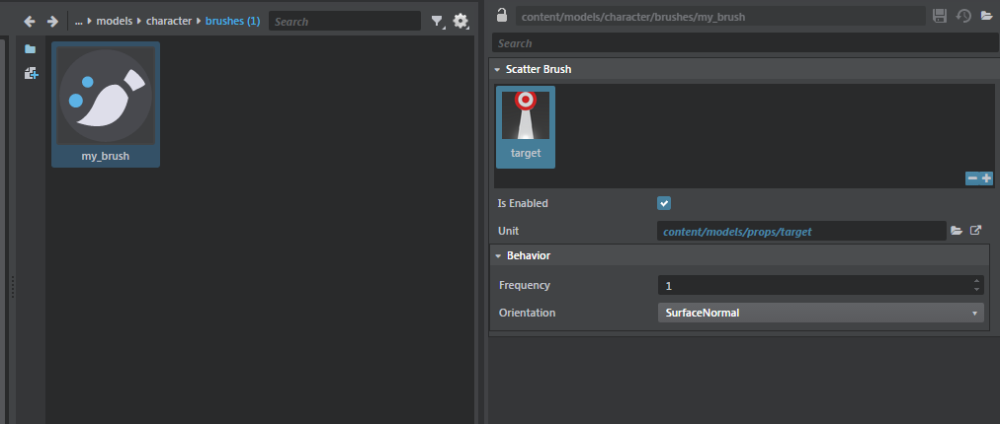
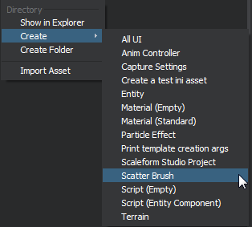

# Editing custom asset types

If you need your plug-in to save data to resource files in the project, you can benefit from many of the standard editing features and tools the editor provides for working with built-in resource types. For example, you can make your plug-in's resource files editable in the **Property Editor**, benefit from automatic undo/redo, etc.

To do this, you define a new *type* for your asset, using a custom SJSON format that describes the kinds of information that each instance of that asset can hold. You can then use the editor's built-in mechanisms to create and modify resources of your custom type. Your plug-in can work with the data in the resources, and let the editor worry about the mechanics of how the user creates, edits and saves instances of the resources.

This makes it relatively easy for you to add new types of assets to the project that are used *only* by the editor to author other kinds of project data. For example, this mechanism is used to save data about scatter brushes to resource files -- data like what units the brush should scatter, at what frequency and what orientation. However, this information is only read by the editor in order to define how and where units get placed in the level while the brush is active. If you need your new type of asset to be available at runtime in the engine, you will need to extend the engine with a plug-in that defines how it should compile your new asset type for runtime use. See also ~{ Extend the Engine }~.

This page describes how you can make your custom SJSON resources re-use the editor's existing asset editing frameworks.

-	To control the way users see and interact with your new asset types in the **Asset Browser**, see also ~{ Register a custom asset type }~.

-	To control the way the **Asset Preview** behaves when the user selects a resource of your custom type, see also ~{ Define previews for custom assets }~.

## Step 1. Create a type file

The first step is to create a `.type` file for the data you need to save in your new resource files. This file defines the structure of your data, using a set of built-in types and other defined types as building blocks. For more information, see ~{ The {{ProductName}} Type System }~.

In order to link the type you define to resource files that contain instances of the defined data structure, you must make sure that your type contains the `extension` field. For example, here is how the `scatter_brush.type` file links its type to the `.scatter_brush` extension:

~~~{sjson}
export = "#scatter_brush"
extension = "scatter_brush"
types = {
    scatter_brush = {
		...
	}
~~~

### Make the resources editable in the **Property Editor**

If you want your new resource type to be editable in the **Property Editor**, you will also want to add an `editor` metadata block for the type exported by your `.type` file. In this block, add the `generic_selector` key. If the value of this key is `true`, the **Property Editor** will respond when the user selects a resource of your type in the **Asset Browser**, to show the data in that asset and allow the user to edit the data values.

~~~{sjson}
// from scatter_brush.type

export = "#scatter_brush"
extension = "scatter_brush"
types = {
    scatter_brush = {
        ...
        editor = {
            label = "Scatter Brush"
            // This specifies that .scatter_brush files should be editable using the Property Editor:
            generic_selector = true
            ...
        }
    }
    ...
~~~

## Step 2. Mount your type file

You need to make sure your `.type` file is mounted in the project. You'd usually do this by putting the path to your type file in a `resources` extension. For more information on this, see ~{ Extend the Project Content }~.

## Step 3. Set up the way new assets get created

The editor can offer users the ability to create new resources of your custom type in the **Asset Browser**:

There are two different ways that you can set up the editor to do this:

-	you can use a generic creation mechanism that relies on the default values set up in the `.type` file.

-	you can use a `template` extension to create new copies of existing assets.

### Generic creator

If your type uses the generic creator, each time the user creates a new asset of your type in the **Asset Browser**, the new asset will use the default values configured for all the fields in the `.type` file. If a field in your type does not specify a default value, the editor will fall back on the default value of that field's base type.

To use the generic creator, add the `generic_creator` key to your exported type's `editor` metadata section, and set its value to `true`.

For example, the scatter brush uses this mechanism as follows:

~~~{sjson}
// from scatter_brush.type

export = "#scatter_brush"
extension = "scatter_brush"
types = {
    scatter_brush = {
        type = ":struct"
        fields = {
            components = {
                key = ":guid"
                type = ":dict"
                value = "#scatter_component"
                editor = {
                    control = "ResourceCarousel"
                    carouselResourceProperty = "unit"
                }
            }
        }
        editor = {
            label = "Scatter Brush"
            // This specifies that scatter brush should have a creation menu item:
            generic_creator = true

            // This specifies that .scatter_brush files should be editable using the Property Editor:
            generic_selector = true
            version = "0.1.0"
        }
    }
    ...
~~~

### Template creation

If you need new assets of your type to be created with a specific set of values that do NOT correspond to the default values in the `.type` file, you can set up a `template` extension for your plug-in. This adds the same asset creation menu option to the **Asset Browser** as the generic creator mechanism above, but it creates the new asset in a different way. This is typically by copying an existing resource that you provide with your plug-in. However, you could create the new asset programmatically in JavaScript if you prefer, by setting up the action run by your template extension to call a function you provide in a JavaScript module within your plug-in.

For more information on the `templates` extension, see ~{ Define templates for new assets }~.

For example, the `capture_frames` plugin uses the template system to create new `.capture_settings` assets:

~~~{sjson}
// From capture_frames.stingray_plugin
templates = [{
		type = "asset"
		name = "Capture Settings"
		default_name = "capture_settings"
		extension = "capture_settings"
		create = [
			"create-frame-capture \"$name.capture_settings\" \"$project/$output_dir\""
		]
	}]
~~~

If you use a template extension to create new assets, you should set the `generic_creator` key to `false` for your resource:

~~~{sjson}
// Exerpt from capture_settings.type:
 editor = {
            label = "Capture Settings"
            generic_creator = false // No generic creator
            generic_selector = true // but do use Property Editor
            version = "1.0.0"
        ...
 }
~~~

Note that the capture settings still have the `generic_selector` set, so those assets can be edited in the **Property Editor**.

## Listen for changes to an asset

Your plug-in can listen for changes that the user makes to your custom assets in the Property Editor. You can then respond to those changes immediately in the editor environment to provide instant feedback -- like updating the **Asset Preview** or the **Level Viewport** as the user drags a slider.

To do this, your plug-in needs to listen for the `DataObjectsConsensusChanged` event emitted by the `object-editing-service`.

For an example, see the `editor\plugins\blend_shapes\blend_shapes\preview-blend-shapes.js` file. Here, the script adds an event listener that handles changes to blend shapes, and responds by updating the blend weights shown in the **Asset Preview**:

~~~{js}
// From preview-blend-shapes.js

setup: function (config, asset, viewportName) {
    objectEditingService.on("DataObjectsConsensusChanged", function (args) {
    		// Each time a Custom asset changes, a change descriptor notification is sent.
            var changeDesc = args[0];
            if (this._previewedAsset !== changeDesc.AssetsModified[0] || changeDesc.Type !== 'ValueChanged') {
                return;
            }

            var path = changeDesc.PropertyPath;
            var separatorIndex = path.lastIndexOf('.');
            var channel = path;
            if (separatorIndex !== -1) {
                channel = path.substr(separatorIndex + 1);
            }

            previewUtils.sendToViewport(this._viewportName, 'set_blend_shape_channel_weight_percentage', luaUtils.toSyntax(channel), luaUtils.toSyntax(changeDesc.Value));
        }));
~~~

When the event is emitted, it comes with an accompanying change descriptor that contains some information about the kind of modification the user made in the **Property Editor**. This descriptor is an object that has the following properties:

~~~{js}
{
	Type: string,                 // One of: ValueAdded, ValueRemoved, or ValueChanged
    PropertyPath: string,         // JSON property path that was modified in the custom asset
    Value: object,                // The value that was set or added
    AssetsModified: Array<string> // The list of assets that were modified (in case of consensus editing)
}
~~~

## Fetch custom asset data

You can use the `asset-service` to query the JSON value of a custom asset that the editor has loaded in memory from the project:

~~~{js}
// From preview-blend-shapes.js

// Get the managed (in memory representation) of a particular blend shape.
assetService.getManagedAsset(assetName + ".blend_shapes").then(function (dataObject){
    if (dataObject) {
        // Fetches the Json representation of this asset (extract Json from the DataObject).
        return dataObject.invokeMethod('ToJson').then(function (blendShapeJsonData) {
            ...
        })
    } else {
        console.error("Cannot find data for: ", assetName + ".blend_shapes");
    }
});
~~~

You can take advantage of other editor services if you want to work with files of your custom asset type programmatically in your JavaScript code. Notably, see the `file-system-service` offers `readJSON()` and `writeJSON()` functions, which you can use to handle reading instances of your assets from their data files, and writing them back to files in the project folder.

## Custom editor asset examples

The "core" resources that are installed with {{ProductName}}, and the built-in plug-ins that are installed with the editor, include several custom asset types that are defined in `.type` files as described above. These are good working examples of how the built-in asset editing system can simplify creating and editing resources.

### Blend shapes

The blend shapes plug-in defines the way users can work with and preview blend shapes in the editor. For background information about working with blend shapes, see the pages under ~{ Blend shapes }~.

Things to note about the blend shapes plug-in:

-	*editor\plugins\blend_shapes\blend_shapes\blend_shapes.type*: The type file describes the data layout of a *.blend_shape* file, as well as which types of controls the **Property Editor** should show for editing its data.

-	In *editor\plugins\blend_shapes\blend_shapes.stingray_plugin*: The plug-in defines an `asset_type` extension to define the way the *.blend_shapes* resource is exposed in the **Asset Browser**, and a `preview` extension that defines a custom behavior for the **Asset Preview**.

Note also that this editor extension is complemented by an engine extension, which handles blending between shapes at runtime.

~~~{js}
// From blend_shape.type

export = "#blend_shapes"
extension = "blend_shapes"
types = {
    blend_shapes = {
        type = ":struct"
        fields = {
            blend_shape_meshes = {
                type = ":value"  // :value means an arbitrary JSON value. The type system won't try to reason about it (or to validate it).
            }
            blend_shape_editor_channels = {
                type = ":value"
            }
        }
        editor = {
            label = "Blend shapes"
            generic_creator = false
            generic_selector = true
            version = "0.1.0"
            control = "BlendShapes"  // Use a custom blend-shape control in the Property Editor, defined in editor/core/components/properties/property-blend-shape.js.
        }
    }
}
~~~

### Scatter brushes

Scatter brushes are resources used only by the editor that encapsulate a list of units that should be painted or *scattered* on another unit or a terrain. For background information about working with scatter brushes in the editor, see the pages under ~{ Paint with the Scatter Tool }~.

Things to note about scatter brushes:

-	*editor\plugins\level_editor\scatter.stingray_plugin*: The plug-in descriptor mounts the folder that contains the `scatter.type` file, and tells the **Asset Browser** where to look for its custom icon.

-	*editor\plugins\level_editor\scatter_type\scatter_brush.type*: The type file defines the UI controls for editing the properties of a scatter brush.

Note also that the `levelEditingService` listens to changes on scatter brushes to reload the Lua scatter data model, as described under [Listening for changes to an asset] above:

~~~{js}
objectEditingService.on("DataObjectsConsensusChanged", function (args) {
    if (this.SelectedToolName !== "scatter" ||
        !this.SelectedScatterBrush) {
        return;
    }

    var changeDesc = args[0];
    if (changeDesc.AssetsModified.indexOf(this.SelectedScatterBrush) === -1) {
        return;
    }

    this.invoke('UpdateLuaScatterBrushComponents');
}.bind(this));
~~~

### Capture settings

Capture settings are resources used only by the editor that specify parameters for capturing a stream of images from the viewport and saving the result as a set of *.exr* files. This usage showcases how a custom asset type can make the **Property Editor** act like a specicalized editing tool. For background information about working with capture settings, see the pages under ~{ Capture Frames Tool }~.

Things to note about capture settings:

-	*editor\plugins\capture_frames\capture_frames.stingray_plugin*: Note the use of a `templates` extension to specify the source for new *.capture_settings* resources that the user creates.
-	*editor\plugins\capture_frames\capture_frames_actions.js*: Handles the capture action, and communicates with viewports to generate the output files.
-	*editor\plugins\capture_frames\capture_frames\capture_settings.type*: Note the use of an **Action** control to trigger the action defined in the plug-in descriptor. In addition, note the special `clean` and `init` callbacks that run initialization code when a *.capture_settings* resource is selected or deselected.

~~~{sjson}
// From capture_settings.type
export = "#capture_settings"
extension = "capture_settings"
types = {
    capture_settings = {
        type = ":struct"
        fields = {
            ...
            start_capture = {
                type = ":bool"
                default = true
                editor = {
                	// Specification of the Action button that kicks in the Capture process.
                    control = "Action"
                    label = "Render Frames to Disk"
                    text = "Start Capturing"
                    color = "#CC3D3D"
                    trigger = {
                        type = "js"
                        module = "capture_frames/capture_frames_actions"
                        function_name = "handleCapture"
                    }
                }
            }
        }
        editor = {
            label = "Capture Settings"
            generic_creator = false
            generic_selector = true
            version = "1.0.0"
            init = {
                type = "js"
                module = "capture_frames/capture_frames_actions"
                function_name = "startCaptureSettingsEditing"
            }
            cleanup = {
                type = "js"
                module = "capture_frames/capture_frames_actions"
                function_name = "endCaptureSettingsEditing"
            }
        }
    }
}
~~~
