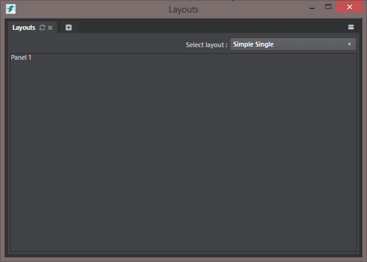

# Layouts
Layouts are used as containers to place tools and controls inside Stingray modules. They are split in two types : Simple Layouts and Resizer Layouts. Each of these layouts can be placed inside another layouts.

In theses examples, dark borders were added to clearly show separation between panels with `stingray-border-dark` class but it can be ignored as it suits your needs.

To use these examples simply copy and paste the code in your plugin, remove or add panels and replace the `'Panel x'` elements with you content.

You can try these examples by installing the [Mithril components sample](https://github.com/AutodeskGames/stingray-plugin-api-samples/tree/develop/samples/mithril_components) plugin inside your Stingray Editor.

[TOC]

## Simple Layouts

#### Container<a name="container-layout"></a>
Simple panel used as a container for direct content. Content can be anything.

```javascript
m.layout.container({className: 'stingray-panel stingray-border-dark'}, [
    'Panel 1'
]);
```

#### Horizontal Layout<a name="horizontal-layout"></a>
Used to display multiple panel horizontally that each contain their own content panel.

```javascript
m.layout.horizontal({}, [
    m.layout.panelFill({className: 'stingray-panel stingray-border-dark'}, m.layout.container({}, [
        'Panel H1'
    ])),
    m.layout.panelFill({className: 'stingray-panel-mid stingray-border-dark'}, m.layout.container({}, [
        'Panel H2'
    ])),
    m.layout.panelFill({className: 'stingray-panel-dark stingray-border-dark'}, m.layout.container({}, [
        'Panel H3'
    ]))
]);`
```

#### Vertical Layout<a name="vertical-layout"></a>
Used to display multiple panel vertically that each contain their own content panel.

```javascript
m.layout.vertical({}, [
    m.layout.panelFill({}, m.layout.container({className: 'stingray-panel stingray-border-dark'}, [
        'Panel V1'
    ])),
    m.layout.panelFill({}, m.layout.container({className: 'stingray-panel-mid stingray-border-dark'}, [
        'Panel V2'
    ])),
    m.layout.panelFill({}, m.layout.container({className: 'stingray-panel-dark stingray-border-dark'}, [
        'Panel V3'
    ]))
]);
```


## Resizer Layouts
Resizer layouts are similar to Simple Layouts but with the ability to be dynamically resized. Each panels can have a `min-size` attribute in px which controls the minimum panel size and also a `ratio` attribute which controls the initial panel size compared to other panels ratios.

In these examples, three panels with each a `ratio` of 1 will render three panels with exact sizes.

#### Horizontal Resizer Layout<a name="horizontal-resizer-layout"></a>
Used to display multiple panel horizontally that can be resized individually and each contain their own content panel.

```javascript
m.resizer.container({direction: 'horizontal', redrawOnResize: false}, {className: 'fullscreen'}, [
    m.resizer.panel({'min-size': 50, ratio: 1}, [
        m.layout.container({className: 'stingray-panel stingray-border-dark'}, [
            'Panel H1'
        ])
    ]),
    m.resizer.panel({'min-size': 50, ratio: 1}, [
        m.layout.container({className: 'stingray-panel-mid stingray-border-dark'}, [
            'Panel H2'
        ])
    ]),
    m.resizer.panel({'min-size': 50, ratio: 1}, [
        m.layout.container({className: 'stingray-panel-dark stingray-border-dark'}, [
            'Panel H3'
        ])
    ])
]);
```

#### Vertical Resizer Layout<a name="vertical-resizer-layout"></a>
Used to display multiple panel vertically that can be resized individually and each contain their own content panel.

```javascript
m.resizer.container({direction: 'vertical', redrawOnResize: false}, {className: 'fullscreen'}, [
    m.resizer.panel({'min-size': 50, ratio: 1}, [
        m.layout.container({className: 'stingray-panel stingray-border-dark'}, [
            'Panel V1'
        ])
    ]),
    m.resizer.panel({'min-size': 50, ratio: 1}, [
        m.layout.container({className: 'stingray-panel-mid stingray-border-dark'}, [
            'Panel V2'
        ])
    ]),
    m.resizer.panel({'min-size': 50, ratio: 1}, [
        m.layout.container({className: 'stingray-panel-dark stingray-border-dark'}, [
            'Panel V3'
        ])
    ])
])
```

## Examples

#### Simple Layout with Toolbar<a name="simple-layout-toolbar"></a>
Example of how we can add a toolbar to a simple layout. See [Toolbars]() for reference.

```javascript
m.layout.vertical({className: 'stingray-panel stingray-border-dark'}, [
    m('div.toolbar', [
        Button.component({
            title: 'Refresh',
            faIcon: 'fa-refresh',
            type: m.button.icon
        }),
        Button.component({
            title: 'Refresh',
            faIcon: 'fa-cloud-download',
            type: m.button.icon
        })
    ]),
    m.layout.container({className: 'stingray-panel-dark panel-fill'}, [
        'Panel 1'
    ])
]);
```

#### Mixed Simple Layout<a name="mixed-simple-layout"></a>
Example of how we can easily mix simple layouts. This is an **exact** copy of the [Vertical Layout](#vertical-layout) placed inside the last panel of the [Horizontal Layout](#horizontal-layout).

```javascript
m.layout.horizontal({}, [
    m.layout.panelFill({}, m.layout.container({className: 'stingray-panel stingray-border-dark'}, [
        'Panel H1'
    ])),
    m.layout.panelFill({}, m.layout.container({className: 'stingray-panel-mid stingray-border-dark'}, [
        'Panel H2'
    ])),
    m.layout.panelFill({}, m.layout.container({className: 'stingray-panel-dark'}, [

        /* Vertical Layout : This is an exact copy of the vertical layout */
            m.layout.vertical({}, [
                m.layout.panelFill({}, m.layout.container({className: 'stingray-panel stingray-border-dark'}, [
                    'Panel V1'
                ])),
                m.layout.panelFill({}, m.layout.container({className: 'stingray-panel-mid stingray-border-dark'}, [
                    'Panel V2'
                ])),
                m.layout.panelFill({}, m.layout.container({className: 'stingray-panel-dark stingray-border-dark'}, [
                    'Panel V3'
                ]))
            ]);
		/* Vertical Layout : End*/

    ]))
]);
```

#### Mixed Resizers Layout<a name="mixed-resizers-layout"></a>
Example of how we can easily mix both types of resizers. This is an **exact** copy of the [Vertical Resizer Layout](#vertical-resizer-layout) placed inside the second panel of the [Horizontal Resizer Layout](#horizontal-resizer-layout).

```javascript
m.resizer.container({direction: 'horizontal', redrawOnResize: false}, {className: 'fullscreen'}, [
    m.resizer.panel({'min-size': 50, ratio: 1}, [
        m.layout.container({className: 'stingray-panel stingray-border-dark'}, [
            'Panel H1'
        ])
    ]),
    m.resizer.panel({'min-size': 50, ratio: 1}, [

        /* Vertical Resizer Layout : This is an exact copy of the vertical resizer layout */
            m.resizer.container({direction: 'vertical', redrawOnResize: false}, {className: 'fullscreen'}, [
                m.resizer.panel({'min-size': 50, ratio: 1}, [
                    m.layout.container({className: 'stingray-panel stingray-border-dark'}, [
                        'Panel V1'
                    ])
                ]),
                m.resizer.panel({'min-size': 50, ratio: 1}, [
                    m.layout.container({className: 'stingray-panel-mid stingray-border-dark'}, [
                        'Panel V2'
                    ])
                ]),
                m.resizer.panel({'min-size': 50, ratio: 1}, [
                    m.layout.container({className: 'stingray-panel-dark stingray-border-dark'}, [
                        'Panel V3'
                    ])
                ])
            ])
		/* Vertical Resizer Layout : End*/

    ]),
    m.resizer.panel({'min-size': 50, ratio: 1}, [
        m.layout.container({className: 'stingray-panel-dark stingray-border-dark'}, [
            'Panel H3'
        ])
    ])
]);
```