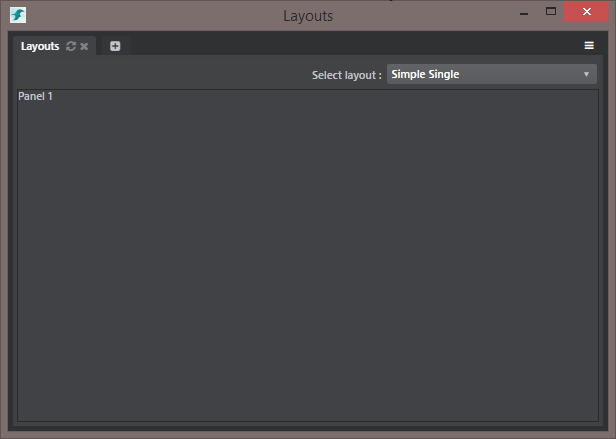
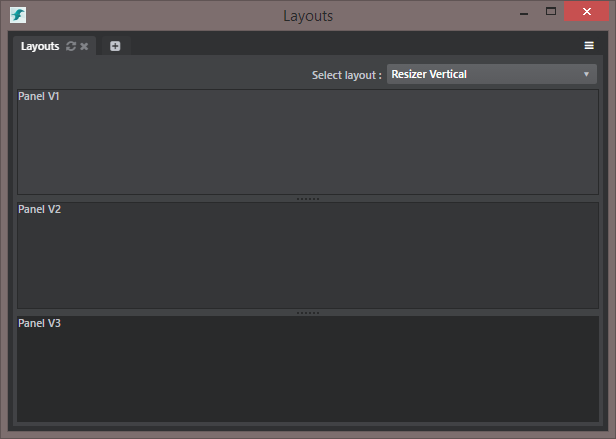
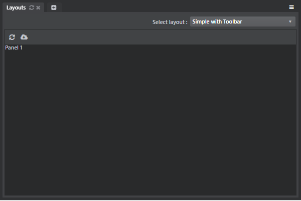
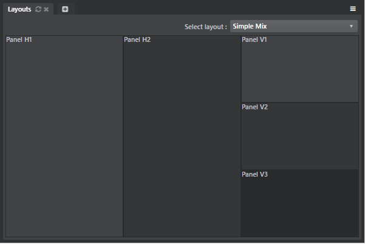
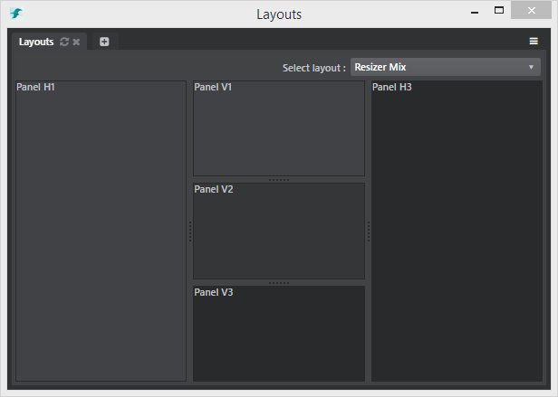

# Layouts

Layouts are used as containers to place tools and controls inside editor modules. They are split in two types : Simple Layouts and Resizer Layouts. Each of these layouts can be placed inside another layout.

In these examples, dark borders were added to clearly show separation between panels with the `stingray-border-dark` class, but you can remove this if it suits your needs better.

To use these examples simply copy and paste the code in your plug-in, remove or add panels and replace the `'Panel x'` elements with you content.

You can try these examples by installing the [Mithril components sample](https://github.com/AutodeskGames/stingray-plugin-api-samples/tree/develop/samples/mithril_components) plug-in in your editor.

## Simple Layouts

#### Container<a name="container-layout"></a>
Simple panel used as a container for direct content. Content can be anything.

```javascript
m.layout.container({className: 'stingray-panel stingray-border-dark'}, [
    'Panel 1'
]);
```

#### Horizontal Layout<a name="horizontal-layout"></a>
Used to display multiple panel horizontally that each contain their own content panel.

```javascript
m.layout.horizontal({}, [
    m.layout.panelFill({className: 'stingray-panel stingray-border-dark'}, m.layout.container({}, [
        'Panel H1'
    ])),
    m.layout.panelFill({className: 'stingray-panel-mid stingray-border-dark'}, m.layout.container({}, [
        'Panel H2'
    ])),
    m.layout.panelFill({className: 'stingray-panel-dark stingray-border-dark'}, m.layout.container({}, [
        'Panel H3'
    ]))
]);`
```

#### Vertical Layout<a name="vertical-layout"></a>
Used to display multiple panel vertically that each contain their own content panel.

```javascript
m.layout.vertical({}, [
    m.layout.panelFill({}, m.layout.container({className: 'stingray-panel stingray-border-dark'}, [
        'Panel V1'
    ])),
    m.layout.panelFill({}, m.layout.container({className: 'stingray-panel-mid stingray-border-dark'}, [
        'Panel V2'
    ])),
    m.layout.panelFill({}, m.layout.container({className: 'stingray-panel-dark stingray-border-dark'}, [
        'Panel V3'
    ]))
]);
```


## Resizer Layouts
Resizer layouts are similar to Simple Layouts but with the ability to be dynamically resized. Each panels can have a `min-size` attribute in px which controls the minimum panel size and also a `ratio` attribute which controls the initial panel size compared to other panels ratios.

In these examples, three panels with each a `ratio` of 1 will render three panels with exact sizes.

#### Horizontal Resizer Layout<a name="horizontal-resizer-layout"></a>
Used to display multiple panel horizontally that can be resized individually and each contain their own content panel.

```javascript
m.resizer.container({direction: 'horizontal', redrawOnResize: false}, {className: 'fullscreen'}, [
    m.resizer.panel({'min-size': 50, ratio: 1}, [
        m.layout.container({className: 'stingray-panel stingray-border-dark'}, [
            'Panel H1'
        ])
    ]),
    m.resizer.panel({'min-size': 50, ratio: 1}, [
        m.layout.container({className: 'stingray-panel-mid stingray-border-dark'}, [
            'Panel H2'
        ])
    ]),
    m.resizer.panel({'min-size': 50, ratio: 1}, [
        m.layout.container({className: 'stingray-panel-dark stingray-border-dark'}, [
            'Panel H3'
        ])
    ])
]);
```

#### Vertical Resizer Layout<a name="vertical-resizer-layout"></a>
Used to display multiple panel vertically that can be resized individually and each contain their own content panel.

```javascript
m.resizer.container({direction: 'vertical', redrawOnResize: false}, {className: 'fullscreen'}, [
    m.resizer.panel({'min-size': 50, ratio: 1}, [
        m.layout.container({className: 'stingray-panel stingray-border-dark'}, [
            'Panel V1'
        ])
    ]),
    m.resizer.panel({'min-size': 50, ratio: 1}, [
        m.layout.container({className: 'stingray-panel-mid stingray-border-dark'}, [
            'Panel V2'
        ])
    ]),
    m.resizer.panel({'min-size': 50, ratio: 1}, [
        m.layout.container({className: 'stingray-panel-dark stingray-border-dark'}, [
            'Panel V3'
        ])
    ])
])
```

## Examples

#### Simple Layout with Toolbar<a name="simple-layout-toolbar"></a>
Example of how we can add a toolbar to a simple layout. See [Toolbars]() for reference.

```javascript
m.layout.vertical({className: 'stingray-panel stingray-border-dark'}, [
    m('div.toolbar', [
        Button.component({
            title: 'Refresh',
            faIcon: 'fa-refresh',
            type: m.button.icon
        }),
        Button.component({
            title: 'Refresh',
            faIcon: 'fa-cloud-download',
            type: m.button.icon
        })
    ]),
    m.layout.container({className: 'stingray-panel-dark panel-fill'}, [
        'Panel 1'
    ])
]);
```

#### Mixed Simple Layout<a name="mixed-simple-layout"></a>
Example of how we can easily mix simple layouts. This is an **exact** copy of the [Vertical Layout](#vertical-layout) placed inside the last panel of the [Horizontal Layout](#horizontal-layout).

```javascript
m.layout.horizontal({}, [
    m.layout.panelFill({}, m.layout.container({className: 'stingray-panel stingray-border-dark'}, [
        'Panel H1'
    ])),
    m.layout.panelFill({}, m.layout.container({className: 'stingray-panel-mid stingray-border-dark'}, [
        'Panel H2'
    ])),
    m.layout.panelFill({}, m.layout.container({className: 'stingray-panel-dark'}, [

        /* Vertical Layout : This is an exact copy of the vertical layout */
            m.layout.vertical({}, [
                m.layout.panelFill({}, m.layout.container({className: 'stingray-panel stingray-border-dark'}, [
                    'Panel V1'
                ])),
                m.layout.panelFill({}, m.layout.container({className: 'stingray-panel-mid stingray-border-dark'}, [
                    'Panel V2'
                ])),
                m.layout.panelFill({}, m.layout.container({className: 'stingray-panel-dark stingray-border-dark'}, [
                    'Panel V3'
                ]))
            ]);
		/* Vertical Layout : End*/

    ]))
]);
```

#### Mixed Resizers Layout<a name="mixed-resizers-layout"></a>
Example of how we can easily mix both types of resizers. This is an **exact** copy of the [Vertical Resizer Layout](#vertical-resizer-layout) placed inside the second panel of the [Horizontal Resizer Layout](#horizontal-resizer-layout).

```javascript
m.resizer.container({direction: 'horizontal', redrawOnResize: false}, {className: 'fullscreen'}, [
    m.resizer.panel({'min-size': 50, ratio: 1}, [
        m.layout.container({className: 'stingray-panel stingray-border-dark'}, [
            'Panel H1'
        ])
    ]),
    m.resizer.panel({'min-size': 50, ratio: 1}, [

        /* Vertical Resizer Layout : This is an exact copy of the vertical resizer layout */
            m.resizer.container({direction: 'vertical', redrawOnResize: false}, {className: 'fullscreen'}, [
                m.resizer.panel({'min-size': 50, ratio: 1}, [
                    m.layout.container({className: 'stingray-panel stingray-border-dark'}, [
                        'Panel V1'
                    ])
                ]),
                m.resizer.panel({'min-size': 50, ratio: 1}, [
                    m.layout.container({className: 'stingray-panel-mid stingray-border-dark'}, [
                        'Panel V2'
                    ])
                ]),
                m.resizer.panel({'min-size': 50, ratio: 1}, [
                    m.layout.container({className: 'stingray-panel-dark stingray-border-dark'}, [
                        'Panel V3'
                    ])
                ])
            ])
		/* Vertical Resizer Layout : End*/

    ]),
    m.resizer.panel({'min-size': 50, ratio: 1}, [
        m.layout.container({className: 'stingray-panel-dark stingray-border-dark'}, [
            'Panel H3'
        ])
    ])
]);
```
