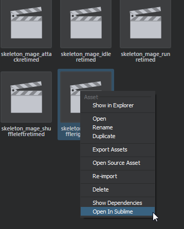
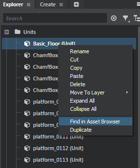
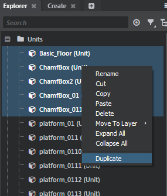

# Add choices to contextual menus

In several places in the interactive editor, users can right-click on something to get a *contextual menu* that offers actions related to the selected item. For example, when you right-click an asset in the **Asset Browser**, or you right-click a unit in the **Level Viewport** or **Explorer**, you get a menu of actions that apply to that asset or level object.

Your plug-in can use the `contextual_actions` extension to add new choices to the default set of options offered by these contextual menus.

For each new contextual menu item you configure, you give the editor one or more actions that it should carry out, and one or more *predicates* that determine whether or not the editor should show the item based on the current context. For example, a predicate might tell the editor to show the menu item only when the selected item is a unit or a light.

## Configuration

Every contextual action extension accepts the following configuration parameters.

~~~{sjson}
extensions = {
	contextual_actions = [
	    {
			label = "Open In Sublime"
        	type = "asset"

	        when = {
	            ...
	        }

			when_multi_select = {
				...
			}

	        do = [
	            ...
	        ]
	    }
	]
}
~~~

`label`

>	Defines the string to display for this action in the contextual menu. This value is also used as a unique name for the action. **Required**.

`type`

>	Defines what kind of items this action can apply to. This can be either `asset` or `level_object`. The action type acts as a global predicate for the contextual action. For example, when the **Asset Browser** needs to populate a contextual menu, it first collects all contextual actions whose type is `asset`, then checks their custom predicates. The **Explorer** panel does the same, but looks only for `level_object` actions. You can also define your own type. **Required**.

`when`

>	A predicate or an array of predicates that determine whether the editor should show this action in the contextual menu. See below for examples of the different kinds of predicates you can configure. The kinds of predicates that are available can vary depending on the `type` set for the contextual actions: for example, only the `asset` type can use the `extension` predicate. **Optional**.

`when_multi_select`

>	Like `when`, this specifies a predicate (or an array of predicates), but this predicate is only checked when the user has selected *more than one* asset or level item at the time the editor opens the right-click menu. **Optional**.

`do`

>	An action or an array of actions that your plug-in should carry out when the user selects this item in the contextual menu. The editor passes each of these actions the context on which it should operate. For assets, this is the path of the asset within the project -- for example, `content/models/character.unit`. For level objects, this is a level object descriptor that the `editor_slave` Lua code uses to keep track of the objects in the level. For more information on actions, see ~{ Register an action }~. **Required**.

## Single-asset predicates

For contextual actions that work on single assets, you have two ways of setting up a predicate in the `when` parameter: based on the `extension` of the asset, or using a `predicate` action.

### Asset extension

You can make your predicate allow the contextual action based on the extension of the selected asset. You can use the `extension` parameter to specify a string or an array of strings. If the file extension of the selected asset matches any of these strings, the editor will show your contextual action.

For example, this allows the editor to show the contextual action when the user right-clicks a *.png* or *.jpg* file in the **Asset Browser**:

~~~{sjson}
{
    label = "Open in Paint"
    type = "asset"

    when = {
    	// Matches both types of image file
        extension = [
            "png"
            "jpg"
        ]
    }

    do = [
        {
            type = "process"
            path = "\"C:\\Program Files\\paint.net\\PaintDotNet.exe\" \"$project\\$1\""
        }
    ]
}
~~~

You can also use a wildcard character `*` to accept any file extensions:

~~~{sjson}
{
    type = "asset"
    label = "Open In Sublime"

    when = {
        // Matches any asset type
        extension = "*"
    }

    do = [
        {
            type = "process"
            path = "\"C:\\Program Files\\Sublime Text 3\\sublime_text.exe\" \"$project\\$1\""
        }
    ]
}
~~~

### Action predicate

If you need to do some more in-depth custom processing to determine whether or not to allow the contextual action, rather than just checking the file extension, you can set up an action for your predicate, using the `predicate` key.

For example, the following configuration runs an `isReadOnly()` function, which is defined inside the `module-actions` JavaScript module. If the action returns `true`, the contextual menu shows the menu item.

~~~{sjson}
// In tests-actions.stingray_plugin
{
    label = "Checkout"
    type = "asset"

    when = {
        extension = "*"
        predicate = {
            type = "js"
            module = "module-actions"
            function_name = "isReadOnly"
        }
    }

    do = [
        {
            type = "js"
            module = "module-actions"
            function_name = "checkout"
        }
    ]
}
~~~

~~~{js}
// In module-actions.js

define(['common/file-system-utils', 'services/file-system-service', 'services/project-service'], function (fileUtils, fileSystemService, assetService, projectService) {

    return {
        // The first parameter passed to an asset predicate is the path to the asset within the project (effectively the
        // asset resource name and its file extension). For example, content/models/character.unit
        isReadOnly: function (assetRelativePath) {

            // The API for invoking predicate actions is Promise based (thus asynchronous). The final Promise must return something
            // "truthy" in order for the contextual action to appear in the contextual menu.
        	return projectService.relativePathToAbsolute(assetRelativePath).then(function (absPath) {
            	return fileSystemService.isReadOnly(absPath);
            });
        },
    }
});
~~~

## Multi-asset predicates

If you want your contextual action to appear when multiple assets are selected, setting up the `when` predicate is the same as handling single assets. However, you also need to set up the `when_multi_select` predicate to determine whether or not your contextual action should be allowed for multiple assets.

In addition, when the user triggers the contextual action, the editor passes all of the selected assets to the action as an array instead of as a single string. If you use the same function to handle both single selections and multiple selections, you will need to handle the two cases appropriately, as in the example below.

~~~{sjson}
// Example in tests-actions.stingray_plugin
{
    type = "asset"
    label = "Duplicate"

	// Note that this action works both for single asset and multi selection of assets
    when = {
        extension = "*"
    }

	// when_multi_select is a predicate.
    when_multi_select = {
    	// This is a nice trick when_multi_select should always be true: invoke an in-place script that returns true.
        type = "js"
        script = "true"
    }

    do = [
        {
            type = "js"
            module = "module-actions"
            function_name = "duplicateAssets"
        }
    ]
}
~~~

~~~{js}
// In module-actions.js
define(['common/file-system-utils', 'services/file-system-service', 'services/project-service'], function (fileUtils, fileSystemService, assetService, projectService) {

    return {
        // Since this action can be invoked both for single and multi selection, we need to check whether its parameter is an array or not.
        duplicateAssets: function (assets) {
			if (!_.isArray(assets)) {
                assets = [assets];
            }

			// Note that each elements in the assets array is a relative asset path.
			_.each(assets, function (assetRelativePath) {
            	// Do something to duplicate an asset
            });
        },
    }
});
~~~

## Single-object predicates

Setting a predicate for level objects is very similar to assets. However, instead of using a file extension, you can use a `category` to define one or more categories of level objects that your action supports. You can also configure a `predicate` to do your own processing.

For example, this predicate only accepts level objects in the "unit" category.

~~~{sjson}
// From asset-browser.stingray_plugin
contextual_actions = [
    {
        type = "level_object"
        label = "Find in Asset Browser"

        // Context specific for asset types
        when = {
                category = "unit"
        }

        do = [
            {
                type = "js"
                module = "asset-browser-actions"
                function_name = "findLevelUnitInAssetBrowser"
            }
        ]
    }
]
~~~

The list of category values you can use is built dynamically based on the *.object_filter* resources visible to the editor. By default, these include all the filters in *core/editor_slave/resources/filters*:

-	camera
-	entity
-	group
-	level_reference
-	light
-	marker
-	note
-	particle_effect
-	prototype
-	scatter_pool_settings
-	sound
-	spline
-	story
-	trigger
-	volume

You can also use a wildcard character `*` to match all categories.

Note that like extensions, you can also specify multiple categories as an array:

~~~{sjson}
{
    type = "level_object"
    label = "Reset position"

    when = {
        category = ["unit", "light"]
    }

    do = [
        {
            type = "js"
            module = "asset-browser-actions"
            function_name = "setPosToZero"
        }
    ]
}
~~~

You can also write a custom predicate the same way you can for an asset:

~~~{sjson}
// In test-actions.stingray_plugin
{
    type = "level_object"
    label = "Close door"

    // Context specific for asset types
    when = {
        category = "unit"
        predicate = {
        	type = "js"
            module = "module-actions"
            function_name = "isDoor"
        }
    }

    do = [
        {
            type = "js"
            module = "module-actions"
            function_name = "closeDoor"
        }
    ]
}
~~~

~~~{js}
// In module-actions.js
isDoor: function (levelObjectTreeNode) {
    // If the unit resource that corresponds to the level object is a door, allow the user to close it.
    return levelObjectTreeNode.dataContext.Type &&
        levelObjectTreeNode.dataContext.Type.startsWith('model/content/door_');
}
~~~

## Multi-object predicates

If you want your contextual action to be shown when multiple level objects are selected, setting up the `when` predicate is the same as handling single objects. However, you also need to set up the `when_multi_select` predicate to determine whether or not your contextual action should be allowed for multiple objects.

In addition, when the user triggers the contextual action, all of the selected objects are passed to the action as an array instead of as a single string. If you use the same function to handle both single selections and multiple selections, you will need to handle the two cases appropriately.

~~~{sjson}
{
    type = "level_object"
    label = "Duplicate Objects"

	// Works both for single level object selection and for multi selection.
    when = {
        category = "*"
    }

    when_multi_select = {
        type = "js"
        script = "true"
    }

    do = [
        {
            type = "js"
            module = "module-actions"
            function_name = "duplicateLevelObjects"
        }
    ]
}
~~~

~~~{js}
// from module-actions.js
duplicateLevelObjects: function (levelObjects) {
	if (!_.isArray(levelObjects)) {
    	levelObjects = [levelObjects];
    }

    _.each(levelObjects, function (levelObject) {
    	// dataContext corresponds to the level object Backend Remote Object. Id is the Level Obejct unique id in the level.
    	levelEditingService.duplicate(levelObject.dataContext.Id);
    });
}
~~~

