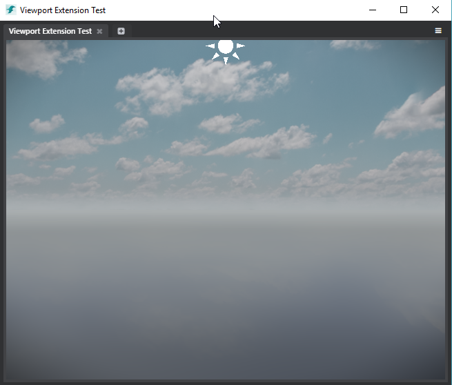

# Create a custom engine viewport

You can use the `viewports` extension to embed an engine viewport into a custom panel or view that your plug-in adds to the Stingray editor.

You can also control the behavior of this viewport by providing a set of custom JavaScript and Lua files that define how users interact with the viewport, and how the engine that is being rendered by the viewport behaves.

This extension is very similar to the `previews` extension that controls the **Asset Preview** -- see also ~{ Define previews for custom assets }~. However, instead of being limited to controlling the existing **Asset Preview** panel, the `viewports` extension lets you create your own viewports inside your own panels, with content and interactions that you decide on.

## Configuration

Viewport extensions require the following parameters:

~~~{sjson}
extensions = {
    viewports = [
        {
            name = "particle-viewport"
            engine = "particle_editor/particle-behavior.lua"
            module = "particle-viewport.js"
        }
    ]
~~~

`name`

>	A descriptive name for the viewport, used internally to instantiate the viewport and to send it Lua commands. This name must be unique among all views registered in the Stingray editor. **Required**.

`engine`

>	The path and file name of the Lua file that controls the behavior of the engine running within the viewport, relative to the location of the *.stingray_plugin* descriptor file. This file should typically override some of the functions exposed in *core/editor_slave/stingray_editor/viewport_behavior.lua*. **Required**.
>
>	Note that your Lua file must be in the project content. You will probably want to use a `resources` extension to mount its folder as part of the project. See ~{ Extend the Project Content }~.

`module`

>	The path to a JavaScript module that the editor will call to run initialization code before instantiating the viewport, as well as to control high-level interaction with the viewport (such as mouse behavior). **Required**.

## Example

The following sections use a new particle editor plug-in as an example. You can find its files under: *editor/plugins/particle-editor* within your Stingray installation directory. This example uses an engine viewport to preview a selected particle system, keeping the preview in sync with the changes that the user makes to the particle settings.

(We're still working on this plug-in, so it isn't yet enabled by default in this release. If you want to try it out in the editor, you'll have to go into its *.stingray_plugin* file and remove the comments at the start on the `menus` and `views` extensions.)

## Viewport interaction overview

The general flow of control when users interact with a viewport in the editor is:

1.	The editor catches all interactions with the viewport.

2.	It forwards those interactions to an `EngineViewport` JavaScript controller: *editor/core/components/engine-viewport.js*.

3.	The `EngineViewport` controller checks for a user-defined JavaScript `ViewportBehavior`, and forwards its events to the user-defined behavior. For an example of one of these behaviors, see *core/plugins/particle_editor/particle-viewport.js*. This means you can change the way users interact with the viewport by changing the current `ViewportBehavior`.

4.	The `ViewportBehavior` sends Lua commands to a specific viewport of the engine. These commands are received by a standard Lua `EditorViewport` controller, which is implemented in *core/editor_slave/stingray_editor/editor_viewport.lua*.

5.	The Lua `EditorViewport` forwards inputs to its current user-defined Lua behavior. This is where your plug-in can respond to user inputs by triggering things to happen within the engine -- like spawning units, changing materials, etc. For the specification that defines this Lua behavior, see *core/editor_slave/stingray_editor/viewport_behavior.lua*. For an example, you can also look at *core/plugins/particle_editor/particle_editor/particle-behavior.lua*.

## Set up the viewport in JavaScript

The JavaScript file that you set in your viewport's `module` parameter should return a module that contains a `setup()` function. The editor will call this function when the viewport is instantiated and ready to be used. For example, you might use this function to load an initial level, implement a ViewportBehavior, or tweak the interactions between the viewport and other Stingray services.

The return value of the `setup` function is a ViewportBehavior object that will receive user events directly from the viewport window.

~~~{js}
// Example from particle-viewport.js

define([
    'services/engine-service',
    'services/engine-viewport-service'
], function () {
    'use strict';

    var engineService = require('services/engine-service');
    var engineViewportService = require('services/engine-viewport-service');

    /**
     * Viewport extension test controller. Implements a viewport extension controller module.
     * @module ParticleViewportController
     */
    var ParticleViewportController = {
        /**
         * Setup the viewport extension controller.
         * @memberof ParticleViewportController#
         * @param {string} engineViewportId - id of the newly created viewport.
         * @param {EngineViewportInterops} engineViewportInterops - engine viewport interop utility class
         */
        setup: function (engineViewportId, engineViewportInterops) {
            this.mouseBehavior = new MouseBehavior(engineViewportId, engineViewportInterops);

            var off = null;
            // Setup will be resolved when it receives a Viewportcreated event.
            return new Promise(function (resolve) {
                off = engineViewportService.on('ViewportCreated', function (id) {
                    if (id === engineViewportId) {
                        resolve();
                    }
                });

                engineViewportService.getViewportNameFromId(engineViewportId).then(function (name) {
                    if (name) {
                        // Viewport has already been created, so no need to wait any longer.
                        resolve();
                    }
                });
            }).then(function () {
                return engineViewportInterops.raise(engineViewportId, 'load_background_level', 'core/editor_slave/resources/levels/empty_level');
            }).then(function () {
                if (off) {
                    off();
                }

				// Notice how the result
                return this.mouseBehavior;
            }.bind(this));
        }
    };

    return ParticleViewportController;
});
~~~

The `engineViewportInterops` object in the example above is a helper that packages communication between the Lua and JavaScript environments. It can help you write a new ViewportBehavior. Its API is as follows:

~~~{js}
// From editor\core\components\engine-viewport.js
// All of these functions return a promise and send a Lua command directly to the engine through a websocket connection.
var EngineViewportInterops = {
    invoke: function (viewportId, method) {},

	// Will eventually do an Editor:raise()
    raise: function (viewportId, method) {},

    keyDown: function (viewportId, keyCode) {},

    keyUp: function (viewportId, keyCode) {},

    mouseLeftDown: function (viewportId, x, y) {},

    mouseLeftUp: function (viewportId, x, y) {},

    mouseMiddleDown: function (viewportId, x, y) {},

    mouseMiddleUp: function (viewportId, x, y) {},

    mouseRightDown: function (viewportId, x, y) {},

    mouseRightUp: function (viewportId, x, y) {},

    mouseMove: function (viewportId, x, y, dx, dy) {},

    mouseWheel: function (viewportId, delta) {}
};
~~~

You can use the helper to create a ViewportBehavior from JavaScript:

~~~{js}
// From core/plugins/particle_editor/particle-viewport.js
// This MouseBehavior implements all functions supported by a ViewportBehavior.
var MouseBehavior = function (engineViewportId, engineViewportInterops) {
        this.viewportId = engineViewportId;
        this.engineViewportInterops = engineViewportInterops;
    };

    MouseBehavior.prototype = {
        mouseDown: function (evt) {
            var x = evt.originalEvent.detail.positionX;
            var y = evt.originalEvent.detail.positionY;
            var buttonNumber = evt.originalEvent.detail.button;
            console.log(buttonNumber);

            engineService.sendToLocalEditors('Editor:set_camera_control_style(%s, %s)', luaUtils.toSyntax(this.viewportId), luaUtils.toSyntax("MayaStyleTurntableRotation"));

            switch (buttonNumber) {
                case 0: this.engineViewportInterops.mouseLeftDown(this.viewportId, x, y);
                    break;
                case 1:this.engineViewportInterops.mouseMiddleDown(this.viewportId, x, y);
                    break;
                case 2:this.engineViewportInterops.mouseRightDown(this.viewportId, x, y);
                    break;
            }
        },

        mouseUp: function (evt) {
            var x = evt.originalEvent.detail.positionX;
            var y = evt.originalEvent.detail.positionY;
            var buttonNumber = evt.originalEvent.detail.button;

            engineService.sendToLocalEditors('Editor:set_camera_control_style(%s, %s)', luaUtils.toSyntax(this.viewportId), luaUtils.toSyntax("None"));

            switch (buttonNumber) {
                case 0: this.engineViewportInterops.mouseLeftUp(this.viewportId, x, y);
                    break;
                case 1:this.engineViewportInterops.mouseMiddleUp(this.viewportId, x, y);
                    break;
                case 2:this.engineViewportInterops.mouseRightUp(this.viewportId, x, y);
                    break;
            }
        },

        mouseMove: function (evt) {
            var x = evt.originalEvent.detail.positionX;
            var y = evt.originalEvent.detail.positionY;
            var deltaX = evt.originalEvent.detail.deltaX;
            var deltaY = evt.originalEvent.detail.deltaY;
            this.engineViewportInterops.mouseMove(this.viewportId, x, y, deltaX, deltaY);
        },

        mouseWheel: function (evt) {
            this.engineViewportInterops.mouseWheel(this.viewportId, -evt.originalEvent.deltaY);
        },

        keyDown: function (evt) {
            this.engineViewportInterops.keyDown(this.viewportId, evt.originalEvent.detail.keyCode);
        },

        keyUp: function (evt) {
            this.engineViewportInterops.keyUp(this.viewportId, evt.originalEvent.detail.keyCode);
        },

        viewportResized: function () {

        },

        viewportDrop: function () {

        }
    };
~~~

## Control the engine behavior in Lua

The Lua counterpart of the JavaScript ViewportBehavior allows the user to interact directly with the engine: you can spawn new units, setup materials, control the camera, modify the shading environment -- whatever your plug-in needs to do to produce in the engine the effect triggered by the user interaction.

A Lua ViewportBehavior can implement the following interface:

~~~{lua}
// From core/editor_slave/stingray_editor/viewport_behavior.lua
ViewportBehavior = interface {
    required = {
        render = function(editor_viewport, lines, lines_no_z) end,
        is_accepting_drag_and_drop = function() return does_accept end,
        world = function() return world end,
        editor_camera = function() return editor_camera end,
        selected_units = function() return selected_units_array end,
        shading_environment = function() return shading_environment end
    },
    optional = {
        update = function(editor_viewport, dt) end,
        shutdown = function() end,
        reset = function() end, -- Called at editor start and at every level change.
        activated = function() end,
        key_down = function(key) end,
        key_up = function(key) end,
        mouse_move = function(x, y, dx, dy, viewport) end,
        mouse_left_down = function(x, y, viewport) end,
        mouse_left_up = function(x, y, viewport) end,
        mouse_middle_down = function(x, y, viewport) end,
        mouse_middle_up = function(x, y, viewport) end,
        mouse_right_down = function(x, y, viewport) end,
        mouse_right_up = function(x, y, viewport) end,
        mouse_wheel = function(delta, steps, viewport) end,
        is_dirty = function() return is_dirty end,
        grid = function() return grid end,
        toolbar_behavior = function() return toolbar_behavior end,
        set_skydome_unit = function(unit) end,
        set_shading_environment = function(shading_environment) end,
        pre_render = function(viewport) end,
        post_render = function(viewport) end
    }
}
~~~

See *core/plugins/particle_editor/particle_editor/particle-behavior.lua* for an implementation that controls a particle effect.

## Create the viewport (using Mithril)

In order to add a viewport to a JavaScript view, the easiest way is to use the `EngineViewport` Mithril component.

[Mithril](http://mithril.js.org) is a lightweight framework that simplifies creating a JavaScript view and keeping it in sync with a data model. Look at *editor/plugins/particle_editor/particle-editor.js* to see a working example of how you can use this framework to build a view that contains an engine viewport.

The easiest way to host a 3D viewport in a Mithril view is probably the method shown in *plugin_tests/viewort_extension/viewport-extension-test.js*:

~~~{js}
define([
    'app',
    'stingray',
    'lodash',
    '3rdparty/mithril/mithril.min',
    'components/engine-viewport'
], function () {
    'use strict';

    var m = require('3rdparty/mithril/mithril.min');
    var EngineViewport = require('components/engine-viewport');

    var $container = $("#viewport-here");

	// Use Mithril mount function to attach the EngineViewport component and pass it the name of the
    // viewport setup file (viewport-extension-test.js)
    m.mount($container[0], EngineViewport.component({
        name: "viewport-extension-test"
    }));
});
~~~

In order to attach the Mithril view to the `#viewport-here` element you need this HTML content in the panel:

~~~{html}
<!-- From plugin_tests/viewort_extension/viewport-extension-test.html -->

	<!-- This element is the anchor on which we attach the viewport -->
    

~~~

Screenshot of the viewport extension test:

