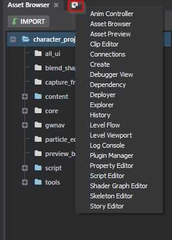
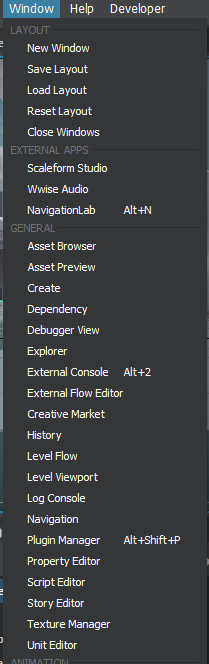
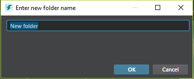

# Create a named panel or dialog

You can use the `views` extension to define a named view for your plug-in. This may be a dockable panel, or a modal dialog. You can then use the view's name to refer to it from elsewhere in your plug-in -- for example, to open it from a `menu` extension. You can even open a named view from another plug-in -- for example, you can pop the standard editor color picker dialog from your own plug-in, even though it is defined in its own separate plug-in.

## Configuration

Each `views` extension accepts the following settings in the *.stingray_plugin* file:

~~~{sjson}
views = [
    {
        name = "project-manager"
        type = "dialog"
        path = "project-manager"
        title = "Project Manager"
        width = 910
        height = 600
    }
]
~~~

`name`

>	A unique name for the view. This name must be unique among all views registered by all Stingray plug-ins. You'll use this name to refer to your view when you want to open it from another extension or from JavaScript code in your plug-in. **Required**.

`type`

>	The type of the view. This can be any of the following: `dialog` (generally modal), `panel` (tool window), or `window` (a top-level window). **Required**.
>
>	Note that if you register your view as a panel, it will also be available through the + button in any tab bar:
>
>	

`path`

>	The path and filename of an HTML file that the editor will load into the view. This path must be set relative to the location of your *.stingray_plugin* file. **Required**.

`title`

>	A title for the view, which the editor will show in the panel tab or the dialog title bar. **Optional**.

`width`

>	The default initial width of the view, in pixels. **Optional**.

`height`

>	The default initial height of the view, in pixels. **Optional**.

## Opening the view from a menu

You can use a `menus` extension to create a new menu item in the Stingray editor that opens your named view. For details, see ~{ Create a new menu item }~, and use the `view` property to specify the name of the view you want to open.

Most of the tools available under the **General** category in the Stingray **Window** menu come from named views that have been registered in a plug-in:

## Opening the view from a global action

The *stingray-editor.stingray_plugin* file sets up a global action named `open-view`. You can use this action in your plug-in to pop open a named view from anywhere that you can run an action.

For example, the following contextual action extension adds a "Show Dependencies" menu item to the contextual menu any time the user right-clicks any asset, and that menu item results in the editor opening the view named `dependency`:

~~~{sjson}
contextual_actions = [
    {
        type = "asset"
        label = "Show Dependencies"

        when = {
            extension = "*"
        }

        do = [
            "open-view \"dependency\""
        ]
    }
]
~~~

## Opening a dockable panel from JavaScript

You can use the `extensions/views` module to open your panel from anywhere in your plug-in's JavaScript code:

~~~{js}
// From dependency-actions.js
define([
    'app',
    'lodash',
    'extensions/views',
    'services/event-service'
], function (app, _, views, eventService) {
    'use strict';

    return {
        showDependencies: function (dependencyPath) {
        	// use the views module to open a view called "dependency" passing this view a custom resource query parameter
            return views.open('dependency', {}, {
                resource: encodeURIComponent(dependencyPath)
            });
        }
    };
});
~~~

## Opening a modal dialog from JavaScript

Like dockable panels, you can use the `extensions/views` module to open your dialog from anywhere in your plug-in's JavaScript code, and to get back its return value when the user closes the dialog:

~~~{js}
// From asset-browser-controller.js
function createNewFolder(uniqueDirectoryEntry) {
	return hostService.openModalTextInputDialog("Enter new folder name",
    	uniqueDirectoryEntry.Filename);
}

~~

~~~{js}
// From host-service.js
define([
    'app',
    'lodash',
    'extensions/views'
], function (app, _, views, eventService) {
    'use strict';

    return {
        openModalTextInputDialog = function (title, defaultValue, options) {
        	// Open the dialog called "text-input-dialog"
            return views.openDialog('text-input-dialog', {
                title,
                defaultValue,
                settings: options
            }).then(function (result) {
                // When the dialog is closed, if its result is valid (dialog hasn't been canceled) returns the
                // dialog result to the caller
            	if (result.accepted)
                	return result.result.TextValue;
        	});
		}
    };
});
~~~

### Global dialog helpers

Whenever the editor opens a custom dialog, it injects a few useful variables and functions into the global `window` object. These may help you manipulate the dialog more easily from your plug-in code:

`window.options`

>	The third parameter that you pass to the `views.openDialog` function, if any. You can use this to pass a plain JSON object from the module that opens the dialog, and pick up the same object from the dialog controller.

`window.accept(result)`

>	Closes the dialog, passing back the `result` to the module that opened the dialog. The dialog will be considered valid.

`window.reject(result)`

>	Closes the dialog, passing back the `result` to the module that opened the dialog. The dialog will be considered rejected or cancelled.

~~~{js}
// From text-input-dialog.js

// Fetch initial values from the `views.openDialog` options parameter:
$scope.dataContext = {
    TextValue: window.options.defaultValue
};

$document.on('keydown', function (evt) {
    if (evt.keyCode === keycodes.KEYCODE_ENTER) {
    	// 'Enter' to accept
        $scope.close(lastValidationState);
        // Stop propagation
        return false;
    } else if (evt.keyCode === keycodes.KEYCODE_ESCAPE) {
    	// Discard dialog (cancelling it) on escape
        window.reject('discarded');
        // Stop propagation
        return false;
    }

    return true;
});

$scope.close = function (accepted) {
    if (accepted && lastValidationState) {
    	// Accept the dialog result passing back the TextValue in the dataContext object
        return window.accept($scope.dataContext);
    }
    window.close();
};
~~~

