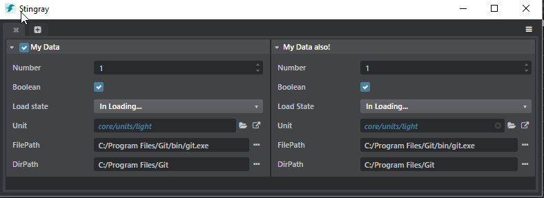

# Use the Property Editor component in your UI

This page shows two different ways that you can re-use the editor's **Property Editor** widget in your own plug-in's user interface.

-	One uses a `.type` file to define the structure of a data resource, along with the controls that the editor should expose for editing those data values. For background on these `.type` files, see also ~{ The {{ProductName}} Type System }~.

-	The other uses pure JavaScript to feed the property editor widget with the data it should manage.

## The plug-in definition

The first thing to do in order to add a new panel to the plug-in is to define the panel in your `.stingray_plugin` file. Here we're using the `views` and `menus` extensions:

~~~{sjson}
 views = [
    {
        type = "panel"
        name = "property-editor-usage"
        path = "property-editor-usage"
        title = "Property Editor usage"
        width = 500
        height = 600
    }
]
menus = [
	{
        path = "Window/My Property Editor Panel"
        view = "plugin-manager"
        shortcut = "Alt+Shift+P"
        order = 379
    }
]
~~~

See also ~{ Create a named panel or dialog }~ and ~{ Create a new menu item }~.

## Panel initialization

The panel's JavaScript file must begin with a `define` block that specifies which other JavaScript modules you want to include. See the last section in ~{ Tips for developing plug-ins}~ for more details on why and how this works.

~~~{js}
// This is the list of all modules we depend on:
define([
    'properties/mithril-property-ext',
    'properties/property-editor-utils',
    'properties/property-editor-component',
    'properties/property-document',
    'components/dom-tools',
    'services/data-type-service',
    'services/marshalling-service',
    'services/host-service',
    'services/project-service',
    'services/element-service',
    'services/asset-service',
    'services/file-system-service'
],
	/** This is the initialization function of your module. Each required dependency gets injected
    	in the same order it is included. Module starting with capital letter a generally Component
        or class (that can be used with new). Module starting with a lowerCase are generally namespace
        containing functions and data.
    */
	function (m, props, PropertyEditor, PropertyDocument, domTools, dataTypeService,
             marshallingService, hostService, projectService, elementService, assetService, fileSystemService) {
    'use strict';
    document.title = "Simple tool";

    // Ensure all CSS are loaded for the property editor:
    domTools.loadCss("core/css/widgets/json-component.css");
    domTools.loadCss("core/css/widgets/property-editor.css");
~~~

Also see the section ~{ Use built-in editor services}~ for more information on the core editor services included in the `define` call above.

## Method 1: Using a type file

The first thing we will do is to specify a type descriptor for the data we want to display in our property editor widget. You could do this by loading a `.type` file from disk -- for example, by using the `readJSON()` method offered by the editor's `fileSystemService`. However, here we will define it directly in JavaScript (using pure JSON):

~~~{js}
// Create the type definition "inline". Alternatively, it could have been loaded from a .type file:
var typeDefinition = {
    type: ':struct',
    fields: {
        Number: {
            type: ":number",
            default: 1,
            min: 0,
            max: 1,
            editor: {
                control: "Number",
                step: 0.3,
                priority: 4
            }
        },
        Boolean: {
            type: ":bool",
            default: true
        },
        Enum: {
            type: ":enum",
            value: ":string",
            default: "InLoading",
            cases: [
                "Loaded",
                "Unloaded",
                "InLoading",
                "ErrorLoading"
            ],
            editor: {
                control: "Choice",
                label: "Load state",
                case_labels: {
                    "Loaded": "Loaded",
                    "Unloaded": "Unloaded",
                    "In Loading...": "InLoading",
                    "Error while Loading": "ErrorLoading"
                }
            }
        },
        Unit: {
            type: ":resource",
            extension: "unit",
            default: 'core/units/light'
        },
        FilePath: {
            type: ":string",
            default: 'C:/Program Files/Git/bin/git.exe',
            editor: {
                control: "PathProperty",
                browseType: "File",
                browseTitle: "Select a exe",
                browseFilter: "*.exe"
            }
        },
        DirPath: {
            type: ":string",
            default: 'C:/Program Files/Git',
            editor: {
                control: "PathProperty",
                browseType: "Folder",
                browseTitle: "Select a folder"
            }
        }
    }
};
~~~

The type descriptor we defined above has six different properties. Each field has:

-	A `type`, which indicates what type of data this field holds -- a number, a string, a resource name, etc. See ~{ Built-in types reference }~ for the list of basic types that are built in to the editor.

-	An `editor` block, which specifies which property control the editor should show in the property editor for modifying this field. It also sets other metadata about the control, like the step size for adjacent numeric values in a spinner control. For more information on the full set of property controls supported by the editor, see ~{ Built-in metadata properties }~.

### Property Document setup

In order to intialize a property editor from a type descriptor, we use the `PropertyDocument` class. This class allows us to customize the categories and to listen for `valueChanged` events that happen when the user modifies the JSON value using the controls in the property editor.

~~~{js}
// Use the dataTypeService to create an initial value that conforms to the type definition.
var initialValue = dataTypeService.createDefaultValue(typeDefinition);

// This instance will holds all the categories and properties created from the type definition.
var documentFromType = new PropertyDocument();

// you can register a global listener to know when a property changes:
documentFromType.on('valueChanged', function (path, value) {
    console.log('valueChanged', path, value);
    m.utils.redraw();
});

// Now we add a category block mapped to a typeDefinition and a value:
documentFromType.addCategory("My Data", {}, initialValue, typeDefinition);

~~~

The `documentFromType` will be passed to the `PropertyEditor` component in order to be rendered in the HTML panel. But before we finalize the UI code, let's see how to create a property editor purely from JavaScript and without using type descriptors.

## Method 2: using compact notation

You can access all the property controls offered by the editor through the `property-editor-utils` module. In the `define` call we set up in the [Initialization] section above, we required this module and assigned it to the `props` variable.

You can use pure JavaScript code to control the parameters of these different properties, as well as tweak how their property models should behave.

All properties use a special getter/setter function, called a *model*, to access and modify their data. This gives you a lot of flexibility when you define how a property should be populated. A property model is a function that can be invoked with one or two argument(s):

-	The first argument is the property that triggers the model change.

-	If there is no second argument, the function is a `getter`: it must return the value of the property.

-	If there is a second argument, the function is a `setter`: it must modify the value of the property.

In our panel, we have created a property model **generator** function:

~~~{js}
function genModel (value) {
	// This returns a property model function that uses a closure to stores its value.
    return function (newValue) {
        if (arguments.length) {
        	// arguments is a JavaScript built in variable available in a function. It allows access to
            // all the parameters passed to the function. Here we check if we have more than
            // 1 parameters so see if the model should be used as a setter.
            value = newValue;
        }
        return value;
    };
}
~~~

The following code uses the editor's *compact notation* to express exactly the same set of properties that we set up in the `.type` example above:

~~~{js}
// The compact notation allows easy configuration of a PropertyEditor using pure JavaScript:
var compactNotationDocument = new PropertyDocument([
    props.category("My Data also!", {}, [
        props.number("Number", genModel(1), {
            default: 1, min: 0, max: 1, increment: 0.3, priority: 4
        }),
        props.bool('Boolean', genModel(true)),
        props.choice('Load State', genModel('InLoading'), {
                "Loaded": "Loaded",
                "Unloaded": "Unloaded",
                "In Loading...": "InLoading",
                "Error while Loading": "ErrorLoading"
            }),
        props.resource('Unit', genModel('core/units/light'), 'unit'),
        props.file('FilePath', genModel('C:/Program Files/Git/bin/git.exe')),
        props.directory('DirPath', genModel('C:/Program Files/Git')),
    ])
]);
~~~

For more information on the different property controls supported by this compact notation, see ~{ Built-in metadata properties }~.

## Create and mount a Mithril view

All that is left to complete our panel is to create a view that holds the two property editor widgets. We'll use [Mithril](http://mithril.js.org/): a lightweight JavaScript library that simplifies creating dynamic HTML that stays in sync with a data model. Everything can be done in pure JavaScript (even the templating), which allows easy debugging.

We use two of Mithril's core concepts:

- [Component](http://mithril.js.org/mithril.component.html): this is a plain JavaScript object that must contain a `view` function. This `view` function uses the hyperscript helper called `m` to create a virtual DOM that gets attached to the real HTML DOM that is shown to the user in the view. See [here](http://mithril.js.org/mithril.html) for more information on how to use the Mithril templating language (which is really HTML expressed in JavaScript).

- [Mount](http://mithril.js.org/mithril.mount.html): when we have a Mithril component, we need to mount it on a real DOM node to properly render.

Here what our view code looks like:

~~~{js}
// Our app component
var PropertyEditorUsageApp = {
    view: function () {
        return m('div', {class :"panel-fill panel-flex-horizontal fullscreen", style:"overflow: auto;"}, [
            m('div', {class: "panel-fill"}, [
                // Use the PropertyEditor Mithril component to attach a
                // Property editor in our view and pass it a configuration:
                PropertyEditor.component({document: documentFromType })
            ]),
            m('div', {class: "panel-fill"}, [
                PropertyEditor.component({document: compactNotationDocument})
            ])
        ]);
    }
};

// Mount the component on DOM
m.mount($('#mithril-root')[0], m.component(PropertyEditorUsageApp, {}));
~~~

## The whole enchilada

This is what our final panel looks like in the editor!

And here is its complete source code:

~~~{js}
define([
    'properties/mithril-property-ext',
    'properties/property-editor-utils',
    'properties/property-editor-component',
    'properties/property-document',
    'components/dom-tools',
    'services/data-type-service',
    'services/marshalling-service',
    'services/host-service',
    'services/project-service',
    'services/element-service',
    'services/asset-service',
    'services/file-system-service'
], function (m, props, PropertyEditor, PropertyDocument, domTools, dataTypeService,
             marshallingService, hostService, projectService, elementService, assetService, fileSystemService) {
    'use strict';
    document.title = "Simple tool";

    // Ensure all CSS are loaded for the property editor:
    domTools.loadCss("core/css/widgets/json-component.css");
    domTools.loadCss("core/css/widgets/property-editor.css");

    //////////////////////////////////////////////////////////////////
    // Initialization of a property editor using a Type file to populate itself.

    // Create type definition "inline". could have been loaded from a .type file.
    var typeDefinition = {
        type: ':struct',
        fields: {
            Number: {
                type: ":number",
                default: 1,
                min: 0,
                max: 1,
                editor: {
                    control: "Number",
                    step: 0.3,
                    priority: 4
                }
            },
            Boolean: {
                type: ":bool",
                default: true
            },
            Enum: {
                type: ":enum",
                value: ":string",
                default: "InLoading",
                cases: [
                    "Loaded",
                    "Unloaded",
                    "InLoading",
                    "ErrorLoading"
                ],
                editor: {
                    control: "Choice",
                    label: "Load state",
                    case_labels: {
                        "Loaded": "Loaded",
                        "Unloaded": "Unloaded",
                        "In Loading...": "InLoading",
                        "Error while Loading": "ErrorLoading"
                    }
                }
            },
            Unit: {
                type: ":resource",
                extension: "unit",
                default: 'core/units/light'
            },
            FilePath: {
                type: ":string",
                default: 'C:/Program Files/Git/bin/git.exe',
                editor: {
                    control: "PathProperty",
                    browseType: "File",
                    browseTitle: "Select a exe",
                    browseFilter: "*.exe"
                }
            },
            DirPath: {
                type: ":string",
                default: 'C:/Program Files/Git',
                editor: {
                    control: "PathProperty",
                    browseType: "Folder",
                    browseTitle: "Select a folder"
                }
            }
        }
    };

    // Use the dataTypeService to create an initial value conforming to the type definition.
    var initialValue = dataTypeService.createDefaultValue(typeDefinition);

    // This instance will holds all the categories and properties created from the type definition.
    var documentFromType = new PropertyDocument();

    // you can register global listener to know when a property changes:
    documentFromType.on('valueChanged', function (path, value, property, category, doc) {
        console.log('valueChanged', path, value, property, category, doc);
        m.utils.redraw();
    });

    // Now we add a category block mapped to a typeDescriptor and a value:
    documentFromType.addCategory("My Data", {}, initialValue, typeDefinition);

    //////////////////////////////////////////////////////////////////
    // Initialization of a property editor using a Type file to populate itself.

    // This will be our model generator:
    function genModel (value) {
        return function (property, newValue) {
            if (arguments.length > 1) {
                value = newValue;
            }
            return value;
        };
    }

    // The compact notation allows easy configuration of a PropertyEditor using pure JavaScript:
    var compactNotationDocument = new PropertyDocument([
        props.category("My Data also!", {}, [
            props.number("Number", genModel(1), {
                default: 1, min: 0, max: 1, increment: 0.3, priority: 4
            }),

            props.bool('Boolean', genModel(true)),

            props.choice('Load State', genModel('InLoading'), {
                    "Loaded": "Loaded",
                    "Unloaded": "Unloaded",
                    "In Loading...": "InLoading",
                    "Error while Loading": "ErrorLoading"
                }),

            props.resource('Unit', genModel('core/units/light'), 'unit'),

            props.file('FilePath', genModel('C:/Program Files/Git/bin/git.exe')),

            props.directory('DirPath', genModel('C:/Program Files/Git')),
        ])
    ]);

    var PropertyEditorUsageApp = {
        view: function () {
            return m('div', {class :"panel-fill panel-flex-horizontal fullscreen", style:"overflow: auto;"}, [
                m('div', {class: "panel-fill"}, [
                    PropertyEditor.component(documentFromType)
                ]),
                m('div', {class: "panel-fill"}, [
                    PropertyEditor.component(compactNotationDocument)
                ])
            ]);
        }
    };

    // Initialize the application
    m.mount($('#mithril-root')[0], m.component(PropertyEditorUsageApp, {}));

    return {
        noAngular: true
    };
});
~~~
