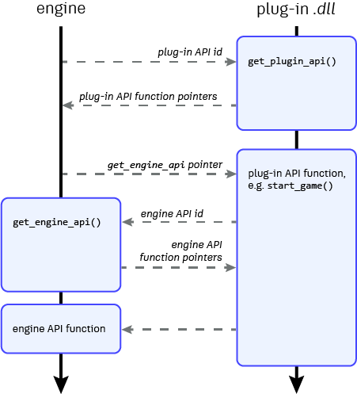

# Extend the Engine

You can write plug-ins that add new features to the runtime interactive engine, expose new objects and functions in the Lua gameplay API, integrate with external middleware SDKs or other libraries, etc. You could even write your gameplay code entirely in C rather than using Flow and Lua, if you are comfortable doing so.

This section provides some tips on getting started extending the engine with your own plug-ins.

## More resources

-	The most important resource for working on engine plug-ins is the repository of example plug-ins. If you don't already have these examples, see ~{ Example Plug-ins }~.

	Start by looking at the `samples/simple_plugin` example. It's a very minimal plug-in that shows the basic skeleton of an interaction between the engine and a plug-in, like the one described in the following sections.

	Then move on to the `samples/bigger_plugin`, which shows how you can create a new resource type, define how that resource gets compiled into runtime data, and set up Lua functions for the project to access the data in that resource at runtime.

-	We really recommend basing your plug-in on the [stingray-plugin repository](https://github.com/AutodeskGames/stingray-plugin). It's already set up with everything you'll need to compile your code to a *.dll* using Visual Studio 2015, which will make it way easier for you to get started.

-	You'll need the SDK header files. You can find them under `stingray_sdk` in the example repository, or under `plugin_sdk` in your {{ProductName}} installation folder. (If you use the [stingray-plugin repository](https://github.com/AutodeskGames/stingray-plugin) repo, it'll fetch these headers for you automatically so you won't have to worry about it.)

-	The [reference documentation](../engine_c/index.html) contains a browsable companion to the APIs defined in the SDK header files.

## Engine and plug-in interactions

The engine's plug-in interface is based around a consistent pattern of interactions between the engine and the plug-in. All of these interactions are based on a shared set of API definitions. Each side queries the other to retrieve the APIs that the other side supports:

-	The engine first queries the plug-in for its API by calling a predetermined `get_plugin_api` function. The plug-in provides the engine with a struct that contains pointers to whatever functions the plug-in implements from their shared plug-in API definition.

-	When the engine calls those functions defined by the plug-in, it passes along a `get_engine_api` function pointer of its own. The plug-in can call that function to query the engine in return, in order to retrieve APIs that expose engine services to the plug-in. The plug-in can then call functions in those returned APIs in order to make the engine perform the tasks it needs.

The following image summarizes this workflow:

## Getting started

These are the basic steps for getting a plug-in to integrate with the runtime engine. All of the example plug-ins do these things, so look in their code for illustrations.

1.	Include the `plugin_api.h` file.

	~~~{cpp}
	#include "engine_plugin_api/plugin_api.h"
	~~~

	When the engine and the plug-in call each other as shown in the diagram above, they use a shared set of IDs to identify the APIs that they are requesting. Each ID always corresponds to a particular struct, defined in the `plugin_api.h` file. So both the engine and the plug-in need to include this file in order to make sure that the identifiers and API definitions match.

1.	Define a function with the following signature:

	~~~{cpp}
	__declspec(dllexport) void *get_plugin_api(unsigned api_id)
	~~~

	The plug-in interface uses C rather than C++, to avoid [ABI incompatibilities](https://en.wikipedia.org/wiki/Application_binary_interface) between different versions of C++ and different compilers. If you want to compile your plug-in using C++, you can wrap your `get_plugin_api` function in an `extern C` block, like this:

	~~~{cpp}
	extern "C" {
		__declspec(dllexport) void *get_plugin_api(unsigned api)
		{
			...
		}
	}
	~~~

	This avoids the function name becoming mangled in the compiled *.dll*.

1.	Each time the engine calls your plug-in's `get_plugin_api` function, it passes a `PluginApiId` that identifies an interface it wants your plug-in to provide. If you want your plug-in to support the requested interface, your implementation of `get_plugin_api` should respond by creating a new instance of the struct that matches that requested API. For each function in that interface that you want your plug-in to support, you should set the pointer for that function in your instance to a function that you write in your plug-in. Once you've set up all the functions you want to support, return the struct.

	The main plug-in API that you'll want to handle is identified by the `PLUGIN_API_ID`, which identifies the `PluginApi` struct. This example responds to the engine sending a `PLUGIN_API_ID` by setting up a `PluginApi` struct with a pointer to a custom implementation for the `setup_game()` function:

	~~~{cpp}
	__declspec(dllexport) void *get_plugin_api(unsigned api_id)
	{
		if (api_id == PLUGIN_API_ID) {
			static struct PluginApi api = {0};
			api.setup_game = setup_game;
			return &api;
		}
		return 0;
	}
	~~~

	The engine converts the returned pointer into a pointer to the corresponding `PluginApi` struct. It then uses that struct to call the functions you've defined.

	There are some other plug-in APIs that the engine requests (the `RENDER_CALLBACKS_PLUGIN_API_ID` for example), and we may add more in future.

1.	So far, you've set up the engine to call out to your plug-in at specific moments in its lifespan. But usually, you'll want the interaction to go both ways: you'll want your plug-in code to call out to the engine in order to ask the engine to do something for you -- to load a world, spawn a unit, compile a resource, render some data, etc.

	The typical pattern is for your plug-in to call a `get_engine_api` function provided by the engine in order to request any service APIs it needs from the engine. In each call, you pass a value from the `PluginApiId` enumeration to tell the engine which interface you want. Then, your plug-in can cache the returned struct in a variable, and use it anytime to carry out operations in the engine.

	For example, the simple plug-in uses this implementation of the `setup_game` function to request the `LuaApi` interface from the engine. It can then use any of the functions defined in that interface to interact with the engine's Lua environment -- in this case, exposing a new function that could be called by a project's Lua scripts as `stingray.SimplePlugin.test()`.

	~~~{cpp}
	struct LuaApi *_lua;
	static void setup_game(GetApiFunction get_engine_api)
	{
		_lua = get_engine_api(LUA_API_ID);
		_lua->add_module_function("SimplePlugin", "test", test);
	}
	~~~

1.	Compile your plug-in to a *.dll* file.

	This can be tricky if you're not used to developing in C. We really recommend starting from the example plug-ins, which are all set up with their own Visual Studio projects.

	You must target the `x64` platform. Also, dynamically linked plug-ins are currently supported only on Windows; see ~{ Alpha SDK Limitations }~.

1.	Get the engine to load your *.dll*. See [Loading the plug-in DLL] below.

Once you have this basic level of integration set up between the engine and your plug-in, you can take it farther by exploring what other functions you can implement from the main `PluginApi` interface, and what other service APIs the engine provides for plug-ins. See ~{ Useful engine plug-in interfaces }~.

## Loading the plug-in DLL

The easiest way to get the engine to load your plug-in *.dll* automatically is to set up a `runtime_libraries` extension in your *.stingray_plugin* description file. While your plug-in is loaded in the editor, any engine instances that you launch through the editor (using Test Level or Run Project) will automatically load the corresponding config of your plug-in.

>	**NOTE:** The `runtime_libraries` extension does not yet package your *.dll* files into deployed standalone builds that you create through the **Deployer** panel. When you deploy, you'll still have to manually copy your *.dll* file to the *plugins* directory within the build output folder, or add your plug-in to a manifest file that identifies files that need to be copied automatically during deployment. See ~{ Distribute and Install a Plug-in }~ for more details.

This extension accepts the following parameters:

~~~sjson
runtime_libraries = [
	{
		name = "my_engine_plugin"
		paths = {
			win32 = {
				dev = "binaries/engine/win64/dev/my_engine_plugin_w64_dev.dll"
				debug = "binaries/engine/win64/debug/my_engine_plugin_w64_debug.dll"
				release = "binaries/engine/win64/release/my_engine_plugin_w64_release.dll"
			}
		}
	}
~~~

`name`

>	A descriptive name that identifies this set of libraries. This name should match the name that your plug-in returns in its implementation of `PluginApi::get_name()`.

`paths`

>	Provides the paths to your libraries for each target platform and each different engine build configuration that it supports. When the editor starts an engine on a target platform that matches one of the keys in this list, and that engine's build configuration matches one of the keys set for that platform, the editor configures the engine to load the *.dll* file that corresponds to that configuration.

If your plug-in needs to load multiple *.dll* files for some reason, you can include multiple objects in the `runtime_libraries` list.

### Other ways to load a plug-in

On platforms that support dynamic plug-ins (currently Windows only), the engine keeps a list of folders that it checks at startup for *.dll* files. Your plug-in *.dll* has to be in one of these folders in order for the engine to load it automatically.

-	By default, the list of plug-in folders contains only the `plugins` folder under the engine executable. You can simply copy your plug-in's *.dll* file to this location.

-	You can add paths to this list by passing the `--plugin-dir <folder>` command-line parameter when you start the engine. See the ~{ Engine command-line reference }~.

-	You can load (and unload) plug-ins dynamically from other paths at runtime:

	-	In Lua, use the functions in the `stingray.PluginManager` API, such as `PluginManager.load_plugin()` and `PluginManager.load_relative_plugin()`.

	-	In C/C++, if you have a loaded plug-in that needs to load another plug-in dynamically, use `PluginManagerApi::load_relative_plugin()`.
