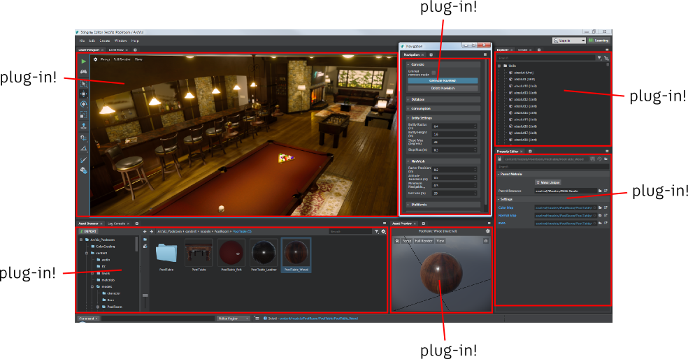
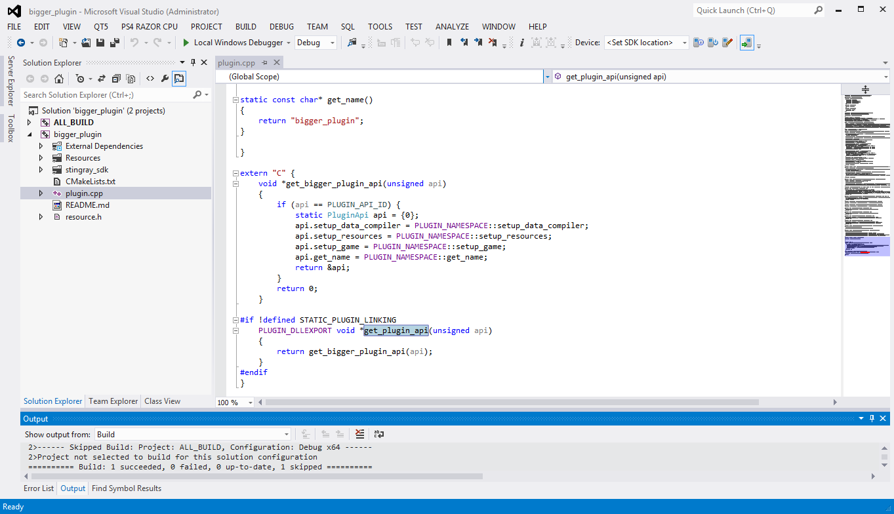
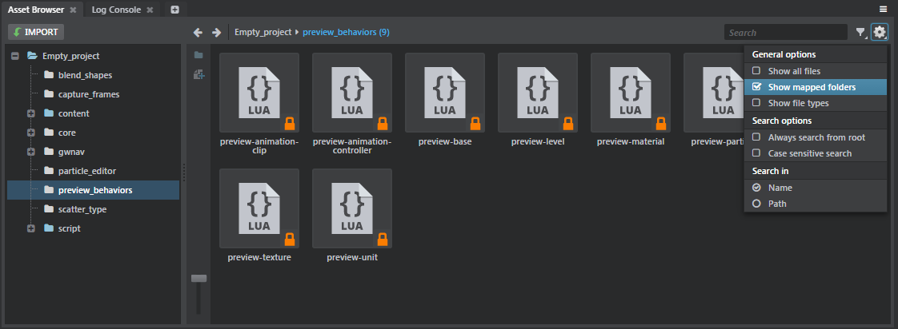

# All the Ways You Can Extend Stingray

As introduced in the ~{ System Overview }~, you can make your custom plug-in hook in to the Stingray editor, the runtime engine, and the project content. Depending on what you want your plug-in to do, you may need to integrate with one, two, or all three of these components.

The Stingray SDK is mostly focused on the first two sections below -- extending the editing tools and the runtime environment through their defined plug-in architectures. But it's worth it to lay out all the different possibilities in one place.

## Editor plug-ins

Editor plug-ins add new capabilities to the Stingray editor, typically for the purpose of creating and managing the raw content that makes up the project's source folder.

-	Editor plug-ins are typically written mostly in **HTML** and **JavaScript**. They can add new panels and dialogs, and they can interact with the project data and with the editing environment through a set of JavaScript service APIs exposed by the editor.

-	Since the editor runs an instance of the engine internally, editor plug-ins can also use **Lua** snippets to make things happen inside the engine.

	This can help control what happens in the editor's viewports -- for example, controlling the way the **Asset Preview** viewport displays assets, or drawing gizmos and debug information into the main **Level Viewport** panel.

	Or, your plug-in could use Lua to call other services and subsystems provided by the engine's Lua scripting APIs. This may be useful for raycasts and collision tests inside a level, playing audio events, doing vector math, etc.

-	Editor plug-ins can also optionally call out from JavaScript to **C** functions that you define in a *.dll*. This can be useful for heavy operations that need to be done with the fastest possible performance, or if you need to integrate directly with third-party libraries or applications.

For more information on how to extend the editor in a plug-in, see ~{ Extend the Editor }~.

Most of the panels and views that you see in the Stingray editor app are actually provided by plug-ins just like the ones you can write yourself:

## Engine plug-ins

Engine plug-ins integrate into the runtime viewing and playback engine, typically with the purpose of changing something about the way project data is loaded, or the way the data is used at runtime during the game loop.

-	Engine plug-ins are always written in **C** and compiled to *.dll* files.

-	They are invoked systematically through a plug-in API at certain times while the engine is running -- for example, when a project is first loaded, at every frame of the update loop, when the data compiler starts up, when units are spawned in the game, etc. Your plug-in can jump in at these points and control what happens next.

-	Engine plug-ins can also add new functions to the engine's Lua environment, so that the project's gameplay logic and/or editor plug-ins can call out to the C code of the engine plug-in to make stuff happen.

-	Engine plug-ins can also contain C implementations for custom Flow nodes. (Note that these C implementations also have to be accompanied in the project by data descriptions for the new nodes. See ~{ Create Custom Flow Nodes }~.)

For more information on how to extend the engine in a plug-in, see ~{ Extend the Engine }~.

## Content extensions

Stingray is a set of tools intended for creative people to use to imagine, design and create unique, new experiences that have never been done or imagined before. So the line can be very blurry between what is simply creating new project content on one hand, and what is extending the toolset on the other hand.

When you simply import new units or create new assets like shaders and levels in a project, most people would not think of that as *extending* the tools -- it's just *using* the product to create content, not changing what the tools are capable of. But what about when you add new Lua scripts? Or new custom Flow nodes and shader nodes? Assets like these are still project content -- they live in the project source folder, and they get compiled and brought into the game engine along with your levels, units, animations, etc. But they often also add new ways to use the editor and the engine in order to create other content.

Content plug-ins make new assets of all kinds available to any project that you open and build in Stingray. These new assets are treated in exactly the same way as the `core` Stingray resources -- they are "mounted" by the editor, visible in the **Asset Browser**, compiled by the engine, and usable in the project at runtime.

Typically, when you're working on a single project, you don't bother to create your own content as a plug-in -- you just create your content within the project's source folder. A content plug-in is only needed if you want a set of assets to be re-used across multiple projects, or if you need a set of assets to support another editor or engine plug-in.

Here are a few kinds of project assets that you may find particularly useful for extending what Stingray can do:

-	Custom Flow nodes that you implement in Lua scripts. See ~{ Create Custom Flow Nodes }~.

-	Custom shader nodes. Shader nodes are all defined in SJSON resources in the `core` folder. If you're comfortable with programming shaders, you can create your own custom shader nodes using the core nodes as models.

-	Render config extensions. You can customize the rendering pipeline by inserting your own render passes and shader code at specific points in the process. This is an advanced feature that we're working on documenting fully; take a look at [this blog post](https://gamedev.autodesk.com/blogs/1/post/3437113321891064420) for some thoughts on the design. To see a working example, you can download the [volumetric clouds plugin](https://github.com/greje656/clouds) and check out its *.render_config_extension* file.

-	Custom entity components. You can extend the entity system by creating your own custom types of data components. For details, see [this page](http://help.autodesk.com/view/Stingray/ENU/?guid=__stingray_help_using_entities_create_custom_component_html).

-	Loading a C DLL into Lua as an extension module, or using the LuaJIT FFI library. This is kind of a hybrid between a content plug-in and an engine plug-in:

-	Lua code that integrates with other applications or web services *via* [HTTP requests](http://help.autodesk.com/view/Stingray/ENU/?guid=__lua_ref_ns_stingray_Http_html) and/or [websocket connections](http://help.autodesk.com/view/Stingray/ENU/?guid=__lua_ref_obj_stingray_WebSocket_html), using the Lua interfaces provided by the engine.

For more information on how to set up a plug-in to expose new resources to the project, see ~{ Extend the Project Content }~.

If you choose to *Show mapped folders* in the **Asset Browser**, you can see all the asset folders that have been mounted by all of your plug-ins:

## So which do you choose?

In order to answer that question, you have to consider the role that you want your plug-in to play within the overall Stingray ecosystem.

Some examples:

-	**editor-only** plug-ins only interact with types of content resources that are already handled natively by the Stingray engine. Or else, they help a user work more effectively with those standard types of resources during their production phase. This is the case for most of the plug-ins that come built in with the Stingray editor.

	For example, the **Dependency** panel helps to track the relationships between the resources in the project as you work on your project, but it doesn't need to add any new functionality into the runtime engine in order to do its job. Similarly, the **History** panel follows the editing operations you make in the editor UI to provide support for undo-ing and redo-ing operations, but it doesn't have any effect on how the engine runs your project.

-	**engine-only** plug-ins add some new capabilities to the engine, or make the engine behave differently while running the project, without exposing those capabilities to the editing environment in any special way.

	For example, you might write an engine-only plug-in if you want to add some new functions to the Lua environment that call out to C code. You might do this to get the best possible performance when running that code, or so that you can integrate with a third-party SDK library. In this case, the engine will automatically make those new functions available for use from the project's Lua code without needing you to extend the editor or add any extra assets.

-	**content-only** plug-ins contain a set of standard Stingray assets that projects can simply use as-is if the need arises.

	For example, a content plug-in might contain a library of useful materials and textures (brick, concrete, carpet, etc.), a library of useful Flow nodes that are implemented in Lua scripts, or even a dynamic time-of-day system that is set up by custom entity components.

-	**editor-and-engine** plug-ins combine both authoring and runtime support for a new feature or capability.

 	For example, you might need to extend both the engine and the editor in order to provide end-to-end integration for a new kind of data resource. Say that you have an asset that you want to be procedurally generated at runtime in the engine from parameters set in the editor -- like a tree that should have a random number of limbs each time the project is played, or a building with a randomly generated facade. You might want to extend the engine so that your runtime code can do whatever calculations are involved in creating those meshes procedurally; and you might want to extend the editor to customize how the user creates, previews, and modifies the parameters for those types of assets.

-	**editor-and-content** plug-ins might use template content of standard types that the engine already supports in order to build or set up other assets.

	An example of a plug-in like this might be a tool for easily placing units to make a forest or a city. The editor plug-in might provide the level designer with some in-viewport tools for defining the extents of the area to be covered by the forest or city, plus an HTML panel that contains parameters for controlling things like density, maximum height, etc. Then, the editor plug-in could automate placing vegetation or buildings into the level according to those parameters. The ultimate output in this case would just a standard level full of standard units, so no changes to the engine are needed in order to consume that content.

-	**engine-and-content** plug-ins add something new to the runtime environment that needs to be supported by additional content, without changing anything about the editing environment.

	For example, suppose that you want to add some custom Flow nodes that are implemented in C. To do this, you'll need your plug-in to extend the project content by adding some new *.flow_node_definition* files that contain data descriptions for the nodes, and you'll need to extend the engine with a *.dll* that contains the C implementations for those nodes. You don't need to extend the editor in this case, since the new nodes will be used as part of the existing Flow editing system.

	Similarly, your plug-in could add a new type of entity component that would mark a game entity for some kind of special treatment by your runtime plug-in. In the editor, a game designer would be able to use the existing entity editing workflows to apply your component to whatever entities need to be marked. Each frame of the update loop, your runtime plug-in could iterate through the entities in the world, looking for the ones that have been assigned the new component.

-	**all-in-one** plug-ins integrate with all the parts of the Stingray environment. You'll probably find this necessary if you want your plug-in to add sophisticated new features for the runtime experience, backed up with a great editing experience for level designers and game authors working in the Stingray editor.

	The Navigation plug-in gives a good example of a plug-in that integrates with all three of these systems:

	-	It extends the editor with a panel that helps users generate NavMeshes for the current level.

	-	It mounts a library of helper assets: units that are pre-set with certain kinds of script data, custom Flow nodes and Lua scripts, etc.

	-	It extends the engine with a *.dll* that calls out to functions in the Navigation SDK libraries, and extends the Stingray Lua environment with an API for interacting with the Navigation system from gameplay code.

	All these plug-in components work together to make the end-to-end authoring and runtime feature possible.
