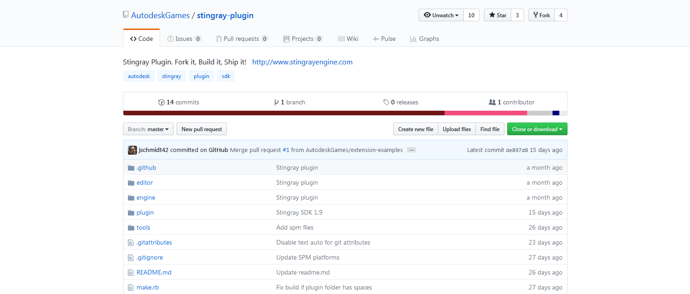
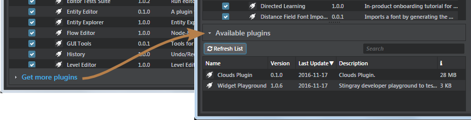

# Example Plug-ins

If a picture is worth a thousand words, a working code example is worth millions. And when it comes to plug-ins, you have a lot of examples to learn from.

## The stingray-plugin repo

The [stingray-plugin](https://github.com/AutodeskGames/stingray-plugin/) repository on GitHub is a great place to get started writing your own plug-ins. You'll find a framework all set up for you with some basic demo content, and all the tools you'll need to build libraries that extend the engine and the editor in C or C++.

For details on how to use this repository, see its main [README.md](https://github.com/AutodeskGames/stingray-plugin/blob/master/README.md) file.

You'll also learn a ton by following along with the demo tutorial in [the repository wiki](https://github.com/AutodeskGames/stingray-plugin/wiki/How-to-create-a-cool-plugin). This walks you step-by-step through the process -- you'll use the plugin repo to build up a full-featured plug-in that extends all the parts of the {{ProductName}} environment: the project content, the editor, and the runtime engine.

## Examples that come with {{ProductName}}

Most of the editing tools and panels in the interactive editor are implemented as plug-ins. They show you concrete working examples of dozens of ways to extend the editor with new interfaces and workflows, and to extend the project with new content.

Look under the `editor/plugins` folder in your {{ProductName}} installation folder.

You'll find plug-ins that define the UI and behavior of all the standard panels, like the **Asset Browser**, **Property Editor**, and even the **Level Viewport**. You can use these built-in plug-ins as examples for your own plug-ins, or even modify them directly if you want to change their behaviors.

Unfortunately, when it comes to the engine plug-ins that are shipped with {{ProductName}}, you don't have the source code. You only the pre-compiled binaries, which you'll find under the `engine/<platform>/<config>/plugins` folders. But keep reading!

## Downloadable plug-ins

In the **Plugin Manager** panel of the interactive editor, you'll find some additional plug-ins that aren't installed by default, but which you can download and install with a single click. Look for the **Get more plugins** panel.

See also ~{ Customize {{ProductName}} using Plug-ins }~.

## More examples on GitHub

We're building out an even larger set of plug-ins in a GitHub repository. You can clone or download a zip of the repo from:

<https://github.com/AutodeskGames/stingray-plugin-api-samples>.

The best thing about this repository is that you'll find sample plug-ins that extend the interactive engine and editor in C -- with full source code, and with projects that you can use to compile the plug-in code into binary *.dll* files. Not only can you learn a lot from looking at these examples, you can use them as an easy starting point for your own plug-ins by simply copying and pasting.

If you want to write an engine plug-in, or a native C extension for the editor, this repository is a must-have.

This repository also contains:

-	A copy of the SDK header files that you'll also find in your {{ProductName}} install folder. This just makes it easier and more convenient to build the samples written in C.

-	Several more plug-ins that extend the editor. These are ones that we don't think are generally useful for real productions -- they may be intended for testing and feature validation, or useful only to illustrate how certain kinds of extensions work. But they can definitely give you some interesting ideas.

For instructions on building the native code for the examples into *.dll* files, see the readme files in the repository.
