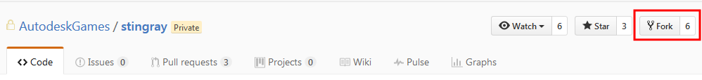

# Clone the source and manage submodules

Once you have been granted access to the GitHub repository, you can follow the instructions on this page to get a local copy of the source code that you can work with and build.

## A note about visual Git clients and submodules

The steps below show how to get the source code using the command-line tools that are installed when you install Git. We consider this method the most foolproof and the least likely to encounter problems.

You might choose to carry out the same steps using a visual Git client instead. However, visual tools often try to simplify your life by handling submodules automatically. Since you won't have access to some of the Stingray submodules by default, you may encounter problems using visual clients unless you can configure them not to recurse into the submodules when cloning and updating.

For example, when you clone your repository for the first time, you need to make sure that you do **not** use the *--recursive* option when you get your clone. Visual clients sometimes do this by default, so you might need to configure your client not to recurse into submodules. Similarly, visual clients may automatically try to update all submodules every time you checkout a new branch or pull from the main repository.

## To get a local copy of the main repository:

1.	Create your own [fork](https://help.github.com/articles/fork-a-repo/) of the **stingray** repository, if you haven't already.

	

2.	[Clone](https://help.github.com/articles/cloning-a-repository/) a local copy of your fork.

	Open a command prompt in the directory that you want to contain the source code, and run:

	`> git clone https://github.com/<your user name>/stingray`

3.	[Checkout](https://git-scm.com/docs/git-checkout) the branch you want to work in. By default, your clone will get the `develop` branch, but you may want the `master` or latest `release` branch instead. Go to the `stingray` directory, and run:

	`> git checkout master`

## To set up and clone submodules:

If you have access to the source code for either or both the PlayStation 4 and Xbox One consoles, you'll need to do a little extra work. The submodules in the **stingray** repository by default point to an internal GitHub server that runs inside the Autodesk network, which you won't be able to access. You'll need to change the submodule pointers to instead refer to the mirrors of these repositories that are accessible to you on *www.github.com*.

1.	Initialize each submodule. From a command prompt in your `stingray` repository, run `git submodule init` for each submodule that you have access to:

	~~~{nohighlight}
	> git submodule init runtime/platforms/ps4
	> git submodule init runtime/platforms/xb1
	~~~

2.	Change the repository for the submodules. Open the `.git/config` file in a text editor, and change all submodule URLs from `https://git.autodesk.com/gameware` to `https://github.com/<your user name>`. For example:

	~~~{ini}
	[submodule "runtime/platforms/ps4"]
		url = https://github.com/username/stingray-ps4.git
	[submodule "runtime/platforms/xb1"]
		url = https://github.com/username/stingray-xb1.git
	~~~

3.	Run `git submodule update` for each submodule that you have access to.

	~~~{nohighlight}
	> git submodule update runtime/platforms/ps4
	> git submodule update runtime/platforms/xb1
	~~~

	This copies the submodule's repository locally to your computer, so that you can build the engine for that platform. You should now see some new files inside your `runtime/platforms/ps4` or `runtime/platforms/xb1` folders.

## I'm getting submodule errors!

When you clone or update your Stingray repository, your git client may report errors about updating submodules, or about being unable to access the `https://git.autodesk.com` repository. As long as these errors refer to the `stingray-internal` repository, or submodule repositories for consoles that you don't have access to, you can safely ignore these errors. They won't prevent you from getting any code that you need.

To avoid seeing these errors in future:

-	Configure your Git client to not clone or update recursively. This means that when you clone or update the main `stingray` repository, your git client won't try to clone or update the missing repositories.

-	If you need to update submodules, update only the one you need instead of updating *all* submodules in the main repository.

	For example, instead of running `git submodule update`, which updates all submodules in the repository, use `git submodule update runtime/platforms/ps4` and `git submodule update runtime/platforms/xb1`.
