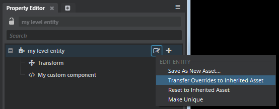
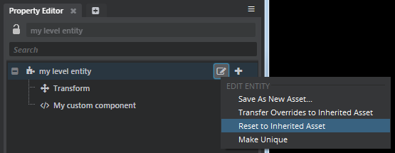
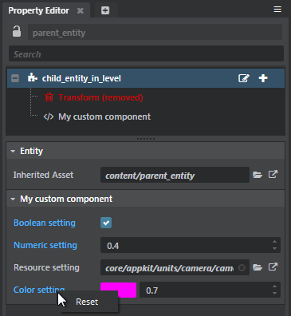
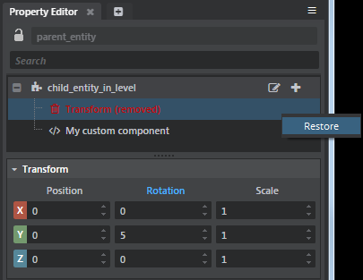

# Apply or discard overrides

When you modify an entity by removing an inherited component, by changing the value of an inherited component's property, or by adding a new component, that change is recorded on the entity as an *override*: a *difference* between the entity and its inherited asset. The override has no effect on the properties of its inherited asset, or on any other entities that inherit from the same entity asset.

This system of overriding properties from inherited assets lets you freely modify your individual entities in order to change or specialize their default sets of components and settings. However, sometimes you may want to apply a change or a series of changes from an entity back up to its inherited asset. Or, you may want to reset an entity's components and properties to match the ones it originally inherited, discarding the modifications you've made directly to the entity.

**To apply all modifications from an entity back up to its inherited asset:**

1.	Select the entity in either the ~{ Asset Browser }~ or the ~{ Explorer panel }~.

1.	In the tree view of the ~{ Property Editor }~, click the  icon and choose **Transfer Overrides to Inherited Asset** from the contextual menu.

	

	Any overrides in the entity are applied to its inherited asset, and the inherited asset is marked as modified.

1.	Make sure to save the change to the inherited asset. Press **Ctrl+Shift+S**. Or, select it in the **Asset Browser** and click the  icon in the **Property Editor**.

**To discard all modifications made to an entity:**

1.	Select the entity in either the ~{ Asset Browser }~ or the ~{ Explorer panel }~.

1.	In the tree view of the **Property Editor**, click the  icon and choose **Reset to Inherited Asset** from the contextual menu.

	

1.	Make sure to save the change to the entity.

	If the entity is an *.entity* asset, press **Ctrl+Shift+S**. Or, select it in the **Asset Browser** and click the  icon in the Property Editor.

	If the entity is in a level, press **Ctrl+S** to save the level.

**To discard overrides to selected inherited properties:**

1.	Select the entity in either the ~{ Asset Browser }~ or the ~{ Explorer panel }~.

1.	In the **Property Editor**, all properties that have been overridden from the entity's inherited asset are displayed with blue text.

1.	Right-click the name of the property whose modification you want to discard. From the contextual menu, choose **Reset**:

	

**To restore a deleted inherited component:**

1.	Select the entity in either the ~{ Asset Browser }~ or the ~{ Explorer panel }~.

1.	In the tree view of the **Property Editor**, inherited components that have been deleted in this entity are listed in red.

1.	Right-click the name of the component you want to restore. From the contextual menu, choose **Restore**.

	
