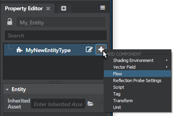
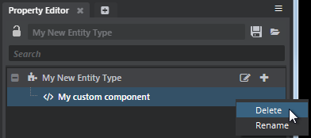

# Assign components to an entity

Each entity is assembled from a collection of different *components*. Each type of component that you assign to an entity customizes or specializes the behavior or functionality of that entity in some way. You can define your own unique kinds of entities by assigning them different kinds of components with different behaviors and settings.

**To add a component to an entity:**

1.	Select the entity you want to modify, either in the ~{ Asset Browser }~ or the ~{ Explorer panel }~.

1.	In the tree view of the ~{ Property Editor }~, click the  icon.

1.	Select a component type from the list.

	

1.	Click the  icon to save your entity.

**To remove a component from an entity:**

1.	Select the entity you want to modify, either in the ~{ Asset Browser }~ or the ~{ Explorer panel }~.

1.	In the tree view of the ~{ Property Editor }~, locate the component you want to remove.

1.	Right-click the component and choose **Delete** from the contextual menu.

	

1.	Click the  icon to save your entity.

Note that if you remove from an entity a component that has been inherited from another entity asset, the removed component remains in the list to indicate that the change is an override from the inherited entity. As with other kinds of overrides, you can apply this change back to the inherited asset, or discard the change by restoring the deleted component. See also ~{ Apply or discard overrides }~.
