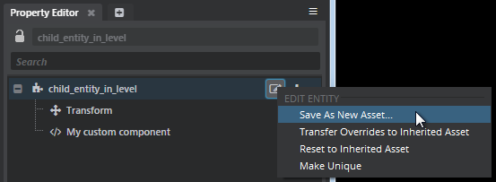
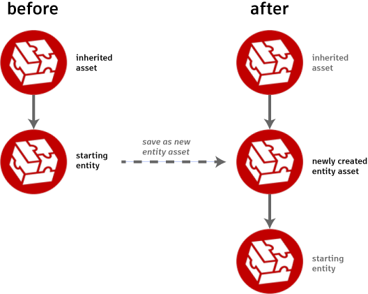

# Create a new entity asset

An *entity asset* is a definition for an entity that is saved in a *.entity* resource in your project.

There are two main reasons why you would want to create an entity asset:

-	You want it to act as an *inherited asset*, whose components and settings get inherited by one or more other entity definitions. Only entity assets can have their components and settings inherited; entities that are saved within levels cannot be inherited by other entities.

-	You want to spawn entities from this definition in the game world at runtime. See also ~{ Interact with entities during gameplay }~.

**To create a new empty entity asset:**

An empty entity asset has no components and does not inherit from any other entity asset. It is a blank slate for you to customize by adding new components.

1.	In the ~{ Asset Browser }~, find the folder that you want your new entity asset to live in.

1.	Right-click the folder and choose **Create > Entity** from the contextual menu.

1.	Give your new entity a name and click **OK**.

**To create a new entity asset from an existing entity:**

1.	Select the entity you want to save as a new asset, either in the ~{ Asset Browser }~ or the ~{ Explorer panel }~.

1.	In the tree view of the ~{ Property Editor }~, click the  icon and choose **Save As New Asset...** from the contextual menu.

	

1.	Use the window provided to set the folder location and file name for the new *.entity* resource.

1.	Click the  icon in the **Property Editor** to save the change to your original entity's parenting.

When you create an entity asset from an existing entity definition, all of the components and properties of the entity you started with are saved to the new entity asset. This includes its inherited asset, if any, and its record of modified components and settings. In addition, the entity you started with is automatically set to *inherit* from the new entity asset:

