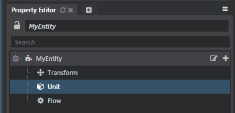

# Interact with entities during gameplay

This topic provides an overview of the ways you can interact with entities in your project during runtime gameplay.

-	For the most part, if you need to interact with an entity at runtime you will need to do so from Lua.

-	 You can set some kinds of component data values using Story. When you add an entity to an entity track in the Story Editor, you can right-click the track in order to add a new animation track for any numeric or boolean data value maintained by the entity's components. See also ~{ Story Editor }~.

-	 The entity system is not yet exposed to Flow, though you can expose any functions you need by defining custom Flow nodes (see ~{ Create custom Flow nodes in Lua }~).

## About component managers, instances and instance IDs

When you work with components, you'll need to understand the difference between component *managers*, component *IDs*, and component *instances*.

-	For each different type of component, the engine creates a component manager that is responsible for creating and updating all the individual instances of that component type. You also use the component manager to interact with individual component instances, for example to get and set property values or call functions.

-	Each individual component within an entity has to have an ID that is unique within the entity that owns it. This name is shown in the Property Editor when you have the entity selected, like **Transform**, **Unit** and **Flow** here:

	

	It's also how you get access to a particular component in Flow and Lua so that you can get or set its property values.

	Usually you'll probably want to use strings to name your components, so that you can tell them apart. But the engine stores those names internally as hashed integer values. If you're using Lua, and you need to pass in an ID to a function like `DataComponent.lookup()`, you can pass either the string value or the hash. If you pass the string, Stingray will convert it for you. But the conversion is one-way, so if you retrieve ID names from the engine by calling a function like `DataComponent.instance_ids()`, what you'll get back is the hashed integers.

-	A component *instance* represents a particular component assigned to a particular entity that has actually been spawned in the engine. Typically, you get an instance of a component from a component manager of the corresponding type, by doing one of the following:

	-	Calling the manager's `lookup()` function to get an instance with a particular ID assigned to a particular entity.
	-	Calling the manager's `instances()` function to get all instances of that component type assigned to a given entity.
	-	Calling the manager's `create()` function with a new ID to spawn a new instance of that component type dynamically.

	>	**Important:** Component instances are only valid within the frame in which you retrieve them. You *cannot* save a component instance to use in a later frame. Instead, save the component's instance ID, and use that ID to do another lookup to get the instance again next time you need it.

Managers typically allow you to interact with individual components either by passing them the instance you want to affect, or by passing them the entity and component ID that identify the instance you want to affect. In the latter case, the component manager will do the lookup for you. For example, you could use `DataComponent.set_property ( self, instance, key, value )` to set a property on an instance, or `DataComponent.set_property_by_id ( self, entity, id, key, value )` to have the DataComponent look up the instance from the entity and ID you provide.

Using the component ID can sometimes be more convenient. However, if you need to make many calls to the same component manager about the same component instance within a given frame, it's generally better if you look up the component instance yourself, to avoid the (small) overhead of extra lookup calls.

>	**Note:** The confusing thing about instances and instance IDs in Lua is that they are both exposed as numbers. You'll have to keep straight what's an ID and what's a reference to an actual instance.

## Spawn and destroy an entity

Entities that you place in a level in the Stingray Editor are automatically spawned when you load that level into your game at runtime. These entities are automatically destroyed when the level is unloaded, if they have not already been destroyed.

In addition, you can spawn entities at runtime using the following methods from the `EntityManager` API:

-	`EntityManager.create()` creates a new, empty entity in the game world. This entity has no components assigned to it and does not inherit from any other entity asset. It is a blank slate for you to customize by adding new components.
-	`EntityManager.spawn()` creates a new entity from an entity asset that you pass to the function. This entity will be created with all of the components and data that you have set up in the entity asset you specify.

When you no longer need an entity in your game, you can destroy it by calling `EntityManager.destroy()`. You can call this function for any entity, regardless of whether you created the entity dynamically by calling the functions above, or whether that entity was spawned automatically when its level was loaded into the game.

## Get a list of entities

There are two main ways to get a list of the entities:

-	`stingray.World.entities()` returns a list of all entities that are currently "alive". This includes:

 	-	Entities that were spawned dynamically by a Lua script.
	-	Entities that were placed in a level in the Stingray Editor and spawned when that level was loaded. The list will not include any entities that have been destroyed dynamically by a Lua script or when the level was unloaded.

-	`stingray.Level.entities()` returns a list of all entities that were placed into the specified level in the Stingray editor and spawned when that level was loaded. The list will not include any entities that have been destroyed dynamically by a Lua script or when the level was unloaded.

## Assign and remove components

You can set up an entity in your gameplay code by adding and removing components dynamically, just like you can in the Stingray Editor. You do this through the component manager for the kind of component you want to create or destroy for an entity. You retrieve this component manager from the `EntityManager`.

For example:

~~~{lua}
function add_remove_components(entity)
    -- get the component managers
    local data_component_manager = stingray.EntityManager.data_component()
    local xform_component_manager = stingray.EntityManager.transform_component(SimpleProject.world)

    -- assign a new data component
    local id = "My New Data Component"
    local new_component_id = stingray.DataComponent.create(data_component_manager, entity, id)

    -- remove the first instance of a given component on an entity
    local xform_component_ids = { stingray.TransformComponent.instance_ids(xform_component_manager, entity) }
    if next(xform_component_ids) then
        stingray.TransformComponent.destroy(xform_component_manager, entity, xform_component_ids[1])
    end

	-- remove a component instance with a specific ID
	local my_instance = stingray.DataComponent.lookup(data_component_manager, entity, "My New Data Component")
	if my_instance then
		stingray.DataComponent.destroy(data_component_manager, my_instance)
	end
end
~~~

## Set and retrieve data for a component

You can use Lua to access the components that you have assigned to an entity. Once you have the component instance, the API of the relevant component manager object provides functions to interact with that component.

For example, the following function shows how to use the `TransformComponent` to get the world space position of an entity from its transform component. It also shows how to use the `DataComponent` manager API to set a new data value for a custom data component.

~~~{lua}
function change_component_values(entity)
    -- get the component managers
    local data_component_manager = stingray.EntityManager.data_component()
    local xform_component_manager = stingray.EntityManager.transform_component(SimpleProject.world)

    -- get component values from a transform component.
    -- there can only be one transform component on an entity, so instances() returns a single ID.
    local xform_component_id = stingray.TransformComponent.instances(xform_component_manager, entity)
    if xform_component_id then
        -- get its data values
        local world_matrix = stingray.TransformComponent.world_pose(xform_component_manager, entity)
        -- use the values
        print("Entity's world space transform: " .. tostring(world_matrix))
    end

    -- set new data component values on a data component.
    -- there can be many different data components with different fields, so we
    -- need to iterate through a list of IDs to find the one that has the value we want to set.
    local data_component_ids = { stingray.DataComponent.instances(data_component_manager, entity) }
    for index, data_component_id in ipairs(data_component_ids) do
        -- check that the data component contains the field we want to change...
        local property_value = stingray.DataComponent.get_property(data_component_manager, entity, data_component_id, "custom_numeric_field")
        if property_value then
            -- set the new value
            stingray.DataComponent.set_property(data_component_manager, entity, data_component_id, "custom_numeric_field", 250)
        end
    end
end
~~~
