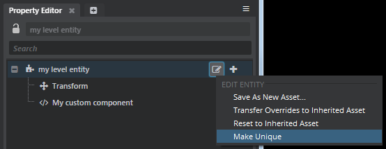

# Set or remove an inherited asset

Each entity can *inherit* all of the components, settings and properties of another entity. At any time, you can set a new *inherited asset* for an entity, or remove its existing inherited asset.

Note that only entities that are defined in *.entity* resources can be used as inherited assets. An entity that lives only within a level cannot be set as a parent, although you can create a new entity asset from that level entity. See ~{ Create a new entity asset }~.

**To set a new inherited asset:**

1.	Select the entity you want to modify in either the ~{ Asset Browser }~ or the ~{ Explorer panel }~.

1.	In the ~{ Property Editor }~, find the **Inherited Asset** setting.

1.	Click the  folder to choose the entity asset that you want your entity to inherit from.

After the change, your entity will inherit any components and properties set in the new inherited asset.

If the entity already had a different inherited asset:

-	it will no longer inherit any components or properties from its old parent.
-	any components that had been set directly on the entity will be retained after the change.

**To remove an inherited asset:**

When you remove an entity's inherited asset, you make it a *unique* entity. The entity retains all of its current components and settings, regardless of whether those properties came from the inherited asset or whether they had been set directly on the entity. However, after the change, none of the entity's components and settings are considered to be inherited from anywhere. Changes you make to the old inherited asset will no longer get inherited by the newly unique entity.

1.	Select the entity you want to modify in either the ~{ Asset Browser }~ or the ~{ Explorer panel }~.

1.	In the tree view of the ~{ Property Editor }~, click the  icon and choose **Make unique** from the contextual menu.

	

1.	Make sure to save the change to the child entity.

	If the child is an entity asset, press **Ctrl+Shift+S**. Or, select it in the **Asset Browser** and click the  icon in the Property Editor.

	If the child is in a level, press **Ctrl+S** to save the level.
