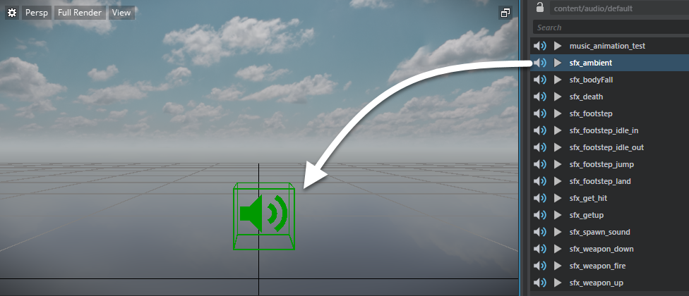
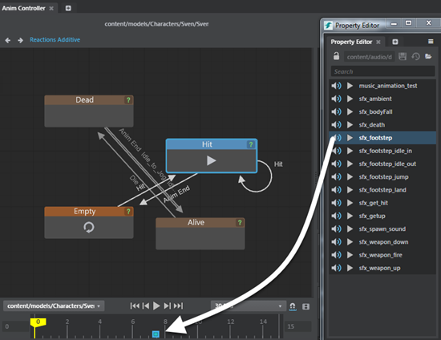

# Add audio sources to levels and animation controllers

## To add audio sources to a level

1. Do one of the following:
- ~{ Create a new audio source }~.
- In the **Asset Browser**, select an audio source and drag-and-drop it into the **Level Editor**.

  	

## To add audio sources to an animation controller

Adding audio events to clips and animation controllers triggers Wwise audio automatically. The audio sources play back when the clip is played.

1. Open your sound bank, and select an audio source in the **Property Editor**.
2. Drag and drop and audio source onto the timeline of the selected state in the **Anim Controller Editor**. A new flow event is created for the audio event.

