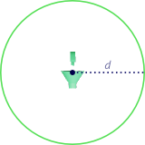
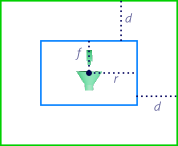
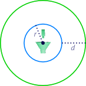
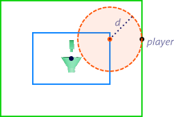
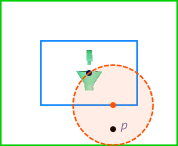
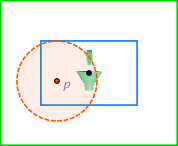
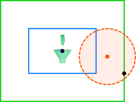
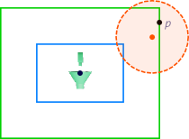
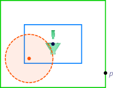
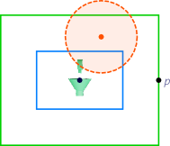

# About audio sources

Audio sources are sound emitters that you place at specific 3D positions within your levels. You can use them to associate sounds with particular locations or objects in your scene. By adjusting the positioning, configuration and attenuation of the source, you can achieve some interesting and complex results that can enrich your level's audio environment.

When a listener comes within range of an audio source that you have placed in your level, the audio source emits a Wwise audio event. In the Wwise authoring tool, you would typically make that event name trigger the playback of an audio clip that you want to be localized at the position of the source.

>  For a video tutorial that helps you understand working with audio sources in Stingray, go [here](http://area.autodesk.com/learning/understanding-audio-sources).

Note that the attenuation settings that you configure for your sound events in Wwise have a large effect on the way your source will be perceived in the game. For details on setting up attenuation in the Wwise authoring tool, see the [Wwise documentation](https://www.audiokinetic.com/library/2015.1.2_5457/?source=Help&id=applying_distance_based_attenuation) or [this quick tip video](https://www.youtube.com/watch?v=v0D4lJkffII).

## Audio source shapes and ranges

The effective outer range of an audio source -- that is, the distance at which the audio source may be triggered by the presence of a listener -- is determined by two factors:

-	The shape and size of the audio source itself, which determine an **inner volume** for the source, and
-	The attenuation range set for the audio source's event in Wwise.

### Point shapes

If the audio source has a **Point** shape, its outer range is a sphere around the location of the audio source. The radius of this sphere is defined by the maximum attenuation distance (*d*) of the sound event.

### Box shapes

An audio source with a **Box** shape has an inner volume that is defined by distance values along its local right (*r*), front (*f*) and up axes. These values are set as properties of the audio source. Its outer volume is a box that enlarges the inner volume by the maximum attenuation distance (*d*) of the sound event.

### Sphere shapes

An audio source with a **Sphere** shape has an inner volume whose radius (*r*) is set by a property of the audio source. Its outer volume is a sphere that enlarges the inner volume by the maximum attenuation distance (*d*) of the sound event.

## Audio source positioning

Once an audio source is triggered, the actual sound event may not always be located at the same 3D position. The position of the sound event is determined by the positioning mode set for the audio event.

### Closest to Listener positioning mode

In this positioning mode, the sound event is always located at the closest point to the listener that lies within the **inner volume** of the audio source.

If the audio source is a point shape, this will always be at the position of the audio source itself.

If the audio source is a box or sphere shape, the sound event will be located on the surface of the inner volume at the point closest to the listener. As the listener moves around within the outer volume of the audio source, the position of the sound event follows the listener at the closest point within the inner volume. When the listener is inside the inner volume, the sound is located at the listener's position.

The overall effect of this positioning mode is that while the listener is at or within the inner volume, the sound is at maximum volume. While the listener is in between the inner and outer volumes the attenuation falls off smoothly with the distance from the inner volume according to the curves set in the Wwise Attenuation Editor.

For instance, when the player (*p*) enters the outer volume from the right, the event plays from the red spot on the inner volume. The dotted line shows the limit of the sound's attenuation range. As the player moves around, the sound tracks the player's position by moving to the nearest point on the inner volume. When the player enters the inner volume, the sound follows the position of the player.

### Random Around Listener positioning mode

In this positioning mode, the sound event is located at a random position that is closer to the listener than the maximum attenuation distance set for the sound event. This random position is determined at the time the listener enters the outer volume of the audio source, and **remains fixed** thereafter until the listener exits the outer volume of the audio source.

For instance, in the following images, each time the player enters the outer volume, a new location is chosen for the sound that is closer to the player than the maximum attenuation distance of the sound. This ensures that the player will hear the sound immediately, though the exact position of the sound will be randomized.

For example:

## Random in Shape positioning mode

In this positioning mode, the sound event is located at a random position that lies anywhere within the outer volume of the audio source. This random position is determined at the time the listener enters the outer volume of the audio source, and **remains fixed** thereafter until the listener exits the outer volume of the audio source.

Note that this may mean that the sound is not actually audible to the listener at the time the random position is chosen, since it is likely to be placed at a greater distance from the listener than the maximum attenuation distance of the sound.

For example:

