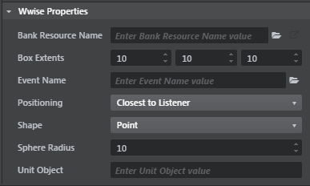

# Configure an audio source

Audio sources are represented in the **Level Viewport** as a small speaker cone:

When you have one or more audio sources selected in the viewport, you can configure their settings in the **Property Editor**:

<dl>
<dt>Bank Resource Name</dt>
<dd>Sets the audio sound bank that will be loaded for use by this audio source. This value is used only when testing your level within the interactive editor. In your final game, you will need to handle the bank loading yourself. See ~{ Load sound banks at runtime }~. This bank must contain an event that matches the name set in the **Event Name** value.</dd>
<dt>Box Extents</dt>
<dd>Sets the half-extents of the audio source's inner volume along its local right, front and up axes respectively. The actual dimensions of the inner volume will be twice these values. Used only when the **Shape** value is set to *Box*.</dd>
<dt>Event Name</dt>
<dd>Specifies the name of the Wwise event that will be triggered by this audio source.</dd>
<dt>Positioning</dt>
<dd>Determines how the origin of the sound event is chosen when the listener comes within range of this audio source. For details on how this positioning mode is interpreted, see ~{ About audio sources }~.</dd>
<dt>Shape</dt>
<dd>Determines the shape of the audio source's playback environment.  For details on how this shape is interpreted, see ~{ About audio sources }~.</dd>
<dt>Sphere Radius</dt>
<dd>Sets the radius of the audio source, used only when the **Shape** value is set to *Sphere*.</dd>
<dt>Unit Object</dt>
<dd>Specifies the name of a node within the audio source unit. If specified, the sound will be emitted from the position of this node rather than the position of the audio source unit. This value is currently unused, as the default audio source unit is not currently configurable. If you need the flexibility to set this value, see the `stingray.WwiseWorld.add_soundscape_unit_source()` Lua function.</dd>
</dl>

---
Related topics:
-	~{ Create a new audio source }~

---
