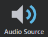

# Create a new audio source

To create a new audio source in a level:

1.	Open the ~{ Create panel }~.

2.	In the **Misc** category, select the **Audio Source** icon to activate the **Place** tool.

	

3.	Click a location in your level to place a new source. While the **Place** tool is active, you can add as many sources as you need.

4.	When you are done, click the **Audio Source** icon again, or switch to a different viewport interaction tool.

---
Related topics:
-	~{ Configure an audio source }~

---
