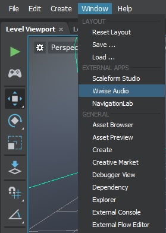
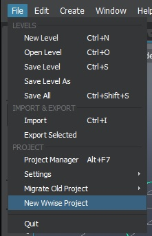

# Create or open a Wwise project

>  You can also find a video tutorial on setting up your audio project [here](http://area.autodesk.com/learning/set-up-an-audio-project).

When creating a new Stingray project you can do so in two different ways.
By creating a completely new 'blank' Stingray project or by using one of
the templates.

If you use one of the ~{ Template projects }~, a Wwise project is created adjacent your Stingray project, and linked to it.

Select **Window > Wwise Audio** to open the authoring tool. This is the way to access
your audio project for the associated Stingray project.

If your project was not created from a template, you need to create
a new Wwise project alongside your new Stingray project. To do this, select **File > New Wwise Project**.

This creates a new Wwise project folder adjacent to the project folder, and
configures it to export to the Stingray project audio directory.

To update the settings of your Wwise project such as export path and post generation steps, select **File > Settings > Update Wwise Project Settings**.
