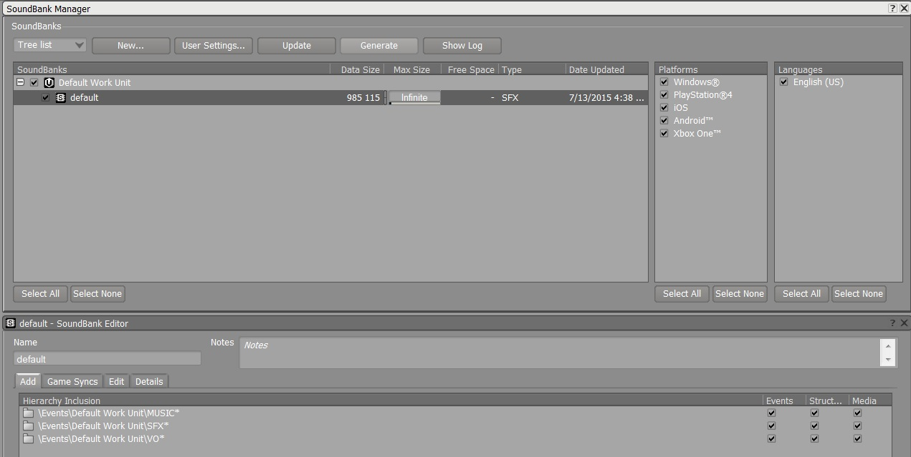

# Generate sound banks

1. In Wwise, select Layout > Soundbank (or press F7).

2. Make sure all sound banks, platforms, and languages you want to generate are selected.

3. Click **Generate**.

	

Wwise builds the sound banks along with some meta-data and places them in the correct spots on disk in \content\audio.
