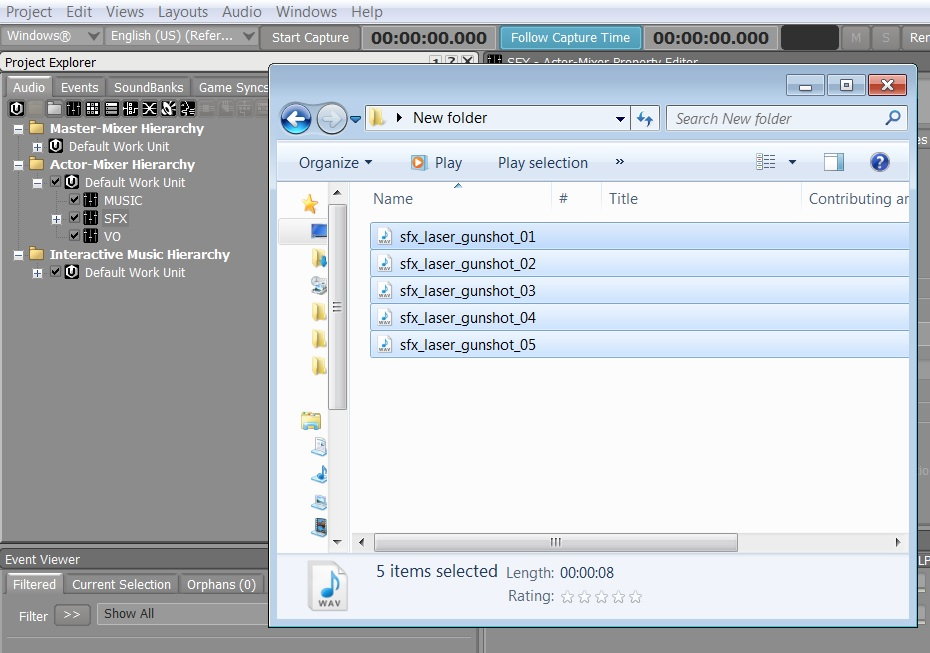
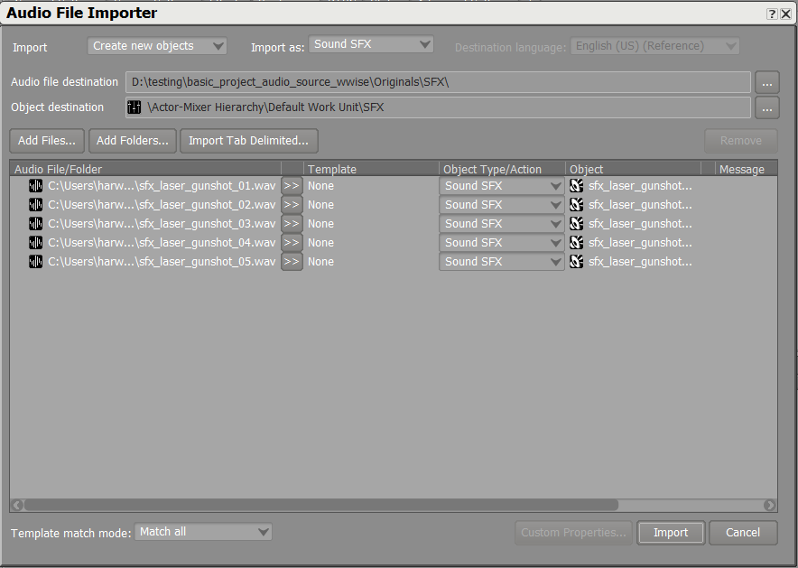
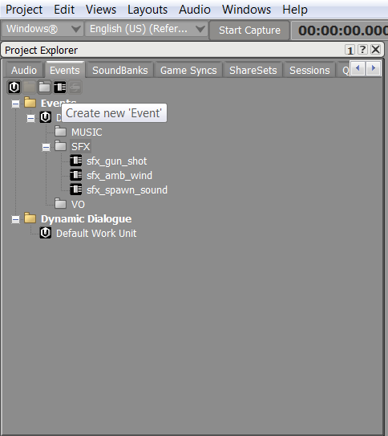
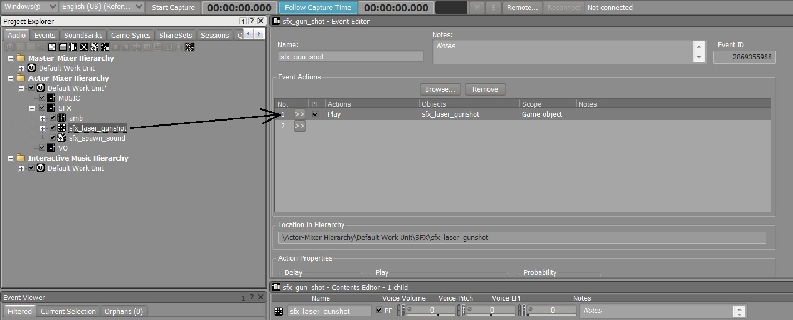

# Importing audio

You'll use the ~{ Wwise authoring tool }~ to import audio into your {{ProductName}} project.

>  You can also find a video tutorial on importing audio [here](http://area.autodesk.com/learning/importing-audio).

1.  Open the Wwise tool by selecting **Window > Wwise Audio**.

2.  Find the audio you want to import and drag and drop it into the Actor-Mixer Hierarchy.

	

3.  Click **Import** in the audio importer dialog box.

    

4.  Create a new event to trigger the audio you just imported by doing the following:

	- Select the Events tab on the project explorer.
	- Select or create a folder where you want to put the event.
	- Associate the imported audio to the event.

        

        
