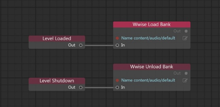

# Load sound banks at runtime

In order for any sounds to play at runtime in your interactive app, you have to load the sound bank resources that contain your audio files into the engine's memory. When you're done using a sound bank, you should also unload it from the engine in order to avoid having your audio files take up extra space in memory.

You can manage loading and unloading your sound banks in three different ways, described in the following sections.

## Load sound banks using Flow

Load and unload your sound banks by triggering the **Audio > Wwise > Banks > Wwise Load Bank** and **Audio > Wwise > Banks > Wwise Unload Bank** nodes.

For example, a typical usage would be to load the sound banks that you need for each level within the flow graph for that level, in response to the **Event > Level Loaded** event emitter node. Then, you can unload the banks in response to the **Event > Level Shutdown** event.

## Load sound banks using Lua

Load and unload your sound banks by calling the `stingray.Wwise.load_bank()` and `stingray.Wwise.unload_bank()` functions. Pass as a parameter the resource name of the sound bank you want to load.

For example, this code snippet automatically loads and unloads a sound bank with the same resource name as the current level, if you are using the Appkit and the `SimpleProject` in your project:

~~~{lua}
function Project.on_level_load_pre_flow()
	stingray.Wwise.load_bank(SimpleProject.level_name)
	...
end

function Project.on_level_shutdown_post_flow()
	stingray.Wwise.unload_bank(SimpleProject.level_name)
	...
end
~~~

## Load sound banks in a resource package

You can make use of the {{ProductName}} resource packaging system to load and unload your sound banks at the same time as you load and unload bundles of other types of resources. For background about how resource packages work, see the topics under ~{ Loading and unloading content at runtime }~.

If you follow this approach, it is not necessary to issue load and unload commands in Lua and Flow.

To load and unload sound banks as part of a resource package, add a `wwise_dep` key to the resource package SJSON file. Set its value to a list of the *.wwise_dep* resource files in your project's source folder. There should be one of these *.wwise_dep* files automatically generated for each bank in your project.

For example:

~~~{sjson}
wwise_dep = [
	"content/audio/Init"
	"content/audio/menu"
	"content/audio/menu.level_1"
	"content/audio/menu.level_2"
]
~~~

Regardless of whether you choose to use this system for loading your sound banks, you should make sure that your project **always** loads the `content/audio/Init` *.wwise_dep* resource in your boot package. This resource contains metadata that the Wwise plug-in needs at runtime in order to be able to work with your banks and events.
