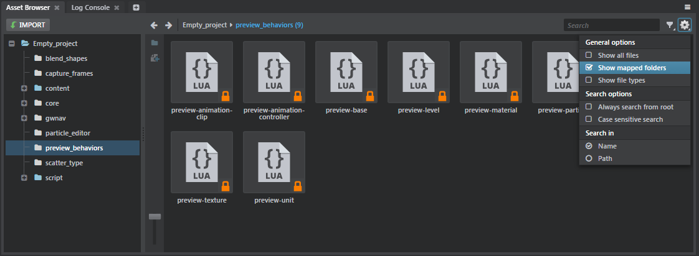

# Extend the project content

Your plug-in can use the `resources` extension to make new assets and content available in the project. When your plug-in is loaded into the Stingray editor, users are able to work with these resources just like any other assets that live in their project source folder or in the `core` resources folder.

For example, you could accompany your plug-in with a *.script_flow_nodes* file that defines some custom Flow nodes. A user with your plug-in installed would then be able to add your custom nodes into their Flow graphs. Or, your plug-in could include pre-made assets like units, materials and particle effects for users to drop directly into their levels.

Each folder that you share through a resource extension is treated as a "mapped folder", similar to the core resources folder. That means:

-	the **Asset Browser** does not show the assets by default. They will only be shown when the **Show mapped folders** or **Show all files** options are active.

	

-	the assets in your shared folder are read-only in the editor. In order to modify them, a user would need to duplicate them in the project folder.

See also [Working with core resources](http://help.autodesk.com/view/Stingray/ENU/?guid=__stingray_help_managing_content_core_resources_html).

## Configuration

Every resource extension accepts just one configuration parameter:

~~~{sjson}
extensions = {
	resources = [
		{
			path = "my-plugin-assets"
		}
	]
}
~~~

`path`

>	The path to a folder that contains the resources you want to make available to the editor. This path is relative to the location of your *.plugin* file.
>
>	Note that whatever folder path you specify here is mounted by the editor as if it were inside your project. Its contents will *override* the contents any folder that already exists with the same name inside the project, and any folder with the same name that has already been mounted by a previously loaded plug-in. (The other folders won't be deleted from disk, but their contents won't be visible to the project anymore.) Try to make sure your plug-in path will be unique. We recommend using as a prefix the unique name of your plug-in as set in your *.plugin* descriptor.

## Resource extensions and resource packages

Stingray offers a system for streaming bundles of resources in and out of memory while the game is running. This is typically used when a project grows too large to fit all resources into memory at the same time. For background information, see the pages under [Loading and unloading content at runtime](http://help.autodesk.com/view/Stingray/ENU/?guid=__stingray_help_managing_content_loading_unloading_html).

If a project that uses custom resource packages like this also uses any resources shared by a plug-in's resource extensions, that project's authors need to make sure that their resource packages also include whatever resources it needs from the plug-in's resource folders. See ~{ Distribute and Install a Plug-in }~.
