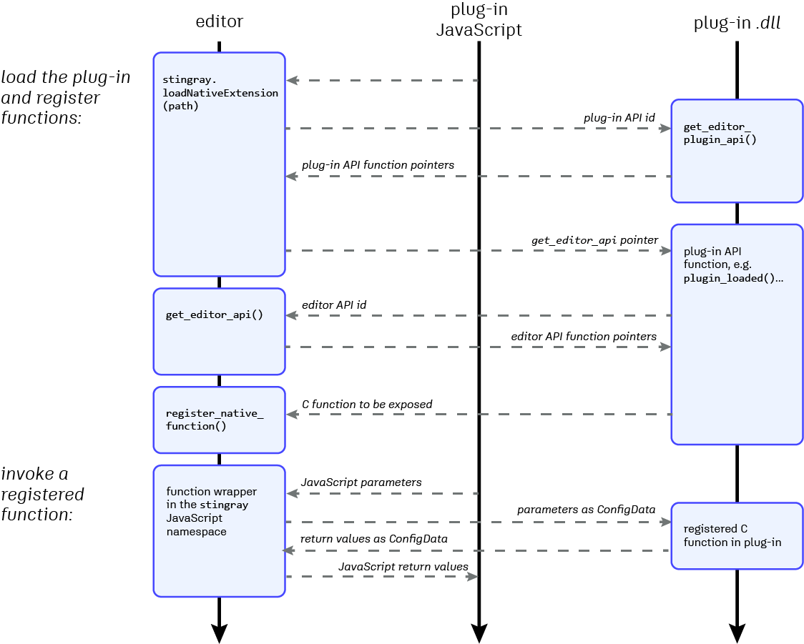

# Call out to C code from JavaScript

You can make your plug-in call out from the editor's JavaScript environment to run C code in a *.dll* file that you provide along with your plug-in. You define some functions in your C code, and use a set of APIs provided by the editor to expose those functions to the editor's JavaScript environment. When you invoke those functions from your plug-in's JavaScript code or from an action extension, your C function is automatically invoked.

This can be useful anytime you need the editing environment to be able to run native code. For example, you might need to call out to another application or library to do some processing; you might want to take advantage of operating system functions that aren't exposed through the editor's JavaScript services; or if you need to do some processing that is especially CPU-intensive, you might want to implement that in C rather than in JavaScript.

Unlike other editor extensions, you don't have to add anything into your *.plugin* file to set up a *.dll* extension. However, you do have to follow the instructions on this page to write your C code, compile to a *.dll* file, tell the editor in your plug-in's JavaScript when you want to load and unload the library, and finally call the exposed C functions from JavaScript.

## More resources

-	The example plug-in repository contains an example that uses a *.dll* to extend the editor. If you don't already have these examples, see ~{ Example Plug-ins }~.

	The one you'll want to look at is under `samples/editor_native_code`.

-	You'll need the SDK header files. You can find them under `stingray_sdk` in the example repository, or under `plugin_sdk/editor_plugin_api` in your Stingray installation folder.

-	The [reference documentation](../../editor_c/index.html) contains a browsable companion to the APIs defined in the SDK header files.

## Editor and plug-in interactions

The editor's C plug-in interface is based around a consistent pattern of interactions between the editor and the plug-in. All of these interactions are based on a shared set of API definitions. Each side queries the other to retrieve the APIs that the other side supports:

-	The editor first queries the plug-in for its API by calling a predetermined `get_editor_plugin_api` function. The plug-in provides the editor with a struct that contains pointers to whatever functions the plug-in implements from their shared plug-in API definition.

-	When the editor calls those functions defined by the plug-in, it passes along a `get_editor_api` function pointer of its own. The plug-in can call that function to query the editor in return, in order to retrieve APIs that expose editor services to the plug-in. The plug-in can then call functions in those returned APIs in order to make the editor perform the tasks it needs -- typically, to register a new function to the JavaScript environment.

The following image summarizes this workflow:

This overall pattern is very similar to the way the Stingray engine interacts with plug-ins that extend its runtime capabilities. See ~{ Extend the Engine }~.

## Synchronous vs Asynchronous

The functions that you register in your plug-in can run either synchronously or asynchronously in the JavaScript environment.

The editor uses the [Chromium Embedded Framework (CEF)](https://bitbucket.org/chromiumembedded/cef) to display HTML and run JavaScript inside its widgets. CEF runs multiple processes:

-	The main process, which handles window creation, painting and network access, is called the *browser* process.

-	Rendering and JavaScript execution occur in a separate process, called the *render* process.

Synchronous functions run in the render process, and are blocking calls. Asynchronous functions run in the browser process (or in the UI thread that belongs to the browser process), and do not block the process. They return a JavaScript `Promise` that can be used to synchronize future operations. Asynchronous functions are especially useful when you interact with the user interface, like creating a new widget. For a bit more on using promises and asynchronous JavaScript, see ~{ Tips for developing plug-ins }~.

In order to register functions in either mode, your plug-in has to load your *.dll* using an editor API that is specific to that mode. You can load your extension using both modes at the same time, but each time the *.dll* will be loaded by a different process. There is currently no way for your plug-in to communicate between the two instances using the asynchronous and synchronous modes. That means that you'll probably find it better to choose either the synchronous or the asynchronous mode and stick with it for all the functions you register.

## Getting started

These are the basic steps for writing a *.dll* that extends the editor, and getting your plug-in's JavaScript code to call out to it:

1.	Include the `plugin_api.h` file in your C code.

	~~~cpp
	#include "editor_plugin_api/editor_plugin_api.h"
	~~~

	When the editor and the plug-in call each other as shown in the diagram above, they use a shared set of IDs to identify the APIs that they are requesting. Each ID always corresponds to a particular struct, defined in the `editor_plugin_api.h` file. So both the editor and the plug-in need to include this file in order to make sure that the identifiers and API definitions match.

1.	Define a function with the following signature:

	~~~{cpp}
	__declspec(dllexport) void *get_editor_plugin_api(unsigned api)
	~~~

	The plug-in interface uses C rather than C++, to avoid [ABI incompatibilities](https://en.wikipedia.org/wiki/Application_binary_interface) between different versions of C++ and different compilers. If you want to compile your plug-in using C++, you can wrap your `get_editor_plugin_api` function in an `extern C` block, like this:

	~~~{cpp}
	extern "C" {
		__declspec(dllexport) void *get_editor_plugin_api(unsigned api)
		{
			...
		}
	}
	~~~

	This avoids the function name becoming mangled in the compiled *.dll*.

1.	Each time the editor calls your plug-in's `get_editor_plugin_api` function, it passes an `EditorPluginApiId` that identifies an interface that your plug-in can provide. If you want your plug-in to support the requested interface, your implementation of `get_editor_plugin_api` should respond by creating a new instance of the struct that matches that requested API. For each function in that interface that you want your plug-in to support, you should set the pointer for that function in your instance to a function that you write in your plug-in. Once you've set up all the functions you want to support, return the struct.

		The editor requests two different plug-in APIs from your plug-in: one for your plug-in to use when your want to register synchronous functions, and one for asynchronous functions. See the following sections for details. This example shows how to fulfill a request for the synchronous plug-in API (`EditorPluginSyncApi`):

		~~~{cpp}
		__declspec(dllexport) void *get_editor_plugin_api(unsigned api)
		{
			if (api == EDITOR_PLUGIN_SYNC_API_ID) {
		        static struct EditorPluginSyncApi editor_api = {nullptr};
		        editor_api.plugin_loaded = &PLUGIN_NAMESPACE::EditorTestPlugin::plugin_loaded;
		        editor_api.get_name = &PLUGIN_NAMESPACE::EditorTestPlugin::get_name;
		        editor_api.get_version= &PLUGIN_NAMESPACE::EditorTestPlugin::get_version;
		        editor_api.shutdown = &PLUGIN_NAMESPACE::EditorTestPlugin::shutdown;
		        return &editor_api;
		    }
			return nullptr;
		}
		~~~

		You'll need to implement those functions in your plug-in -- like `plugin_loaded()`, `get_name()`, `get_version()`, and `shutdown()` in the example above. The editor uses the struct you return to call the functions you've defined.

1.	So far, you've set up the editor to call out to your plug-in at specific times -- when your *.dll* is loaded and unloaded.

	When the editor calls your plug-in's implementation of the `plugin_loaded()` and `shutdown()` functions, it passes a `get_editor_api` function that you can use to request any service APIs you need from the editor. In each call, you pass a value from the `EditorApiId` enumeration to tell the editor which interface you want. Once you have one of these editor APIs, your plug-in can call its functions to register and unregister C functions so that they can be invoked from JavaScript. Typically, your plug-in will register these functions in `plugin_loaded()` and unregister them in `shutdown()`.

	The exact editor service APIs you need to retrieve, and the functions your plug-in should use in order to register and unregister functions, are different depending on whether you want to register synchronous or asynchronous functions. See the sections below for details.

1.	Compile your plug-in to a *.dll* file.

	This can be tricky if you're not used to developing in C. We really recommend starting from the example plug-in, which is all set up with its own Visual Studio project. Note that you must target the `x64` platform.

1.	In your JavaScript plug-in, you need to tell the editor when to load and unload your compiled *.dll* by calling functions in the `stingray` JavaScript namespace. While your *.dll* is loaded, your plug-in's JavaScript code can invoke any of the functions registered by your *.dll*. How you do this is slightly different depending on whether your functions will be invoked synchronously or asynchronously. See the following sections for details.

### Registering and calling synchronous functions

If you want to register functions that will be called synchronously from JavaScript, your plug-in's implementation of the `get_editor_plugin_api()` function should check for the `EDITOR_PLUGIN_SYNC_API_ID`. When the editor passes this ID to `get_editor_plugin_api()`, your plug-in should create a new `EditorPluginSyncApi` struct, set up its members to point to functions in your plug-in, and return that struct to the editor.

Then, when you want to register synchronous functions with the editor, you have a choice of three different editor service APIs that you can request from the editor: `EditorApi`, `EditorApi_V2`, and `EditorApi_V3`. The only difference is in the kind of handler that you can register:

-	`EditorApi` and `EditorApi_V2` register pointers to C functions. If you use the V2 signature, the editor also passes your function a pointer to the `get_editor_api` function, so that your function can retrieve other editor APIs (like the `EditorEvalApi` or `EditorLoggingApi`).

-	`EditorApi_V3` also handles the `std::function` type, so you can register lambda expressions.

In all cases, the APIs behave the same way:

-	You register a function by calling `register_native_function()`, passing a namespace and function name that determine how the function should be exposed to JavaScript. We recommend using your plugin name as the namespace, to reduce the chances of trying to register a function that has already been registered by another plug-in.

	You'd typically do this in your implementation of `EditorPluginSyncApi::plugin_loaded()`, which is called when the *.dll* is loaded from JavaScript.

-	When your function handler is no longer needed, you should unregister it by calling `unregister_native_function()`. Use the same namespace and name to identify the function you want to unregister.

	You'd typically do this in your implementation of `EditorPluginSyncApi::shutdown()`, which is called when the *.dll* is unloaded from JavaScript.

On the JavaScript side:

-	To load your *.dll* into the editor, call `stingray.loadNativeExtension()`. Pass this function the absolute path to your *.dll* file on disk. The function returns an identifier that you'll use later to unload the plug-in.

	**Tip:** you can use the `getPlugin()` function from the `services/plugin-service` module to retrieve info about your plugin. The `$dir` member of the returned object gives you the directory of the plug-in's `.plugin` file, so you can construct the path assuming that you know the relative path from your *.plugin* file to your *.dll*.

-	To invoke a registered function from JavaScript, you call it as `window.namespace.name()`, using the namespace and function name that you used to register it from C.

-	To unload your *.dll* when you no longer need its functions, call `stingray.unloadNativeExtension()`. Pass it the identifier that the editor returned to you when you loaded the *.dll*.

### Registering and calling asynchronous functions

If you want to register functions that will be called synchronously from JavaScript, your plug-in's implementation of the `get_editor_plugin_api()` function should check for the `EDITOR_PLUGIN_ASYNC_API_ID`. When the editor passes this ID to `get_editor_plugin_api()`, your plug-in should create a new `EditorPluginAsyncApi` struct, set up its members to point to functions in your plug-in, and return that struct to the editor.

Then, to register asynchronous functions with the editor, you use the `EditorAsyncApi`:

-	You register a function by calling either `register_async_function()`. This makes your asynchronous function run in the CEF browser process. Alternatively, if you want it to run in the GUI thread of the Qt application, use `register_async_gui_function()` instead. This might be useful if your C function will be providing some UI components and you want to keep them responsive.

	Whichever function you call, you need to pass a unique name for your function that you'll use later to identify it in your JavaScript code. We recommend including your plugin name somewhere in the name, to reduce the chances of trying to register a function that has already been registered by another plug-in. Since this identifier is just a string, it can contain characters that you wouldn't be able to use when naming a synchronous function, like `.`. For example, you could register your function as `plugin-name.function-name`

	You'd typically do this in your implementation of `EditorPluginSyncApi::plugin_loaded()`, which is called when the *.dll* is loaded from JavaScript.

-	When your function handler is no longer needed, you should unregister it by calling `unregister_async_function()` or `unregister_async_gui_function()`. Use the same unique name to identify the function you want to unregister.

	You'd typically do this in your implementation of `EditorPluginSyncApi::shutdown()`, which is called when the *.dll* is unloaded from JavaScript.

On the JavaScript side:

-	To load your *.dll* into the editor, call `stingray.loadAsyncExtension()`. Pass this function the absolute path to your *.dll* file on disk. The function returns a Promise, which resolves to an identifier that you'll use later to unload the plug-in.

	**Tip:** you can use the `getPlugin()` function from the `services/plugin-service` module to retrieve info about your plugin. The `$dir` member of the returned object gives you the directory of the plug-in's `.plugin` file, so you can construct the path assuming that you know the relative path from your *.plugin* file to your *.dll*.

-	To invoke a registered async function from JavaScript, you call `stingray.hostExecute()`, passing the identifier that you used to register the function from C. The return value is a Promise that resolves to whatever object your C function returned, if any.

-	To unload your *.dll* when you no longer need its functions, call `stingray.unloadAsyncExtension()`. Pass it the identifier that the editor promised you when you loaded the *.dll*.

For example:

~~~{js}
stingray.loadAsyncExtension(path).then(function (id) {
	console.warn('Loaded async plugin ' + id);
	pluginAsyncId = id;
});

// later...

stingray.unloadAsyncExtension(pluginAsyncId).then(function () {
	console.warn('Plugin ' + pluginAsyncId + ' unloaded!');
	pluginAsyncId = '';
});
~~~

## Exchanging data between JavaScript and C

To pass data back and forth between JavaScript and your *.dll*, we use `ConfigData`: a JSON-like recursive data structure defined in C that holds essentially the same kinds of data types as JSON.

When you call a registered function from JavaScript, and you pass some parameters in the function call, the editor passes those parameters along to the registered C function as `ConfigData` objects. Similarly, your C function can pass data back to JavaScript by creating a new a `ConfigData`, storing its return values in the structure, and returning it. Your JavaScript code can then read the values from the object returned to it by the editor.

>	NOTE: In synchronous mode, each parameters you pass to your function in JavaScript is passed to the C function as a separate `ConfigData`. If you pass three parameters to your function, you will receive three `ConfigData` objects. However, in asynchronous mode, the C function always receives one `ConfigData` that contains the same object you pass to `stingray.hostExecute`.

To read input data and encode return values in a `ConfigData`, your C function uses the `ConfigDataApi`. You can retrieve this API from the editor by calling the `get_editor_plugin` function with the API ID `CONFIGDATA_API_ID`.

The `ConfigData` structure supports these different types :

 - `CD_TYPE_NULL` : represents a `null` value.
 - `CD_TYPE_UNDEFINED` : represents an `undefined` value.
 - `CD_TYPE_FALSE` : represents a `false` value.
 - `CD_TYPE_TRUE` : represents a `true` value.
 - `CD_TYPE_NUMBER` : represents a `number` value, converted to double.
 - `CD_TYPE_STRING` : represents a `string` value.
 - `CD_TYPE_ARRAY` : represents an `array` of any of the supported types.
 - `CD_TYPE_OBJECT` : represents an `object` that contains any of the supported types.
 - `CD_TYPE_HANDLE` : represents a user-defined handle to a resource that lives only inside your *.dll*. You should not access or modify this handle in your JavaScript code. It is only useful if you need to pass a resource handle between functions. The function to add a handle to a `ConfigData` also supports a deallocator, which is called when the JavaScript object that holds the handle is deallocated. **Warning**: This data type is only supported in synchronous mode.

When you create a `ConfigData`, you have to pass your own allocator function. This makes sure that wherever it is deleted, it is always done with the same resource allocator. For example, here is an example of a simple allocator function:

~~~{c}
void *EditorTestPlugin::config_data_reallocator(void *ud, void *ptr, int osize, int nsize, const char *file, int line)
{
    if (nsize == 0) {
        free(ptr);
        return nullptr;
    }
    auto *nptr = realloc(ptr, nsize);
    return nptr;
}
~~~

Many of the different functions provided by the `ConfigDataApi` rely on a special type of object called `cd_loc`. This represents the location of the data that you are either reading or writing within the overall `ConfigData` object.

For an example of how to use the `ConfigDataApi` to read values from one object and copy them to another, see the `EditorTestPlugin::test()` and `copy_config_data_value()` functions, in the `editor_native_code/src/editor_native_plugin.cpp` example.

## Other C APIs

The editor also offers other service APIs to your plug-in:

-	`EditorLoggingApi`, which you can use to send messages, warnings and errors to the editor's log console.

-	`EditorEvalApi`, which you can use to evaluate JavaScript code in the editor's JavaScript environment from within your *.dll*.

For details on these APIs, see their data structures in the [reference documentation](../../editor_c/index.html).
