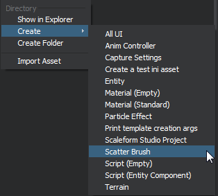
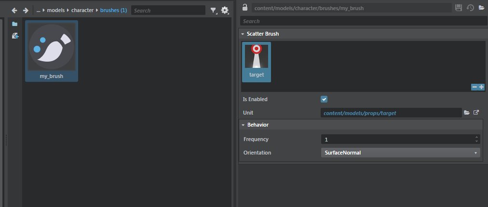
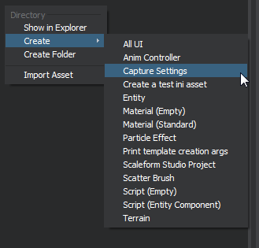
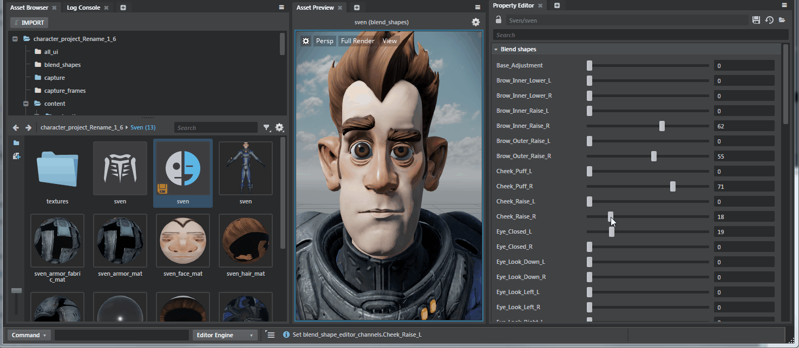
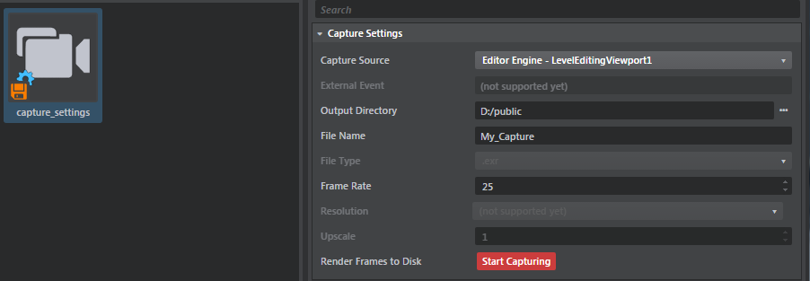

# Custom Asset Editing

Since Stingray V1.5 it is possible to define new types of assets and to automatically have the Property Editor generate editing UI for it. You will benefit from all the standard editing workflows: undo/redo, discard and creation from ~{ Asset Browser }~.

This makes defining new assets used **only** for editor purpose super easy (ex: scatter brush). Obviously, if you want to define a new type of asset that needs to be available on the runtime side of Stingray you will need to create a runtime plugin containing a compiler extension for it.

For information on how to define new assets type so they are properly displayed in the ~{Asset Browser}~ (ex: icons, categories) please refer to ~{Register a custom asset type}~.

## Type file specification and mounting

To register a new type of asset and benefits from Property Editor editing capabilities, you need to create a `.type` file describing the data layout of that asset and ensure that `.type` file is in in a mapped folder. See ~{ Make new resources available to the project }~ for more information on mapping a folder.

Here is an example on how it is done for `scatter.plugin`:

```lua
resources = [
	// This mount the scatter_type folder which contains the aptly named scatter_type.type file which describes the data model and editing requirements of a scatter brush.
    {
        path = "scatter_type"
    }
]
```

### Registering a type file for editing

When creating a `.type` file, you need to ensure the `extension` property is set to the file extension corresponding to your asset. This indicate to the Stingray type system that your `.type` file describes a new asset. See ~{Stingray Type Descriptor}~ for a complete description of the type format.

Here is how `scatter_brush.type` specifies its extension:

```lua
export = "#scatter_brush"
// This indicate to the type system that all file ending in .scatter_brush are custom assets.
extension = "scatter_brush"
types = {
    scatter_brush = {
        ...
    }
}
```

## Creating new custom asset

There are 2 ways to ensure a Custom Asset is available for creation in the Asset Browser.

#### Generic creator and selector

In a `.type` file, if you set the `generic_creator` property to true you will be able to right click in the ~{Asset Browser}~ and see an creation menu item for your asset type.



Asset created using the `generic_creator` will be generated from the default values (or the default values of types) specified in the `.type` file.

```lua
// from scatter_brush.type

export = "#scatter_brush"
extension = "scatter_brush"
types = {
    scatter_brush = {
        type = ":struct"
        fields = {
            components = {
                key = ":guid"
                type = ":dict"
                value = "#scatter_component"
                editor = {
                    control = "ResourceCarousel"
                    carouselResourceProperty = "unit"
                }
            }
        }
        editor = {
            label = "Scatter Brush"
            // This specifies that scatter brush should have a creation menu item.
            generic_creator = true

            // This specifies that the scatter_brush should be editable using the property editor.
            generic_selector = true
            version = "0.1.0"
        }
    }
    ...
```

In the example above, notice how the editor block for the `scatter_brush` asset uses the `generic_selector` property. When this property is set to `true` it means selecting a scatter brush will allow the Property Editor modify it.



#### Template creation

If you need to create an asset with a specific set of values that do NOT corresponds to the default values in the `.type` file you can use the template system specified in ~{Define templates for new assets}~.

As an example the capture_frames plugin uses the template system to instantiate new `capture_settings` asset:

```lua
// From capture_frames.plugin
templates = [{
		type = "asset"
		name = "Capture Settings"
		default_name = "capture_settings"
		extension = "capture_settings"
		create = [
			"create-frame-capture \"$name.capture_settings\" \"$project/$output_dir\""
		]
	}]
```

In its `.type` file, capture_settings doesn't use `generic_creator` (but still uses the Property Editor):
```lua
// Exerpt from capture_settings.type:
 editor = {
            label = "Capture Settings"
            generic_creator = false // No generic creator
            generic_selector = true // Use Property editor
            version = "1.0.0"
        ...
 }
```



## Listening to changes on asset

It is possible to listen to changes happening in the Property editor when a Custom Asset is modified and to react to those changes. You need to listen to the `DataObjectsConsensusChanged` of the `objectEditingService`.

See how `preview-blend-shapes.js` listen to changes on blend shapes to properly update the blend weights in the ~{Asset Preview}~:

```lua
// From preview-blend-shapes.js

setup: function (config, asset, viewportName) {
    objectEditingService.on("DataObjectsConsensusChanged", function (args) {
    		// Each time a Custom asset changes, a change descriptor notification is sent.
            var changeDesc = args[0];
            if (this._previewedAsset !== changeDesc.AssetsModified[0] || changeDesc.Type !== 'ValueChanged') {
                return;
            }

            var path = changeDesc.PropertyPath;
            var separatorIndex = path.lastIndexOf('.');
            var channel = path;
            if (separatorIndex !== -1) {
                channel = path.substr(separatorIndex + 1);
            }

            previewUtils.sendToViewport(this._viewportName, 'set_blend_shape_channel_weight_percentage', luaUtils.toSyntax(channel), luaUtils.toSyntax(changeDesc.Value));
        }));

```

A change descriptor has the following properties:

```javascript
{
	Type: string, // Can be either: ValueAdded, ValueRemoved, ValueChanged
    PropertyPath: string, // Json property path modified in the Custom asset
    Value: object, // Value set or added
    AssetsModified: Array<string> // List of assets that were modified (in case of consensus editing.)
}
```

## Fetching Custom Asset data

You can use the `assetService` to query the Json value of a custom asset.

```javascript
// From preview-blend-shapes.js

// Get the managed (in memory representation) of a particular blend shape.
assetService.getManagedAsset(assetName + ".blend_shapes").then(function (dataObject){
    if (dataObject) {
        // Fetches the Json representation of this asset (extract Json from the DataObject).
        return dataObject.invokeMethod('ToJson').then(function (blendShapeJsonData) {
            ...
        })
    } else {
        console.error("Cannot find data for: ", assetName + ".blend_shapes");
    }
});
```

## Use cases
Stingray editor ships with 3 different Custom assets described using `.type` file. These are good examples showcasing usage opf the Stingray Type Descriptors.

### Blend shapes

- editor\plugins\blend_shapes\blend_shapes.plugin : selecting a `blend_shape` file will allow editing of properties and display the result using a custom preview behavior.
- editor\plugins\blend_shapes\blend_shapes\blend_shapes.type : type file describing the data layout of a blend_shape file as well as which type of control to use for editing.

```lua
// From blend_shape.type

export = "#blend_shapes"
extension = "blend_shapes"
types = {
    blend_shapes = {
        type = ":struct"
        fields = {
            blend_shape_meshes = {
                type = ":value"  // :value means an arbritray Json value. The type system won't try to reason about it (or to validate it).
            }
            blend_shape_editor_channels = {
                type = ":value"
            }
        }
        editor = {
            label = "Blend shapes"
            generic_creator = false
            generic_selector = true
            version = "0.1.0"
            control = "BlendShapes"  // Use custom blend-shape editor (property-blend-shape.js)
        }
    }
}
```



### Scatter brushes
Scatter brushes are an editor only resource that encapsulate a list of units used to *paint/scatter* on anoter unit or a terrain.

- editor\plugins\level_editor\scatter.plugin: defines where to find the scatter `.type` file as well as the scatter brush icons.
- editor\plugins\level_editor\scatter_type\scatter_brush.type : define UI to edit a scatter brush.

As a side node, the levelEditingService listens to changes on scatter brushes to reload the Lua scatter data model:

```javascript
objectEditingService.on("DataObjectsConsensusChanged", function (args) {
    if (this.SelectedToolName !== "scatter" ||
        !this.SelectedScatterBrush) {
        return;
    }

    var changeDesc = args[0];
    if (changeDesc.AssetsModified.indexOf(this.SelectedScatterBrush) === -1) {
        return;
    }

    this.invoke('UpdateLuaScatterBrushComponents');
}.bind(this));
```


### Capture settings
Capture Settings are an editor only resource that specify parameters needed to do a viewport capture and save the result as an `exr` stream of files. It showcases how a custom asset using the PRoperty Editor can act as a *specicalized editor*.

- editor\plugins\capture_frames\capture_frames.plugin
- editor\plugins\capture_frames\capture_frames\capture_settings.type : uses an Action button and special `clean/init` callbacks to be able to execute initialization code when a capture_settings are *selected/unselected*.

```lua
// From capture_settings.type
export = "#capture_settings"
extension = "capture_settings"
types = {
    capture_settings = {
        type = ":struct"
        fields = {
            ...
            start_capture = {
                type = ":bool"
                default = true
                editor = {
                	// Specification of the Action button that kicks in the Capture process.
                    control = "Action"
                    label = "Render Frames to Disk"
                    text = "Start Capturing"
                    color = "#CC3D3D"
                    trigger = {
                        type = "js"
                        module = "capture_frames/capture_frames_actions"
                        function_name = "handleCapture"
                    }
                }
            }
        }
        editor = {
            label = "Capture Settings"
            generic_creator = false
            generic_selector = true
            version = "1.0.0"
            init = {
                type = "js"
                module = "capture_frames/capture_frames_actions"
                function_name = "startCaptureSettingsEditing"
            }
            cleanup = {
                type = "js"
                module = "capture_frames/capture_frames_actions"
                function_name = "endCaptureSettingsEditing"
            }
        }
    }
}
```
- editor\plugins\capture_frames\capture_frames_actions.js : handle capture action and communicate with viewports to generate exr files.


