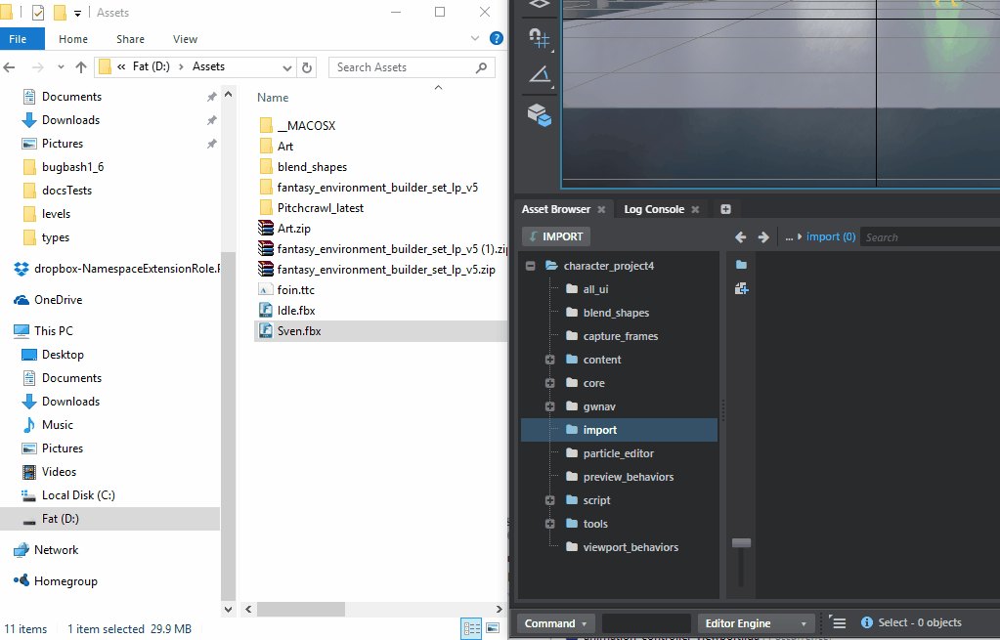
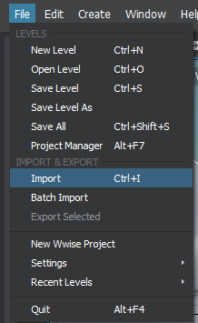
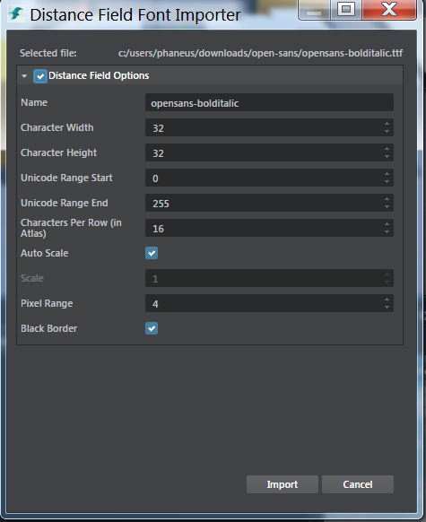

# Create a new importer
With version 1.6 of Stingray it is now possible to write custom file importers. This will allow client to drag and drop (or to use the import menu) any file type (ex: .obj, .ttc) and convert those files to Stingray assets (.texture, .bsi, ...).

Here  are all the different ways to import files in Stingray:

-	Drag and drop:

	

-	Import button in Asset browser:

	

-   **File > Import** menu:

	

## Importer format

An importer can be spcify in a .plugin file:

```sjson
// From core/plugins/asset_browser/asset-browser.plugin defines different importers:
imports = [
    {
        types = ["fbx", "bsi"]
        label = "Scenes"
        regroup = true
        priority = 1 // Low priority because there is a dialog involved.
        options = {
            types = ["types/material_import_options", "types/scene_import_options"]
            validate = {
                type = "js"
                module = "asset-browser-actions"
                function_name = "validateSceneImportSettings"
            }
        }
        do = "import-fbx"
    }

    {
        types = ["dds", "tga", "png", "jpg", "jpeg", "tif", "tiff"]
        label = "Textures"
        regroup = true
        do = "import-core-assets"
    }

    {
        types = ["srz", "zip"]
        label = "Packages"
        regroup = true

        do = [
            {
                type = "js"
                module = "asset-browser-actions"
                function_name = "importPackages"
            }
        ]
    }
]
```

`types`

>	List of file extensions supported for import. **Required**.

`label`

>	Name group of files supported for import. **Required**. This is displayed in the file selector whe using the File import menu or the Asset browser Import button. Note that all importers registered in Stingray are available in the Import File Selector.


`regroup`

>	boolean. **Optional**. Regroup all assets to be imported of the same types and execute in batch. Each actions specified in the `do` section will get passed the whole list of files to import.

`do`

>	Action sequence. See ~{Register an action}~. **Required**. Array of actions to execute when files of the specified type are to be imported.

`priority`

>	Number. **Optional**. If multiple importers are registered for the same type of files, this defines the priority in which importers are executed. **Lower** prirotiy are ran first.

`options`

>	Json. **Optional**. Custom user defined data that is passed to each actions of the import sequence. As an example in the Fbx importation `options` section can contain type file specification (used by the Generic Import dialog) and a validation function.

## Stingray core importers

Stingray supports multiple files for importation. All the Stingray core impporters are specified in `editor\plugins\asset_browser\asset-browser.plugin`.

We will go over those importers quickly to explain how they are "wired":

### Fbx import


```sjson
{
    types = ["fbx", "bsi"]
    label = "Scenes"
    regroup = true
    priority = 1 // Low priority because there is a dialog involved.
    options = {
    	// Specifies how to populate the Generic Import Dialog
        types = ["types/material_import_options", "types/scene_import_options"]

        // Function used to validate importation settings while the user is in the Generic Import Dialog.
        validate = {
            type = "js"
            module = "asset-browser-actions"
            function_name = "validateSceneImportSettings"
        }
    }

    do = {
        name = "import-fbx"
        type = "js"
        module = "asset-browser-actions"
        function_name = "importFbx"
    }
}
```

The importFbx function is quite complicated and handles popping the resource dialog, merging options with the default Fbx importation options and then triggering the importation process itself.

Let's look at `importFbx` to see which parameters it gets passed during an importation:

```js

// options: corresponds to the options objects in the importater descriptor above
// previousResult: if there was a previous importer in the chain of importation these are all the results (compilation results, asset created).
	// previousResult[0]: compilation information
    // previousResult[1]: an object packaging all created/modified/removed assets during importation
// assets: list of files to import
// directory: relative destination directory where the importation is to happen.
// flags: set of flags passed by stingray for importation. Currently flag.reImport  indicates that an asset needs to be reimported.
importFbx: function (options, previousResult, assets, directory, flags) {
    let sceneImport = new SceneImport(options, flags, processFlags, showDialog, null, options.validate);

    return sceneImport.doImport();
}
```


A quick exerpt from `asset-browser-actions.js` showcase what happens during the `sceneImport.DoImport` call:

```js

importFbx: function (options, previousResult, assets, directory, flags) {
    let sceneImport = new SceneImport(options, flags, processFlags, showDialog, null, options.validate);
    return sceneImport.doImport();
}

// From SceneImport class:
doImport() {
    return projectUtils.getSettings(fbxImportSettings)
    	// Lots of chaining of processing to ensure default Fbx importation options are properly saved/merged with user defined importation options:
        .then(this.processInfo.bind(this))
        .then(this.processImportOptions.bind(this))
        .then(this.importDefault.bind(this))
        .then(function (categories) {
            if (!projectService.showCreateExtraRoot) {
                let mesh = _.find(categories, {'id': 'mesh'});
                if (mesh) {
                    mesh.definitions.fields.CreateExtraRoot.editor.showLabel = false;
                    mesh.definitions.fields.CreateExtraRoot.editor.showValue = false;
                }
            }

            // Importation without a dialog: import fbx directly
            if (this.hideDialog)
                return importService.importFbx(this.importAssets, this.defaultSettings, this.hideDialog);

            let title = 'Import FBX';
            if (this.flags && this.flags.reImport)
                title = 'Re-Import FBX';

            // Trigger the importation dialog. This will evenetually called the importservice to trigger fbx importation.
            return this.showDialog(categories, this.importAssets, title, this.validation);
        }.bind(this));
}

// Show dialog for Fbx import:
var showDialog = function (categories, assets, title, validation) {
    if (!title)
        title = 'Import';

    return assetUtils.trackFileSystemChanges(function () {
        return hostService.openDialog(title,
                [{ assets: assets, categories: categories, plugin_name: 'asset-browser', validate: validation }],
                require.toUrl('core/views/import-dialog'),
                { width: 430, height: 760 })
            .then(function (result) {
                if (result.accepted) {
                    var data = result.data[0];
                    projectUtils.setSettings(fbxImportSettings, data.options);
                    return Promise.all([
                        waitForImportCompletedPromise(),

                        // calls to the importService to effectively do Fbx import.
                        importService.importFbx(data.assets, data.options)
                    ]);
                }
            });
    });
};
```

### Extend importation of already registered file

You can register another importer for a specific type of file. Your importer will be called according to its priority and could allow you to extract further information from the file or to tweak the assets that were created during importation.

As an example we will write an importer to list what was created during Fbx importation:

```sjson
// From asset-browser.plugin
{
    types = ["fbx"] // Another importer for Fbx
    label = "Fbx Log"
    regroup = true
    priority = 1000 // Will run AFTER normal Fbx importation
    do = {

         type = "js"
         module = "asset-browser-actions"
         function_name = "fbxImportLog"
     }
}
```

Here we look at how the `fbxImportLog` function is coded:

```js
fbxImportLog: function (options, previousResult, assets, directory, flags) {
    let fbxImportReport = previousResult[1];

    console.log('Fbx Importation Log:');
    console.log('New asset created', fbxImportReport.added);
    console.log('Existing assets modified', fbxImportReport.changed);
    console.log('Assets remove', fbxImportReport.removed);
}
```

## Font importation and Generic Import Dialog

Stingray now supports a new Font importer which makes use of the Generic Import Dialog as well.

```sjson
// From font-importer.plugin:
imports = [
    {
        types = ["ttf" "ttc" "otf" "otc" "cff" "woff" "fnt" "pfa" "pfb" "pfr"]
        label = "Font"
        options = {
            types = ["font-import-options"]
            validate = {
                type = "js"
                module = "font-importer-module"
                function_name = "validateImportOptions"
            }
        }
        do = [

            // Step 1 - Open dialog with the import options
            {
                type = "js"
                module = "font-importer-module"
                function_name = "fontImporterDialog"
            }

            // Step 2 - Import actual asset as a Stingray resource
            {
                type = "js"
                module = "font-importer-module"
                function_name = "importFontFile"
            }
        ]
    }
]
```

Let's look at how the Import Dialog is setup:

```js
// From font-importer-module.js
function fontImporterDialog (importOptions, previousResult, file, destination, flags) {
    if (!_.isArray(file)) file = [{ file: file, directory: destination }];

	// Loop over the different type files spcified in importOptions.
    let types = importOptions.types[0].types;
    let categories = [];

    // Create a list of categories with all the different properties specified in the type descriptor:
    let categoryNames = Object.keys(types);
    _.each(categoryNames, function (categoryName) {
      let category = {};
      category.id = categoryName;
      category.options = types[categoryName].editor;
      category.definitions = {
          type: types[categoryName].type,
          fields: types[categoryName].fields
      };

      category.default_values = dataTypeService.createDefaultValue(types[categoryName]);
      category.default_values.Name = fsUtils.getFileName(file[0].file, true);
      categories.push(category);
    });

	// Pop the Generic Import Dialog passing it the properties to show:
    return hostService.openDialog('Distance Field Font Importer',
          [{ assets: file, categories: categories, plugin_name: 'font-importer', validate: importOptions.validate }],
          require.toUrl('core/views/import-dialog'),
          { width: 510, height: 430 });
}
```

The `importFont` is interesting in how it runs a command tool to extract data from the font file and then writes textures assets:

```js
function importFontFile (importOptions, dialogResult, file, destination/*, flags*/) {
  if (!dialogResult.accepted) {
      return console.info('Font import has been cancelled.');
  }

  var importOptions = dialogResult.data[0].options;
  if (!importOptions)
      throw new Error('Nothing to import');

  return projectService.relativePathToAbsolute(destination).then(function (absoluteDestination) {
    absoluteDestination = fsUtils.cleanPath(absoluteDestination);
    return projectService.absolutePathToRelative(absoluteDestination+"/"+importOptions.Name).then(function (assetpath){
      return locatorService.getToolChainDirectory().then(function (tccDir) {

		 // Start a command line tool to generate an atlas from a font:

          var cmd_Args = ["-generateAtlas", file, "-size", `${importOptions.CharWidth}`, `${importOptions.CharHeight}`, "-pxrange",`${ importOptions.PixelRange}`, "-autoframe",
                          "-atlasRange", `${importOptions.UnicodeRangeStart}`, `${importOptions.UnicodeRangeEnd}`, "-atlasItemsPerRow", `${importOptions.ItemsPerRow}`,
                          "-o", `${absoluteDestination}/${importOptions.Name}.dds`, "-outputFontInfo", `${absoluteDestination}/${importOptions.Name}.font`];
          if(importOptions.BlackBorder)
            cmd_Args.push("-blackBorder");

          if(!importOptions.Autoscale) {
            cmd_Args.push("-scale");
            cmd_Args.push(`${importOptions.Scale}`);
          }

          // hostService allows to start external process and wait for their execution to be done:
          var msdfgenExe = fsUtils.join(tccDir, "tools", "msdfgen.exe");
          return hostService.startProcess(msdfgenExe, cmd_Args, {
            UseShellExecute: true,
            CreateNoWindow: true,
            WorkingDirectory: absoluteDestination,
            WaitForExit: true
          });
      }).then(function (/*processDescriptor*/) {
          // Write a material file in the folder where we started the font importation:
          // fileSystemService allows to read/write files. There are even function to write Json files directly.
          return fileSystemService.writeJSON(`${absoluteDestination}/${importOptions.Name}.material`, {
              shader: "gui:DEPTH_TEST_ENABLED:DIFFUSE_MAP:MEDIAN_BIT_ALPHA",
              textures: {
                diffuse_map: `${assetpath}`
              }
          });
      }).then(function () {

      	  // Writes a texture file for the newly generated atlas.
          return fs.writeJSON(`${absoluteDestination}/${importOptions.Name}.texture`, {
              common: {
                input: {
                  filename: `${assetpath}`
                },
                output: {
                  apply_processing: true,
                  category: "",
                  cut_alpha_threshold: 0.5,
                  enable_cut_alpha_threshold: false,
                  format: "R8G8B8A8",
                  mipmap_filter: "box",
                  mipmap_filter_wrap_mode: "mirror",
                  mipmap_keep_original: false,
                  mipmap_num_largest_steps_to_discard: 0,
                  mipmap_num_smallest_steps_to_discard: 0,
                  resident_mips: 0,
                  srgb: true,
                  streamable: false
                }
              }
          });
      }).then(function() {
        return fs.copy(file, absoluteDestination+"/"+fsUtils.getFileName(file));
      });
    });
  });
}
```

### Using the Generic import dialog

The Generic import dialog uses type descriptors to automatically populate a dialog containing a property editor. A type descriptor is specified in a `.type` file. As an example here is an exerpt of the `font-import-options.type` file:

```sjson
export = "#fonts"
types = {
	fonts = {
		type = ":struct"
		editor = {
			label = "Distance Field Options"
		}
		fields = {
			AdvancedOptions = {
				type = ":bool"
				default = false
				editor = {
					label = "Distance Field Options"
					description = "Options for generating distance field font resources"
					showLabel = false
					showValue = false
					enable_category = true
				}
			}
			Name = {
				type = ":string"
				default = ""
				editor = {
					label = "Name"
					description = "Name of the font asset"
				}
			}
			CharWidth = {
				type = ":number"
				default = 32
				min = 1
				editor = {
					label = "Character Width"
					description = "Image width of each character in pixels"
					step = 1
				}
			}
			CharHeight = {
				type = ":number"
				default = 32
				min = 1
				editor = {
					label = "Character Height"
					description = "Image height of each character in pixels"
					step = 1
				}
			}
		}
	}
}
```

Basically it is a json file that specifies how a specific piece of Json should be interpreted and edited. The Stingray property editor uses `.type` file to populates itself automatically and to edit a json data model:



The complete syntax of a type file can be found here: ~{ Stingray Type System }.

---
Tags:
-	plugin
-	plug-in
---
