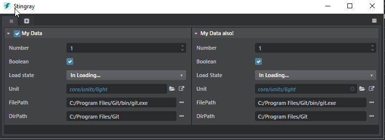

#Property Editor Usage

It is really easy to create new a Panel/Editor using the Stingray Editor SDK. This document will highlight how to create a panel containing 2 property editors: one will be setup using a `.type` file the onther one using pure javascript.

## Plugin definition
First thing to do when defining a new panel is to add its definition to your `.plugin` file:

```lua
 views = [
    {
        type = "panel"
        name = "property-editor-usage"
        path = "property-editor-usage"
        title = "Property Editor usage"
        width = 500
        height = 600
    }
]
menus = [
	{
        path = "Window/My Property Editor Panel"
        view = "plugin-manager"
        shortcut = "Alt+Shift+P"
        order = 379
    }
]
```

For more information on `.plugin` file see: ~{About plug-in definitions}~. Views definition can be found here: ~{Views and Dialogs}~. And menu customization can be found here: ~{Create a new menu item}~.

## Property Editor Panel

### Initialization

Each javascript panel file file should begin with a `define` block that will specify which other javascript modules you want to include (see [RequireJs](http://requirejs.org/) for more information on require itself). You can also look at the last section in ~{# Tips for developing plug-ins}~ for more Stingray specific details on requiring files.

```javascript
// This is the list of all modules we depend on:
define([
    'properties/mithril-property-ext',
    'properties/property-editor-utils',
    'properties/property-editor-component',
    'properties/property-document',
    'components/dom-tools',
    'services/data-type-service',
    'services/marshalling-service',
    'services/host-service',
    'services/project-service',
    'services/element-service',
    'services/asset-service',
    'services/file-system-service'
],
	/** This is the initialzation function of your module. Each required dependency gets injected
    	in the same order it is included. Module starting with capital letter a generally Component 
        or class (that can be used with new). Module starting with a lowerCase are generally namespace
        containing functions and data.
    */
	function (m, props, PropertyEditor, PropertyDocument, domTools, dataTypeService,
             marshallingService, hostService, projectService, elementService, assetService, fileSystemService) {
    'use strict';
    document.title = "Simple tool";

    // Ensure all CSS are loaded for the property editor:
    domTools.loadCss("core/css/widgets/json-component.css");
    domTools.loadCss("core/css/widgets/property-editor.css");

    // In V1.6, we need to create a context for the PropertyEditor containing access to all the
    // Stingray Services used by properties. This will no longer be necessary for V1.7 and upward.
    var services = {
        marshallingService: marshallingService,
        elementService: elementService,
        projectService: projectService,
        assetService: assetService,
        fileSystemService: fileSystemService
    };
    var editorContext = props.makeEditorContext(services);
```

The section ~{# Use built-in editor services}~ contains more information on core Stingray services.

### Property Editor using Type file
We will first highlight how to create a property editor from a `.type` file. These files describe how to interpret JSON data (like Stingray Assets) and what type of properties should be used to modify this data. For more reference on `.type` file see ~{Stingray Type System}~.

#### Type description

First thing we will do is specify a type descriptor for the data we want to display in the Property editor. Instead of relying on loading a `.type` file from disk, we will define it directly in javascript (in pure JSON):

```javascript
// Create type definition "inline". Alternatively, it could have been loaded from a .type file:
var typeDefinition = {
    type: ':struct',
    fields: {
        Number: {
            type: ":number",
            default: 1,
            min: 0,
            max: 1,
            editor: {
                control: "Number",
                step: 0.3,
                priority: 4
            }
        },
        Boolean: {
            type: ":bool",
            default: true
        },
        Enum: {
            type: ":enum",
            value: ":string",
            default: "InLoading",
            cases: [
                "Loaded",
                "Unloaded",
                "InLoading",
                "ErrorLoading"
            ],
            editor: {
                control: "Choice",
                label: "Load state",
                case_labels: {
                    "Loaded": "Loaded",
                    "Unloaded": "Unloaded",
                    "In Loading...": "InLoading",
                    "Error while Loading": "ErrorLoading"
                }
            }
        },
        Unit: {
            type: ":resource",
            extension: "unit",
            default: 'core/units/light'
        },
        FilePath: {
            type: ":string",
            default: 'C:/Program Files/Git/bin/git.exe',
            editor: {
                control: "PathProperty",
                browseType: "File",
                browseTitle: "Select a exe",
                browseFilter: "*.exe"
            }
        },
        DirPath: {
            type: ":string",
            default: 'C:/Program Files/Git',
            editor: {
                control: "PathProperty",
                browseType: "Folder",
                browseTitle: "Select a folder"
            }
        }
    }
};
```

This defines a type descriptor with 6 different properties. See that each field in the type descriptor is made out of 2 blocks:

- The field type description which explains what is the JSON value corresponding to this field (see ~{Built-In Types Reference}~ for more information on types).
- The editor block which specifies which property control should be used to modify this field and what are the parameters of this control. See ~{Built-In Properties Reference}~ for more information on the different property controls supported by Stingray.

#### Property Document setup
In order to intialize a property editor from a type descriptor we use the `PropertyDocument` class. This class will allow us to customize the categories and to listen to event (i.e propertyChanged) happening while the JSON value is being modified.

```javascript
// Use the dataTypeService to create an initial value conforming to the type definition.
var initialValue = dataTypeService.createDefaultValue(typeDefinition);

// This instance will holds all the categories and properties created from the type definition.
var propertyDocument = new PropertyDocument(dataTypeService);

// you can register global listener to know when a property changes:
propertyDocument.on('propertyChanged', function (path, value, property, category, doc) {
    console.log('onPropertyChanged', path, value, property, category, doc);
    m.utils.redraw();
});

// Now we add a category block mapped to a typeDefinition and a value:
propertyDocument.addCategory("My Data", {}, initialValue, typeDefinition);

// We then create the configuration used to power up the property editor component:
var fromTypeConfig = props.editor(editorContext, propertyDocument.getCategories());
```

The `fromTypeConfig` will be passed to the `PropertyEditor` component in order to be rendered in the HTML Panel. But before we finalize the UI code, lets see how to create a property editor purely from javascript and wihout using type descriptors.

### Property Editor using Compact notation
All the property control of Stingray are available through the `property-editor-utils` module (required in the `props` variable).

You can use pure Javscript code to control the different properties parameters as well as tweak how the property model should behave.

All the properties use a special getter/setter function (called a model) to access and modify their data. This allows the user extreme flexibility when defining how to populate a property.

A property model is:

- A function that can be invoked with one or two argument(s).
- First argument is the property triggering the model change.
- If there is no second argument, the function is a `getter` and it must returns the value of the property.
- If there is a second argument, the function is a `setter` and must modify the value of the property.

In our panel, we have created a property model **generator** function:

```javascript
function genModel (value) {
	// This returns a property model function that uses a closure to stores its value.
    return function (property, newValue) {
        if (arguments.length > 1) {
        	// arguments is a javascript built in variable available in a function. It allows access to
            // all the parameters passed to the function. Here we check if we have more than
            // 1 parameters so see if the model should be used as a setter.
            value = newValue;
        }
        return value;
    };
}
```

The Stingray property compact notation makes it easy to define properties. Here are the same properties that we used in the `.type` example above:

```javascript
// The compact notation allows easy configuration of a PropertyEditor using pure javascript:
var compactNotationConfig = props.editor(editorContext, [
    props.category("My Data also!", {}, [
        props.number("Number", genModel(1), {
            default: 1, min: 0, max: 1, increment: 0.3, priority: 4
        }),
        props.bool('Boolean', genModel(true)),
        props.choice('Load State', genModel('InLoading'), {
                "Loaded": "Loaded",
                "Unloaded": "Unloaded",
                "In Loading...": "InLoading",
                "Error while Loading": "ErrorLoading"
            }),
        props.resource('Unit', genModel('core/units/light'), 'unit'),
        props.file('FilePath', genModel('C:/Program Files/Git/bin/git.exe')),
        props.directory('DirPath', genModel('C:/Program Files/Git')),
    ])
]);
```

See ~{Built-In Properties Reference}~ for more information on the different property controls supported by Stingray compact notation.

### Create and mount a Mithril view
All that is left is to create a view holding the 2 Property Editors. To do so, we use [Mithril](http://mithril.js.org/). Mithril is a super lightweight (less than 2000 lines of code) javascript library that make it easy to create dyanmic HTML that refreshes super fast when datas are modified. Everything can be done in pure Javascript (even the templating) allowing easy debugging.

We use 2 Mithril concepts:
- [Component](http://mithril.js.org/mithril.component.html): this is a plain javascript object that must contain a `view` function. This `view` function uses the hyperscript helper called `m` to create a virtual DOM that will gets attached to the real HTML DOM. See [here](http://mithril.js.org/mithril.html) for more information on how to the Mithril templating language (which is really HTML expressed in Javascript).
- [Mount](http://mithril.js.org/mithril.mount.html): when we have a Mithril component, we need to mount it on a real DOM node to properly render.

Here what our view code looks like:

```javascript
// Our app component
var PropertyEditorUsageApp = {
    view: function () {
        return m('div', {class :"panel-fill panel-flex-horizontal fullscreen", style:"overflow: auto;"}, [
            m('div', {class: "panel-fill"}, [
                // Use the PropertyEditor Mithril component to attach a
                // Property editor in our view and pass it a configuration:
                PropertyEditor.component(fromTypeConfig)
            ]),
            m('div', {class: "panel-fill"}, [
                PropertyEditor.component(compactNotationConfig)
            ])
        ]);
    }
};

// Mount the component on DOM
m.mount($('#mithril-root')[0], m.component(PropertyEditorUsageApp, {}));
```

### The whole Enchilada
This is what our panel looks like!



And here is the complete source code of the Panel:
```javascript
define([
    'properties/mithril-property-ext',
    'properties/property-editor-utils',
    'properties/property-editor-component',
    'properties/property-document',
    'components/dom-tools',
    'services/data-type-service',
    'services/marshalling-service',
    'services/host-service',
    'services/project-service',
    'services/element-service',
    'services/asset-service',
    'services/file-system-service'
], function (m, props, PropertyEditor, PropertyDocument, domTools, dataTypeService,
             marshallingService, hostService, projectService, elementService, assetService, fileSystemService) {
    'use strict';
    document.title = "Simple tool";

    // Ensure all CSS are loaded for the property editor:
    domTools.loadCss("core/css/widgets/json-component.css");
    domTools.loadCss("core/css/widgets/property-editor.css");

    // In V1.6, we need to create a context for the PropertyEditor containing access to all the
    // Stingray Services used by properties. This will no longer be necessary for V1.7 and upward.
    var services = {
        marshallingService: marshallingService,
        elementService: elementService,
        projectService: projectService,
        assetService: assetService,
        fileSystemService: fileSystemService
    };
    var editorContext = props.makeEditorContext(services);

    //////////////////////////////////////////////////////////////////
    // Initialization of a property editor using a Type file to populate itself.

    // Create type definition "inline". could have been loaded from a .type file.
    var typeDefinition = {
        type: ':struct',
        fields: {
            Number: {
                type: ":number",
                default: 1,
                min: 0,
                max: 1,
                editor: {
                    control: "Number",
                    step: 0.3,
                    priority: 4
                }
            },
            Boolean: {
                type: ":bool",
                default: true
            },
            Enum: {
                type: ":enum",
                value: ":string",
                default: "InLoading",
                cases: [
                    "Loaded",
                    "Unloaded",
                    "InLoading",
                    "ErrorLoading"
                ],
                editor: {
                    control: "Choice",
                    label: "Load state",
                    case_labels: {
                        "Loaded": "Loaded",
                        "Unloaded": "Unloaded",
                        "In Loading...": "InLoading",
                        "Error while Loading": "ErrorLoading"
                    }
                }
            },
            Unit: {
                type: ":resource",
                extension: "unit",
                default: 'core/units/light'
            },
            FilePath: {
                type: ":string",
                default: 'C:/Program Files/Git/bin/git.exe',
                editor: {
                    control: "PathProperty",
                    browseType: "File",
                    browseTitle: "Select a exe",
                    browseFilter: "*.exe"
                }
            },
            DirPath: {
                type: ":string",
                default: 'C:/Program Files/Git',
                editor: {
                    control: "PathProperty",
                    browseType: "Folder",
                    browseTitle: "Select a folder"
                }
            }
        }
    };

    // Use the dataTypeService to create an initial value conforming to the type definition.
    var initialValue = dataTypeService.createDefaultValue(typeDefinition);

    // This instance will holds all the categories and properties created from the type definition.
    var propertyDocument = new PropertyDocument(dataTypeService);

    // you can register global listener to know when a property changes:
    propertyDocument.on('propertyChanged', function (path, value, property, category, doc) {
        console.log('onPropertyChanged', path, value, property, category, doc);
        m.utils.redraw();
    });

    // Now we add a category block mapped to a typeDescriptor and a value:
    propertyDocument.addCategory("My Data", {}, initialValue, typeDefinition);

    // We then create the configuration used to power up the property editor component:
    var fromTypeConfig = props.editor(editorContext, propertyDocument.getCategories());

    //////////////////////////////////////////////////////////////////
    // Initialization of a property editor using a Type file to populate itself.

    // This will be our model generator:
    function genModel (value) {
        return function (property, newValue) {
            if (arguments.length > 1) {
                value = newValue;
            }
            return value;
        };
    }

    // The compact notation allows easy configuration of a PropertyEditor using pure javascript:
    var compactNotationConfig = props.editor(editorContext, [
        props.category("My Data also!", {}, [
            props.number("Number", genModel(1), {
                default: 1, min: 0, max: 1, increment: 0.3, priority: 4
            }),

            props.bool('Boolean', genModel(true)),

            props.choice('Load State', genModel('InLoading'), {
                    "Loaded": "Loaded",
                    "Unloaded": "Unloaded",
                    "In Loading...": "InLoading",
                    "Error while Loading": "ErrorLoading"
                }),

            props.resource('Unit', genModel('core/units/light'), 'unit'),

            props.file('FilePath', genModel('C:/Program Files/Git/bin/git.exe')),

            props.directory('DirPath', genModel('C:/Program Files/Git')),
        ])
    ]);

    var PropertyEditorUsageApp = {
        view: function () {
            return m('div', {class :"panel-fill panel-flex-horizontal fullscreen", style:"overflow: auto;"}, [
                m('div', {class: "panel-fill"}, [
                    PropertyEditor.component(fromTypeConfig)
                ]),
                m('div', {class: "panel-fill"}, [
                    PropertyEditor.component(compactNotationConfig)
                ])
            ]);
        }
    };

    // Initialize the application
    m.mount($('#mithril-root')[0], m.component(PropertyEditorUsageApp, {}));

    return {
        noAngular: true
    };
});
```
