# Built-in metadata properties

You can use the editor's **Property Editor** panel to view and modify a wide range of different types of properties -- both simple types like strings, booleans, and numbers, and compound types like colors and rotations. You also have a lot of control over the way the **Property Editor** displays these values. Many property types can be represented using a variety of UI widgets -- like, a number could be edited using a text field, a slider, a spinner box, etc.; you can control display labels, tooltips, ordering, etc.

To tell the **Property Editor** how it should visually represent the data it is editing, you can give your data some metadata. There are two main ways to do this:

-	If your data is described in a type file, you can use an `editor` block for each type in the data to describe how that type should be represented in the editor. See also ~{ The Stingray Type System }~.

-	Or, you can use a compact notation that is expressed purely in JavaScript. See ~{ Use the Property Editor component in your UI }~.

This reference details the different kinds of built-in metadata the **Property Editor** understands, and shows how to use them in both SJSON type files and in JavaScript.

## Common editor metadata properties

These parameters are available for all property control types.

Property       |Type     |Default   |Description
---------------|---------|----------|-----------
`order`     |`Number` |`Infinity`|Controls the ordering of properties in ascending order.
`control` or `displayType`     |`String` |`null`    |Specify a control to use when editing the property. See below for additional control specific properties.
`label`        |`String` |`null`    |Set a custom label for the property.
`suffixLabel`       |`String` |`null`    |Set a suffix to be displayed after the property value. Only shown for some widget types.
`description`  |`String` |`null`    |Set a description for the property. Shown in tooltips.
`isReadOnly`     |`Boolean`|`false`    |If `true`, prevents the user from editing the property.
`isMultiEditSupported`|`Boolean`|`true`    |If `false`, prevents the user from editing the property if several objects are selected (i.e. consensus editing).
`showLabel`      |`Boolean`|`true`    |If `false`, hides the label of the property in editor.
`showValue`      |`Boolean`|`true`    |If `false`, hides the value of the property in editor.

### Type file example

```sjson
{
    type = ":number"
    min = 0
    max = 100
    default = 50
    editor = {
        order = 140
        label = "Health"
        suffix = "HP"
        description = "Initial health of the entity"
        control = "adskPropertySlider"
        step = 10
    }
}
```

### Compact notation example

```js
var numberProperty = props.slider("Health", m.prop(50), {
	order: 140,
    suffix: "HP",
    description: "Initial health of the entity",
    min: 0,
    max: 100,
    increment: 10
})
```

--------------------------------------------------------------------------------

## Built-in control widgets

The following sections describe the differen values you can use for the `control` or `displayType` metadata field. Each one defines a different kind of built-in widget for viewing and interacting with the value of the corresponding type -- like sliders, textfields, checkboxes, etc.

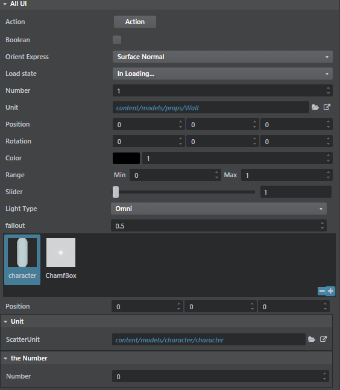

### Quick Mithril Model Recap

The compact property editor notation in the following examples uses a [Mithril](http://mithril.js.org/) getter/setter function mechanism to encapsulate access to the property model. For more information, see ~{ Use the Property Editor component in your UI }~.

This is a quick example of a property model function:

```js
var _propertyData = "This is my data";
function propertyModel (property) {
	if (arguments.length > 1) {
    	_propertyData = arguments[1];
    }
    return _propertyData;
}
```

Most examples below use the following function which **generates** a property model on the fly:

```js
function genModel (value) {
	return function (property, newValue) {
    	if (arguments.length > 1) {
    		value = newValue;
    	}
    	return value;
    };
}
```

### Action

A simple button that triggers a custom function.

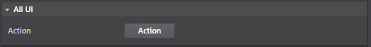

Property|Type    |Default |Description
--------|--------|--------|-----------
`action` (compact notation only)  |`Function`|`null`  |Function with no arguments.
`trigger` (type file only)  |`action` (see ~{Register an action}~)|`null`  |Action to execute.
`text`  |`string` |`""`  |Button text.
`color`  |`color` |  |Button background color. Any html color is valid.
`iconName`  |`string` |  |See [Font Awesome Icons](http://fontawesome.io/icons/) for a list of supported icons name.

#### Type file

```sjson
{
    type = ":string"
    editor = {
        order = 140
        text = "Compute"
        description = "Initial health of the entity"
        control = "Action"
        trigger = {
            type = "js"
            module = "generic_asset/generic-asset-actions"
            function_name = "triggerAction"
        }
    }
}
```

#### Javascript

```js
var actionProperty = props.action("Action", function () {
                        console.log('Action is triggered!');
                    }, {iconName: "fa-star-o"}),
```

### Boolean

A checkbox control.

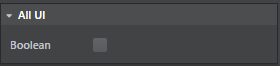

#### Type file
```sjson
{
    type = ":boolean"
    editor = {
        order = 140
        control = "Boolean"
        isReadOnly = true
    }
}
```

#### Javascript

```js
var actionProperty = props.bool("Boolean", genModel(true));
```

### Choice

A combobox that can map to either an enum type or a string.

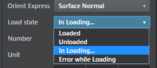

Property       |Type     |Default   |Description
---------------|---------|----------|-----------
`options`     |`object` |`{}`|This is a javascript object where the keys are the "pretty label" for the different choices and the values are the actual enum values. See below for an example.
`fetch_options` (type file only)  |`action` (see ~{Register an action}~)|`null`  |Action that will return dynamically generated options.
`defaultValueName`        |`String` |`null`    |Default label if no choice.
`defaultValue`       |`String` |`null`    |Default value if no choice.

#### Type file (Enum)

```sjson
Enum = {
    type = ":enum"
    value = ":string"
    default = "InLoading"
    cases = [
        "Loaded"
        "Unloaded"
        "InLoading"
        "ErrorLoading"
    ]
    editor = {
        control = "Choice"
        label  = "Load state"
        case_labels = {
            "Loaded" = "Loaded"
            "Unloaded" = "Unloaded"
            "In Loading..." = "InLoading"
            "Error while Loading" = "ErrorLoading"
        }
    }
}
```

#### Type file (String)

```sjson
// This effectively creates a string that will use a Combobox control to select between
// a specific list of string values.
ChoiceString = {
    type = ":string"
    default = "SurfaceNormal"
    editor = {
        control = "Choice"
        label  = "Orient Express"
        fetch_options = {
            type = "js"
            module = "generic_asset/generic-asset-actions"
            function_name = "populateActions"
        }
    }
}
```

#### Javascript

```js
var options {
    'Beer': 1,
    'Scotch': 2,
    'Rhum': 3,
    'Wine': 4
};

var choiceProperty = props.choice("Tough choice", genModel(2), options, {defaultValueName: "Choose a drink"});
```

### Color

A color swatch with an accompanying intensity slider.

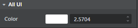

Clicking the swatch brings up a color picker dialog:

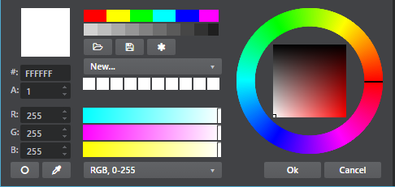

#### Type file (String)

```sjson
Color = {
    type = "core/types/color"
}
```

#### Color base type definition

```sjson
// see core/types/color.type
export = "#color"
types = {
    color = {
        type = ":struct"
        fields = {
            rgb = {
                type = ":array"
                value = "#component"
                size = 3
                default = [0, 0, 0]
            }
            alpha = {
                type = "#component"
                default = 1
            }
            intensity = {
                type = ":number"
                default = 1
                min = 0
            }
        }
        editor = {
            control = "adskPropertyColor"
        }
    }
    component = {
        type = ":number"
        min = 0
        max = 1
    }
}
```

#### Javascript

```js
// Simple color:
var colorProperty = props.color("Color", genModel([1,1,1]));

// HDR color:
var hdrColorProperty = props.hdrColor("Color", genModel([1,1,1]), genModel(1));
```

### Number

A spinner control that allows editing of a number value. Comes with lots of nifty features:

-	Right-clicking the spinner resets it to its default value.
-	Holding `Shift` while spinning modifies the data more quickly.
-	Holding `Ctrl` while spinning modifies the data more slowly.

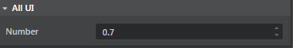

Property       |Type     |Default   |Description
---------------|---------|----------|-----------
`min`     |`number` |`-2147483648`|Minimal value of the number
`max`|`number` |`2147483647`  |Maximal value of the number
`step` (in type file)|`number` |`0.1`  |When pressing the spinner button how much should it increment/decrement
`increment` (in javascript)|`number` |`0.1`  |When pressing the spinner button how much should it increment/decrement
`decimal`|`number` |`4`  |Number of decimals to show. If 0, the number is assumed to be an integer.
`numericDefaultValue`|`number` |`0`  |Value to reset to whrn right clicking on the Spinner.

#### Type file

```sjson
Number = {
    type = ":number"
    editor = {
    	// Use min/max/default in the editor block instead of the type specification
    	default = 1
    	min = 0
    	max = 1
        control = "Number"
        step = 0.3
        priority = 4
    }
}
```

#### Javascript

```js
var numberProperty = props.number("A Numeric Value", genModel(42.111), {
	increment: 0.5,
    min: -9,
    max: 56.9
});
```

### Slider

A slider control allows editing of a number using a left-to-right slider. Most of its parameters are similar to the [number] property (see above).

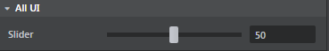

Property       |Type     |Default   |Description
---------------|---------|----------|-----------
`min`     |`number` |`-2147483648`|Minimal value of the number
`max`|`number` |`2147483647`  |Maximal value of the number
`step` (in type file)|`number` |`0.1`  |When pressing the spinner button how much should it increment/decrement
`increment` (in javascript)|`number` |`0.1`  |When pressing the spinner button how much should it increment/decrement
`decimal`|`number` |`4`  |Number of decimals to show. If 0, the number is assumed to be an integer.


#### Type file

```sjson
Number = {
    type = ":number"
    editor = {
    	// Use min/max/default in the editor block instead of the type specification
    	default = 1
    	min = 0
    	max = 1
        control = "Slider"
        step = 0.3
        priority = 4
    }
}
```

#### Javascript

```js
var sliderProperty = props.slider("Percentable", genModel(50), {min: 0, max: 100, increment: 1});
```

### String

String properties are edited by default through simple text boxes.

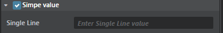

Property       |Type     |Default   |Description
---------------|---------|----------|-----------
`isMultiline`     |`boolean` |`false`|Defines if the textbox should span over multiple lines.
`lineRows`|`number` |`0`  |If `isMultiline` is `true` you can specify the number of lines of the textbox (between 1 and 8).

#### Type file
```sjson
SingleLine = {
    type = ":string"
    editor = {
        label = "Single Line"
    }
}
MultiLine = {
    type = ":string"
    default = "pow"
    editor = {
        label = "Multi Line"
        isMultiline = true
        lineRows = 4
    }
}
```

#### Javascript

```js
var stringProperty = props.color("Color", genModel([1,1,1]));

var colorModel = genModel([1,1,1]);
var intensityModel = genModel(1);
var hdrColorProperty = props.hdrColor("Color", colorModel, intensityModel);
```

### Path

The path property allows a user to select either a folder or a file on disk,  using a window provided by the operating system.

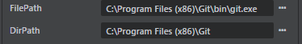

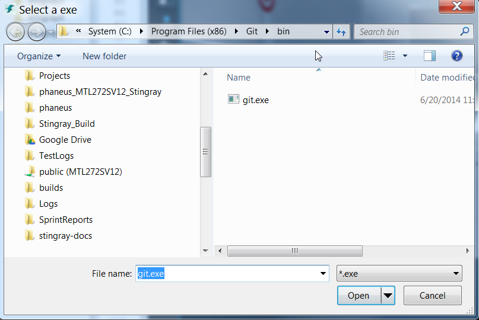

Property       |Type     |Default   |Description
---------------|---------|----------|-----------
`browserType`     |`string` | |Can be either `File` or `Folder`. Defines what type of native path selector will be popped.
`browseTitle`|`string` |  |Title of the native dialog.
`browseFilter`|`string` |  |File filter to only show files with a specific extension.

#### Type file

```sjson
FilePath = {
    type = ":string"
    editor = {
        control = "PathProperty"
        browseType = "File"
        browseTitle = "Select an exe"
        browseFilter = "*.exe"
    }
}
DirPath = {
    type = ":string"
    editor = {
        control = "PathProperty"
        browseType = "Folder"
        browseTitle = "Select a folder"
    }
}
```

#### Javascript

```js
var fileProperty = props.file("File", genModel('c:/Pogram Files (x86)/Git/bin/git.exe'), "Pick an exec", "*.exe"),
var dirProperty = props.directory("Folder", genModel('c:/Pogram Files (x86)/Git'), "Pick a folder"),
```

### Range
A control that contains two numeric min and max value fields.

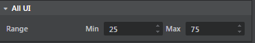
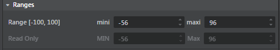

#### Type file
```sjson
Range = {
    type = "core/types/range"
}
```

#### Javascript

```js
var range1= props.range("Range [-100, 100]", "mini", genModel(25), 'maxi', genModel(75), {min: -100, max: 100, increment: 0.5}),
var range2 = props.range("Read Only", "MIN", genModel(25), 'Max', genModel(75), {min: -100, max: 100, increment: 0.5, isReadOnly: true})
```

### Vector

A control that can be used to display a list of 2, 3 or 4 components -- but not a rotation (see [Rotation] below).

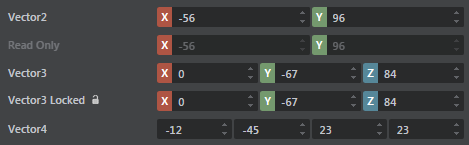

#### Type file

```sjson
Position = {
    type = "core/types/vector3"
}
```

#### Vector3 base type definition

```sjson
// see core/types/vector3.type
export = "#vector3"
types = {
    vector3 = {
        type = ":array"
        value = ":number"
        size = 3
        default = [0, 0, 0]
        editor = {
            control = "adskPropertyVector3"
        }
    }
}
```

#### Javascript

```js

var vec2 = props.vector2("Vector2", genModel([34, 78]), {min: -100, max: 100, increment: 0.5});

var vec3 = props.vector3("Vector3", genModel([1,2,3]));

var vec4 = props.vector4("Vector4", genModel([34, 78, 67, -90]));
```

### Rotation

A control that that uses as its data model a vector made up of three radian values, and that shows three spinners with the values converted to degrees.

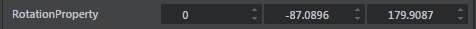

#### Type file

```sjson
Rotation = {
    type = "core/types/rotation"
}
```

#### Rotation base type definition

```sjson
// see core/types/rotation.type
export = "#rotation"
types = {
    rotation = {
        type = ":array"
        value = ":number"
        size = 3
        default = [0, 0, 0]
        editor = {
            control = "adskPropertyRotation"
        }
    }
}
```

#### Javascript

```js
var rotation = props.rotation("Rotation", genModel(0, -1.52, 3.14));
```
