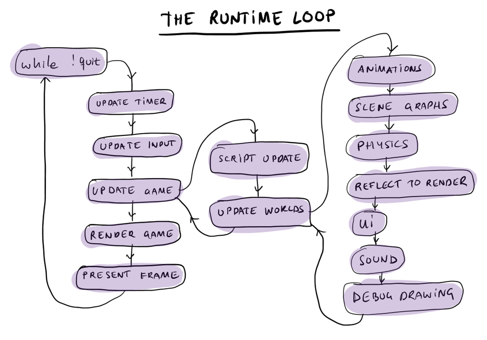

# Extend the engine

The topics in this section provide a brief introduction to writing plug-ins for the runtime Stingray engine. You can write plug-ins to extend the engine by adding new features, adding new objects and functions to the Lua gameplay API, integrating external middleware into the engine, etc.

## Examples

For working examples of plug-ins that demonstrate the material in this section, see the `runtime/plugins` directory.

-	Begin by looking at the `simple_plugin`, which is a very minimal plug-in that adds a new function to the Lua gameplay API.
-	The `bigger_plugin` shows how you can create a new resource type, define how it gets compiled into runtime data, and provide Lua functions for accessing the data in the resource at runtime.
-	The code for the middleware and third-party plug-ins is also provided in this location. These plug-ins are much larger and more complicated than the simple examples, but they also illustrate more functional areas of the runtime plug-in APIs.

## Related source code

Most of the engine code that you will need to understand and interact with in order to write a plug-in is kept in the `runtime/application/plugin/plugin_api.h` file. Refer to this file as well as the sample plug-ins as you go through the topics in this section.

## The update loop

The update loop, also called the *game loop* or the *main loop*, is a key concept in real-time games.

