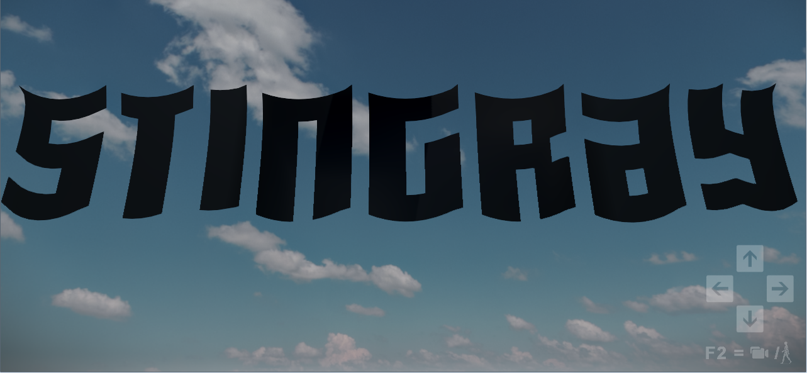
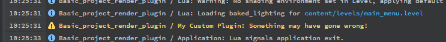

# Useful engine plug-in interfaces

This page gives a quick overview of some of the most commonly used engine APIs that your plug-in can take advantage of.

## Manipulating the Lua environment

One very common thing for plug-ins to do is to add new modules and functions to the engine's Lua environment. When a project's Lua scripts invoke one of these new functions in the Lua environment as the project is running, a corresponding C function in your plug-in gets invoked.

For a very simple example of how this works, see the `simple_plugin/plugin.c` file in the engine plug-in examples. This file defines a new C function, `static int test(struct lua_State *L)`. Then, it retrieves the engine's `LuaApi`, and calls `add_module_function("SimplePlugin", "test", test)` to expose the `test` function from C to Lua. The project's Lua code can then invoke the function by calling it as `stingray.SimplePlugin.test()`.

Note that the C function is passed a `lua_State`. This is a Lua *stack*, which lets your C function access parameters passed by the Lua invocation, and send return values back to Lua. This is the standard way of passing information back and forth between Lua and C -- you can read more about it [in the Lua documentation](https://www.lua.org/pil/24.2.html). The only extra thing to know is that your plug-in accesses the Lua functions for stack manipulation (like `lua_tonumber` and `lua_pushnumber`) through the Stingray `LuaApi` -- for example, `LuaApi::tonumber` and `LuaApi::pushnumber`. The `LuaApi` also extends these standard functions with additional ones that handle types specific to Stingray, like `LuaApi::getunit` and `LuaApi::pushunit`, so that you can pass units, vectors, quaternions and matrices back and forth between your plug-in and the project's Lua code.

## Controlling gameplay

You can use the `ScriptApi` to access a huge set of functions for manipulating the application and the project content. Just like with the Lua scripting API, you can use the `ScriptApi` to load levels, spawn and unspawn units, control the physics simulation, etc. Most of what you can do in Lua, you can do with the `ScriptApi` -- in fact, most of the Lua scripting API invokes the C API behind the scenes, so by calling the functions directly from C, you're just taking a small shortcut.

The `ScriptApi` can be useful for any plug-in that needs to add or modify content in the project as it's running. It's also useful for project authors who want to write their gameplay code in C rather than in Lua, to squeeze out every last bit of runtime performance.

## Handling a custom resource type

Often, a plug-in will need to rely on some kind of special, custom data in order to do its job. If you are able to save this data to files in the project, you can take advantage of the engine's resource management system to compile your data and access it from the engine at runtime.

You'll need to start by retrieving the `DataCompilerApi` from the engine. Use its `add_compiler()` function to add a new compilation function for your resource type. The engine will invoke this function any time it needs to compile a resource of your custom type. Your function is responsible for taking the data from its disk file representation and turning it into the binary representation that your plug-in will use at runtime.

Then, when you need to access your data at runtime in your plug-in, you can use the `ResourceManagerApi` to query for and retrieve resources of your custom type.

For an example that demonstrates this resource management pipeline -- how to compile SJSON data from a file into a binary representation, then access that data at runtime -- see the `bigger_plugin/plugin.cpp` file in the engine plug-in examples.

## Building and rendering procedural meshes

Your plug-in can use the `MeshObjectApi` and the `RenderApi` together to build new meshes at runtime, and to render them in the scene. The new objects are shaded with dynamic lighting, exactly as if you had placed the objects into the scene in the Stingray editor.

For a working example that shows how a plug-in can create and render meshes on the fly, see the `render_plugin/plugin.cpp` file in the engine plug-in examples. This plug-in programmatically creates a mesh shaped like the word Stingray, and deforms the mesh each frame to simulate a cloth effect:



To get this example working in your own project, first compile and install the *.dll*. Then, from your project's Lua script, call the `stingray.RenderPlugin.create_logo()` function that the plug-in adds to the Lua environment. You have to pass this function three parameters:

-	a unit that will act as the parent of the new mesh,
-	the scene graph index that the new mesh should use within that unit (you can just use `1`),
-	the material the mesh should use. The generated mesh doesn't have a normals channel, so a standard material won't work -- you can use `core/stingray_renderer/shader_import/no_uvs`. Or, you could edit a standard material and remove the nodes that produce the normal data for the output node.

## Logging messages to the engine

It's often a good idea for your plug-in to send back some feedback to the user, especially when things go wrong. The engine already has a mechanism for logging messages, which a user working in the Stingray editor can see in the **Log Console**. Your plug-in can have the engine re-use the same mechanism for its own messages.

You'll need to retrieve the `LoggingApi` from the engine, and call its `error()`, `info()` or `warning()` methods. When you call these methods, you need to provide a `system` parameter -- the name of your plug-in, as you want it to appear to the user in the log message. For example:

```
_logging_api->warning("My Custom Plugin", "Something may have gone wrong!");
```



## The plug-in foundation

Not everything your plug-in does will be glamorous and original. To be able to make the good stuff happen, you'll also have to do some less exciting plumbing work -- like vector and quaternion math, managing strings and arrays and memory allocations, etc.

To help simplify this work, and to standardize the way these things are handled across plug-ins, the Stingray SDK comes with a *plug-in foundation*. This foundation is a set of interfaces that you can  use in your plug-in to handle these kinds of common tasks. The foundation is totally optional; you are free to use as much or as little of it as you like.

It's particularly helpful in conjunction with the `ScriptApi`, as most of its types can be cast back and forth with the types used by `ScriptApi` functions. For example, if you get a `CApiQuaternion` returned to you by the `ScriptApi`, you can cast it to a `stingray_plugin_foundation::Quaternion` and use foundation functions like `stingray_plugin_foundation::lerp()` or  `stingray_plugin_foundation::normalize()` to transform it.

To see what the foundation offers, take a look at the header files that you'll find in the `plugin_foundation` folder of the SDK. If you decide to use any of the components in the foundation, you just have to include the header files that define those components into your plug-in.

All of the implementations are inline, so that you can see exactly what the functions do. If you ever need to alter an implementation for your plug-in, you should be able to copy the files to your own project and modify your copies.
