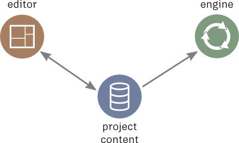
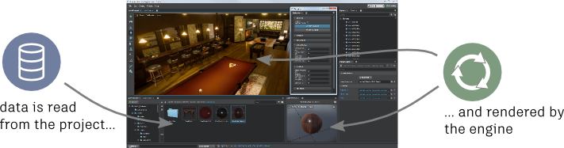
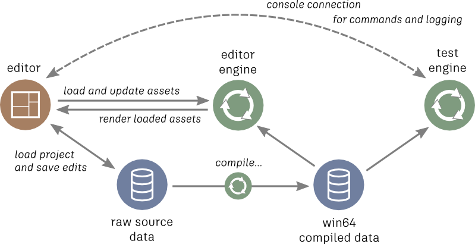

# System Overview

Before you start thinking about how you want to extend Stingray, it's helpful to get a good understanding of how the overall Stingray ecosystem is set up.

You can think of Stingray as three main components working together: the **project**, the **engine**, and the **editor**.

-	The **project** is a collection of different kinds of assets -- 3D objects, materials and textures, levels, Lua scripts, Flow graphs, and other content. Typically, when you're working with Stingray as a user, most of your time is spent bringing assets in to the project, creating new assets, and setting up the way the player interacts with or experiences the scenes you create.

-	The **engine** is essentially a viewer or playback app for the project content. There's a different version of this app for each different platform Stingray supports. Its job is to load up the assets that make up the project, and to run through [the main update loop](extend_engine.md) over and over again: accepting user input, processing events, and rendering the scene.

-	The **editor** is a Windows-only authoring tool that helps you create and set up your project content so that it looks and behaves the way you want it to when you run the project in the engine.

You can create Stingray *plug-ins* that extend each of these three main components. For a complete discussion, see ~{ All the ways you can extend Stingray }~.

## Under the hood

The picture of the three components above is conceptually true when it comes to the general roles of the three components, but in fact the interactions between the editor, project content and engine are much more intricate:

-	The editor runs its own instance of the Windows engine. It loads your project content into this engine as you're working on it, and uses the engine to render your levels and other assets in integrated viewports so you can preview your scenes.

	

-	The project content that you work with in the editor, which you see listed in the **Asset Browser**, isn't exactly the same as the files that the editor's internal engine loads and renders. You author content in raw formats -- FBX files, image formats like .png or .dds files, and often plain-text SJSON files -- but the engine needs these raw assets to be compiled into an optimized binary data format that is different for each supported platform. You can read more about it [in this topic about the asset pipeline](http://help.autodesk.com/view/Stingray/ENU/?guid=__stingray_help_managing_content_content_lifecycle_html).

-	The data compilation step is actually carried out by the engine. The editor triggers this compilation automatically for Windows binaries each time you save changes to an asset. For other platforms, the editor asks the engine to compile the data when you run your project on that platform, mirror the editor a remote device, or deploy your project for that platform.

-	The editor can't always wait for the changes you make to an asset to get saved to disk, compiled to the Windows-specific binary format, and then reloaded into its internal engine. Although that round-trip process does happen behind the scenes when you save changes, you often need instant feedback in the editor while you're making changes like moving objects or adjusting sliders. In order to provide fast feedback about what you're doing in the editor viewports, the engine running inside the editor doesn't load your levels in exactly the same way as it does when you run your game.

	Instead, the editor uses a framework of pre-written Lua scripts to control the way your level's assets get loaded into the engine, and the way you work with those assets in the editing viewports. You can find all these scripts under the `core/editor_slave` folder. If you need your plug-in to integrate with the editor's viewports -- for example, to provide immediate feedback about unsaved edits -- you may occasionally need to integrate with this script environment.

A slightly fuller picture might look like this:

However, this picture covers the project authoring and testing workflow for Windows only -- it still omits other things testing and mirroring to other platforms, and deploying final bundles of the game.

## Multiple editors

In addition, one last point worth making is that Stingray editing tools are not really a single monolithic entity as shown above. Although we hope that the main Stingray editor will be open extensible enough to support plugging in any kind of content authoring workflow or tools, the fact is that anything capable of producing content understood by the engine can be "an editor" by saving that content into the raw source folder.

For example, you can use other editing tools that are provided with Stingray as separate applications, like the Unit Editor or Texture Manager. You can use your favorite text editor for authoring Lua scripts and for editing raw SJSON content like levels and units. If your plug-in adds runtime support for some new kind of data format, you could use your own separate tools to create and manage that data in the project source folder.

You just have to make sure that whatever assets you add or modify end up being compiled for your target platform by a Stingray tool (usually the main Stingray editor, Unit Editor, etc.), or by calling the engine yourself on the command line with the right flags. See the [engine command-line reference](http://help.autodesk.com/view/Stingray/ENU/?guid=__stingray_help_reference_engine_command_line_html).

But in the context of this SDK guide, when we talk about extending "the editor", we mean writing plug-ins that run inside the main Stingray editor.
