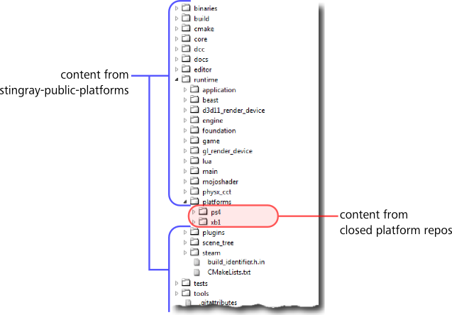

# Merging closed platform source with the public platform source

If you have access to one or more "closed" platform repositories, you will need to combine their content with the content of the `stingray-public-platforms` repository.

The goal is to end up with your closed platform code merged inside the `runtime\platforms` folder of the stingray public platforms repository. For example:

There are several ways you can achieve this. We recommend the following workflow:

1.	Make sure that the head revision of each of your forks is in sync with the others. That is, make sure that you last collected changes from the upstream Autodesk repositories at the same time for all your forks. If your closed platform forks are not in sync with the public platform fork, you may end up with incompatibilities in the source code.

1.	Create a new integration branch in your `stingray-public-platforms` fork.

2.	Clone a local copy of that integration branch.

3.	Add a new remote to your local branch for each of the closed platform repositories that you have access to. This makes it possible to collect content from those repositories and pull it into the same local branch.

	For more, see the [GitHub help](https://help.github.com/articles/adding-a-remote/) on adding remotes.

4.	Merge changes from each of the new remotes into your local integration branch.

	Make sure that you merge from the branch of the closed platform that matches the branch you used to create your integration branch. For example, if you created your integration branch from the `develop` branch of `stingray-public-platforms`, merge in changes from the `develop` branch of each closed platform repository.

5.	If you have configured the collaboration permissions of your `stingray-public-platforms` fork so that it is accessible only to you, you can commit your changes and push them to your integration branch.

	Please do not push up the closed platform content while your `stingray-public-platforms` fork is accessible to other users outside of your organization and Autodesk. This may result in unregistered developers getting access to protected source code through your fork.

Whatever approach you use to get the closed platform source merged into the public platforms repo, you must update your library dependencies after you get the closed platform source. See ~{ Library dependencies }~.

## Updating your integration branch

When you update your forks to a new revision (see ~{ Updating to the latest changes from Autodesk }~), you can update your integration branch by repeating the process of merging in the latest revision from each of the remote forks.
