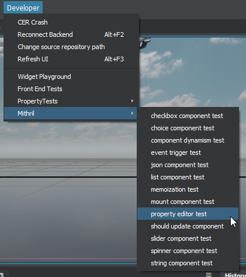
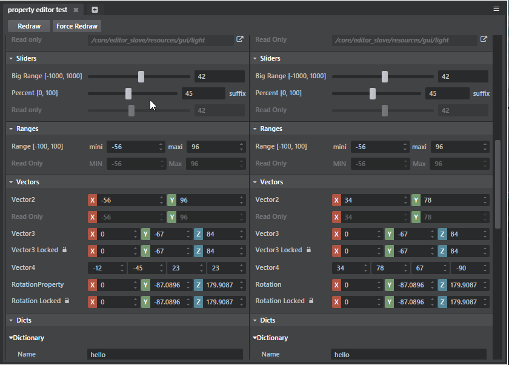
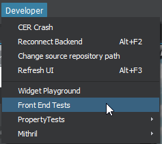
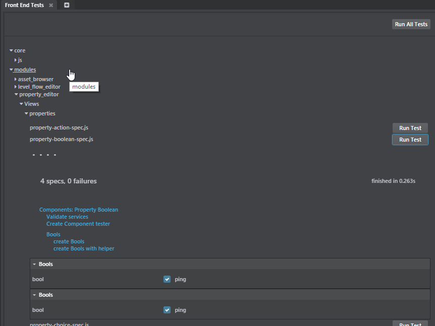

# Property Editor Widget How To

This document explains everything you have to know about the new Property Editor Widget!

The property editor is now a standalone Mithril widget that can be either used in a Mithril Template or in an angular template (using the component-harness).

There are two ways to use a Property editor widget:

- Create a PropertyEditor Mithril component and pass it a structure of Pure Json Property Descriptor. This is a workflow similar to how we build the Property editor using the PropertyDescriptors coming from the backend. This is a really cumbersome way of working though!
- I have introduce a new compact notation to use a property editor from Javascript that is really lighweight and easier to use. This should be the preferred way of working!


## How to embed a property editor widget in a view

In the Mithril Developer menus, you can find a Property Test dialog that shows how to instantiate and configure any kind of properties.

The menu to pop this dialog is here (only available if the backend is compiled in debug):



The Property editor test looks like this:



The left side shows a property editor created using only json descriptor similar to how a Property Editor is built from the PropertyDescriptors coming from the backend.

The rigft side shows a Property Editor buolt using the "compact notation" which is way easier to manipulate than the Json Descriptors.

####Property Editor Compact notation

Here is the quickest way to add a Property Editor in an angular vie using the compact notation (see editor\backend\modules\widget_playground\Views\mithril\property-editor-test.html):

```html

<!-- Important to include the styling for the property editor -->
<link rel="stylesheet" href="../../../property_editor/Views/css/property-editor.css"/>
<link rel="stylesheet" href="../../../../core/css/widgets/property-view.css"/>

<!-- in teh enclosing div containing the property editor, be sure to add the module-property-editor class -->
<div class="module-property-editor spinner-component-test stingray-panel fullscreen" ng controller="propertyController">
		<!-- Use the componentn harness tp embed a mithril component inside angular -->
       	<component-harness args="propArgs" component="PropertyEditor"></component-harness>
    </div>
</div>
```

Here is the compact notation used to build the whole Property Editor (code taken from: editor\backend\modules\widget_playground\Views\mithril\property-editor-test.js)


```javascript
$scope.helperArgs = props.editor(editorContext, [
            props.category('Bools', {}, [
                props.bool("bool", propertyModel('bool'), {suffixLabel: "ping"})
            ]),

            props.category('Strings', {}, [
                props.string("string", propertyModel('string'), {
                    suffixLabel: "pong"
                }),
                props.string("multistring", propertyModel('multistring'), {
                    isMultiline: true,
                    lineRows: 4,
                    liveUpdate: true
                })
            ]),

            props.category('Choices', {}, [
                props.choice("choice", propertyModel('choice'), choiceOptions, {})
            ]),

            props.category('Numbers', {}, [
                props.number("No Limit", propertyModel('number'), {increment: 1}),
                props.number("Percent [0,1]", propertyModel('percent'), {min: 0, max: 1, increment: 0.1}),
                props.number("Read Only", propertyModel('number'), {isReadOnly: true})
            ]),

            props.category('Paths', {}, [
                props.file("File", propertyModel('file'), "Pick an exec", "*.exe", {isRightToLeft: true}),
                props.directory("Folder", propertyModel('folder'), "Pick a folder", {suffixLabel: "suffix"}),
                props.path("Read Only", propertyModel('folder'), "File", "Pick an exec", "*.exe", {isReadOnly: true})
            ]),

            props.category('Resources', {}, [
                props.resource("Material", propertyModel('material'), "material", {isRightToLeft: true}),
                props.element("Element", propertyModel('wwise_event'), "wwise_event", {isClearableEnabled: false, suffixLabel: "suffix"}),
                props.resource("Read Only", propertyModel('material'), "material", {isReadOnly: true, isClearableEnabled: false})
            ]),

            props.category('Sliders', {}, [
                props.slider("Big Range [-1000, 1000]", propertyModel('slider'), -1000, 1000, 1, {}),
                props.slider("Percent [0, 100]", propertyModel('sliderPercent'), 0, 100, 0.5, {suffixLabel: "suffix"}),
                props.slider("Read Only", propertyModel('slider'), -1000, 1000, 1, {isReadOnly: true})
            ]),

            props.category('Ranges', {}, [
                props.range("Range [-100, 100]", "mini", propertyModel('rangeMin'), 'maxi', propertyModel('rangeMax'), {min: -100, max: 100, increment: 0.5}),
                props.range("Read Only", "MIN", propertyModel('rangeMin'), 'Max', propertyModel('rangeMax'), {min: -100, max: 100, increment: 0.5, isReadOnly: true})
            ]),

            props.category('Vectors', {}, [
                props.vector2("Vector2", propertyModel('vector2', [34, 78]), {min: -100, max: 100, increment: 0.5}),
                props.vector2("Read Only", propertyModel('vector2'), {min: -100, max: 100, increment: 0.5, isReadOnly: true}),

                props.vector3("Vector3", {x: propertyModel('vector3X'),
                                          y: propertyModel('vector3Y'),
                                          z: propertyModel('vector3Z'),
                                            min: -100, max: 100, increment: 0.5}),

                props.vector3("Vector3 Locked", {x: propertyModel('vector3X'),
                    y: propertyModel('vector3Y'),
                    z: propertyModel('vector3Z'),
                    min: -100, max: 100, increment: 0.5,
                    supportsLock: true}),

                props.vector4("Vector4", propertyModel('vector4', [34, 78, 67, -90]), {min: -100, max: 100, increment: 0.5, showAxisLabels: false}),

                props.rotation("Rotation", {x: propertyModel('rotationX'),
                    y: propertyModel('rotationY'),
                    z: propertyModel('rotationZ'),
                    increment: 0.5}),

                props.rotation("Rotation Locked", {x: propertyModel('rotationX'),
                    y: propertyModel('rotationY'),
                    z: propertyModel('rotationZ'),
                    increment: 0.5,
                    supportsLock: true
                })
            ]),

            props.category('Dicts', {}, [
                props.dictionary("Dictionary", {
                    Name: props.string('Name', propertyModel('d.Name')),
                    D1: props.dictionary("D1", {
                        number: props.number('number', propertyModel('d.D1.number')),
                        string: props.string('string', propertyModel('d.D1.string'))
                    }),
                    D2: props.dictionary("D2", {
                        number: props.bool('boolean', propertyModel('d.D2.boolean')),
                        string: props.number('number', propertyModel('d.D2.number'))
                    })
                })
            ]),

            props.category('Json', {}, [
                props.json("json", jsonValue)
            ]),

            props.category('Actions', {}, [
                props.action("Action", function () {
                    console.log('Action is triggered!');
                }, {iconName: "fa-star-o"}),

                props.action("Read Only", function () {
                    console.log('Action is triggered!');
                }, {isReadOnly: true, iconName: "fa-star-o"})
            ]),

            props.category('Colors', {}, [
                props.color("Color", propertyModel('color')),
                props.color("Read Only", propertyModel('color'), {isReadOnly: true}),

                props.hdrColor("Hdr", propertyModel('hdrcolor'), propertyModel('intensityHdrcolor')),
                props.hdrColor("Hdr ReadOnly", propertyModel('hdrcolor'), propertyModel('intensityHdrcolor'), {isReadOnly: true})
            ]),

            props.category('Tables', {}, [
                props.table("Table", [
                    {
                        label: "Name",
                        description: "this is the name"
                    },
                    {
                        label: "Position",
                        description: "this is my position"
                    }
                ],
                [
                    createNewRowWithHelper(0, "pow", [56, 89]),
                    createNewRowWithHelper(1, "ping", [64, -2])
                ], {
                    createNewRow: createNewRowWithHelper
                })
            ]),

            props.category('Gradients', {}, [
                props.gradient("Gradient", [
                    createNewGradientElement(0.25, [0.2, 0.5, 0.7]),
                    createNewGradientElement(0.75, [0.5, 0.6, 1])
                ],
                {
                    createNewElement: createNewGradientElement
                })
            ])
        ]);
```

The takeaway of the compact notation:

- The "props" namespace (created from including property-editor-utils.js) contains a lot of utilities to quickly build a property editor.
- Each property types has a specific helper (props.vector2, props.color) to allow easy creation of a property (see the property types for info on each helper).
- Most helpers have the following structure:
	- `props.<property helper>(<Property Name>, <PropertyModel>, <other attributes>)`
- the Signature for a PropertyModel used in the property Editor is `function (propertyDescriptor, newValue)`
	- propertyDescriptor is the JsonProperty descritor for the property triggeing the model. It allows access to the path of that property.
	- Effectively if the Property Model is called with *only* a ProperyDescriptor it it used as a getter, if it is called with 2 arguments (newValue) it is used as a setter.

See the section on Test suites for an example of a PropertyEditor created with only Json Descriptors (NOT compact notation).

## Property Test suites

Each property types has its own test suites (only available if the backend is built in debug):

Front end test menus (for those who don't know!):



What the property tests looks like:



These are "rendering tests only". It means we do not test the behavior of the property widget (for now). But these tests can find lots of problems if we rename properties parameters.

#### How to add a new test

All the property types test suites are located here : editor\backend\modules\property_editor\Views\properties\tests.

All the test suites have the same structure:

```javascript
/* global it, describe, expect, beforeEach, beforeAll, jasmine, xdescribe, xit */
describe('Components: Property Boolean', [
    'common/test-utils',
    './test-helpers.js',
    '../mithril-property-ext.js', '../property-editor-utils.js', '../property-editor-component.js',
    'services/marshalling-service',
    'services/host-service',
    'services/project-service',
    'services/element-service',
    'services/asset-service'
], function(testUtils, utils, m, props, PropertyEditor) {
    "use strict";

    var config = {
        services: {
            marshallingService: null,
            hostService: null,
            elementService: null,
            projectService: null,
            assetService: null,
            fileSystemService: null
        }
    };

    // Use the test helper mecanism to fetch out the services.
    testUtils.initializeSpec(config);

    var editorContext;
    var componentTester;
    it('Validate services', function () {

        // Create the editorContext and validate that everything is sound.
        editorContext = props.makeEditorContext(config.services);

        expect(config.services.marshallingService).toBeDefined();
        expect(config.services.hostService).toBeDefined();
        expect(config.services.elementService).toBeDefined();
        expect(config.services.projectService).toBeDefined();
        expect(config.services.assetService).toBeDefined();
        expect(config.services.fileSystemService).toBeDefined();
    });

    it('Create Component tester', function () {

        // Create a "Mithril Component tester". This allows us to host multiple Mithril component
        // on the same mount point and validate them.
        componentTester = utils.createComponentsTester();
    });

    var categoryType = 'Bools';

    describe(categoryType, function () {
        // Test showing that the pure Json Descriptors are working:

        var component;
        var model = m.property.modelIgnoringPropDesc(m.prop(true));
        it('create ' + categoryType, function (done) {
            var args = {
                editorContext: editorContext,
                categories: [
                    {
                        label: categoryType,
                        properties: [
                            {
                                label: "bool",
                                displayType: 'Boolean',
                                isReadOnly: false,
                                suffixLabel: "ping",
                                showValue: true,
                                model: model
                            }
                        ]
                    }
                ]
            };

            // This creates a new PropertyEditor with args and add it to the componentTester.
            componentTester.testComponent(PropertyEditor, args, function (c) {
                // This callbacks triggers when the Property editor is actually hosted in the DOM.
                component = c;
                done();
            });
        });

        it('create ' + categoryType + ' with helper', function (done) {
            // Test for the property compact notation:
            var args = props.editor(editorContext, [
                props.category(categoryType, {}, [
                    props.bool("bool", model, {suffixLabel: "ping"})
                ])
            ]);

            componentTester.testComponent(PropertyEditor, args, function (c) {
                component = c;
                done();
            });
        });
    });
});
```

## How to define a compact helper for a property type

Look at all the property types defined in: editor\backend\modules\property_editor\Views\properties\property-boolean.js and look for the propertyEditorUtils.registerPropertyHelper call.

`propertyEditorUtils.registerPropertyHelper(<helper name>, <helper constructor>)`

Some example on how to register compact helper:

```javascript
propertyEditorUtils.registerPropertyHelper('bool', function (label, model, userArgs) {
	// DisplayType is always manadatoty
    // label is the property name that will be displayeddisplayed
    // model: a PropertyModel use to get/set the property value.
    // useragrs are merged with the resulting property descriptor.
    // useragrs can contains all kind of stuff (placholder, disabled, readonly... see above for more example)

    return propertyEditorUtils.property(label, {displayType: 'Boolean', model: model}, userArgs);
});
```

Another example:
```javascript

// Slider always use boundaries so it makes sense to force the user to specify a min/max/increment in the compact helper.
propertyEditorUtils.registerPropertyHelper('slider', function (label, model, min, max, increment, userArgs) {
    return propertyEditorUtils.property(label, {displayType: 'Slider', model: model,
    		min: min, max: max, increment: increment}, userArgs);
});
```

Another example
```javascript
// Property path can be used for file and directory. The Json Property Notation supports both types.
// For convenience we provide 2 compact helpers:

propertyEditorUtils.registerPropertyHelper('file', function (label, model, title, filter, userArgs) {
    return propertyEditorUtils.property(label, {
        displayType: 'PathProperty', model: model,
        browseType: "File",
        browseTitle: title,
        browseFilter: filter
    }, userArgs);
});

propertyEditorUtils.registerPropertyHelper('directory', function (label, model, title, userArgs) {
    return propertyEditorUtils.property(label, {
        displayType: 'PathProperty', model: model,
        browseType: "Folder",
        browseTitle: title
    }, userArgs);
});
```

Some things to think about when creating new property types:
- Ensure all the parameters used to create a Property are lowercase.
- Ensure to register a new compact helper
- Use the m.property.model to properly wrap a model pass to the property component.
