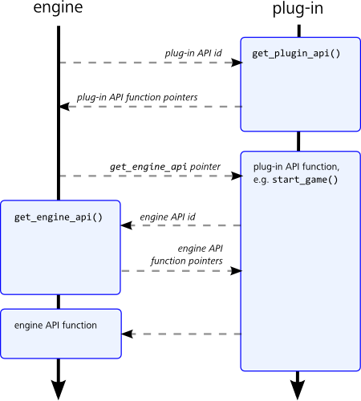

# Plug-in interface design

The Stingray plugin interface has been designed to be as minimalistic and decoupled as possible from the engine code. It minimizes the contact surface between the engine runtime and the plugin. This means that plug-ins can continue to work even if the engine internals change. In particular, plug-ins don't have access to the engine's utility classes (e.g. maps, vectors, file systems, etc.) because in the future we may want to redesign those classes. If you need that functionality, you need to implement it yourself in the plugin code. You can see how this is done in some of the sample plug-ins.

It is based around a simple set of interactions between the engine and the plug-ins, using a shared set of API definitions. Essentially, each side queries the other to retrieve the APIs the other side supports:

-	The engine first queries the plug-in for its API by calling a predetermined `get_plugin_api` function. The plug-in provides the engine with a struct that contains pointers to all functions that it implements from their shared plug-in API definition.
-	When the engine calls those functions from the plug-in, it passes along a `get_engine_api` function pointer of its own. The plug-in can call that function to query the engine in return, in order to retrieve specific APIs supported by the engine. The plug-in can then call functions in those returned APIs in order to make the engine perform the tasks.

The following image summarizes this workflow:

## API IDs

Each API ID exchanged by the engine and the plug-in always corresponds to a particular struct, whose definition must be agreed on by both sides. The API IDs and their corresponding structs are defined in the `plug-in_api.h` file. This file must be included by both the engine and the plug-in in order to make sure that the identifiers and API definitions match.

> **Note:**
> Currently, the plug-in APIs are in development. This means that (for now) we reserve the right to change the structs without changing the IDs. If that happens, your plug-ins will need to be recompiled in order to work with newer version of the engine. Once we reach a version 1.0 of the plug-in architecture, we will lock down the interface. Old plug-ins will then continue to work with new versions of the engine without needing to be recompiled.
