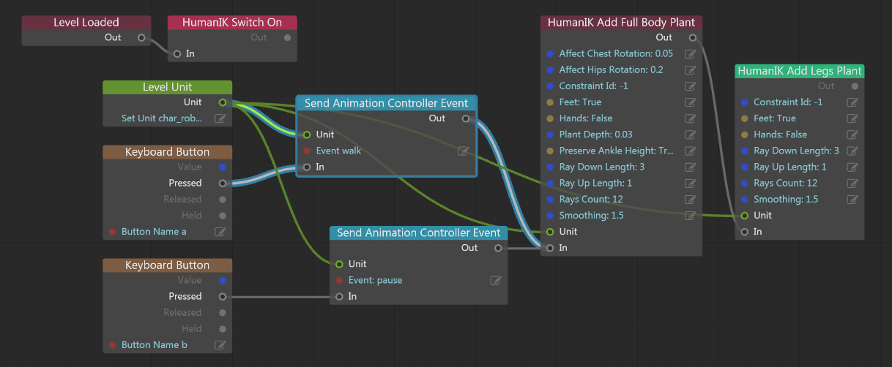

#Set up floor contact using HumanIK

HumanIK tools implemented in Stingray let you quickly set up foot pinning on your game characters, ensuring that the feet do not slip through the ground even on dynamic terrain. With HumanIK floor contact, the feet angle and position themselves dynamically, and the rest of the body reacts naturally to the foot position, maintaining a realistic range of motion.

This topic explains how to set up floor contact using the HumanIK plug-in. Floor contact lets you adapt locomotion clips (or entire animation controllers) live, so that they take into account the terrain topology.

For example, an animation clip recorded on a flat ground can be warped to play back properly on a slope, on bumpy terrain, or on stairs.

(Note that this topic does not cover all information required for setting up the entire HumanIK character, including movers/physics.)

##Step 1. Import a characterized character

1.	In Maya or MotionBuilder, characterize your character model using the **Character Controls**.

	> **Note:** It's important to make sure the characterization includes feet markers if you plan to set up floor contact. The feet markers will ensure precise feet contact in the game engine by taking into account the thickness of the mesh around the feet joints; markers should also be included for the hands if you plan to enable floor contact on hands (when the character is crouching for instance).

2.	In Stingray, create a new level. See ~{ Create or load a level }~.

3.	~{ Import a character mesh }~.

	Import the characterized character, and during the import process make sure to select **New or update skeleton** for **Skeleton** and enter a name to create a new skeleton.

	Don’t place the character unit in your level yet.

	> **Tip:** You can confirm the model is properly characterized by checking the 'content/units folder of your project. When you import a characterized character, Stingray creates a .character file ("CharacterName.character").

##Step 2. Import animation and retarget animation from the clip onto the character

1.	~{ Import animation clips }~.

	Import an FBX file containing your character animation clip. In the Import FBX options, turn off other options except for Animations and select the target skeleton created earlier for the character.

	Most Autodesk content creation software (3ds Max, Maya, Maya LT, MotionBuilder) comes with some generic motion capture clips, or you can also download clips from Creative Market. These clips usually already contain characterized skeletons, including foot markers.

2.	~{ Set up an animation controller }~ for the motion capture clip.

3.	Drag the animation clips from the **Asset Browser** to the Animation controller. The controller will create the necessary states for these clips.

4. Add events to control the animation clip states during runtime.

	Your character starts to animate in the ~{ Asset Preview }~.

##Step 3. Set up your level

1. Load the created new level. (~{ Create or load a level }~.)

2.	Place the character asset in the level.
	(Drag & drop from the **Asset Browser**.)

##Step 4. Create a bumpy floor for testing

1.	Populate your scene with geometry representing the floor (scaled cubes for instance).

2.	Set the floor objects (cubes) to act as collision objects:

	- Double-click a cube to open the ~{ Unit Editor }~.

	- Right-click the cube object in the hierarchy view panel and select **Create Physics Actor**.

	- In the **Properties** panel, under **Physics**, set **Actor Template** to **Keyframed**.

##Step 5. Enable HumanIK  and create floor contact constraints using Flow

1. Enable HumanIK (disabled by default).

	You can control HumanIK using HumanIK flow nodes. Both level flow graphs and unit flow graphs are supported.

	You can enable HumanIK in the level flow graph, when the **Event > Level Loaded** event gets triggered. up

2. Equip your character with all constraints it might use during its lifetime - in this case, the floor contact related constraints (the Full Body Plant and the Legs Plant constraints).

	This part is usually done in the unit flow graph, when the **Unit > Unit Spawned** event gets triggered.

	> Alternatively, you can enable and set up HumanIK through LUA.

	Set up these flow nodes and test your level:

	-	Add **Event > Level Loaded** node connected to **HumanIK > Setup and Debug > HumanIK Switch On** node. This enables Human IK.
	-	Add **Data > Level Unit** to select the character unit.
	-	Connect the character unit to **HumanIK > Character Add Constraints > HumanIK Add Full Body Plant**. The character now adapts its hips and ankles to respond to the floor topology and the shape of the terrain.
	-	Add a **HumanIK > Character Add Constraints > HumanIK Add Legs Plant** and connect it with the character and the full body plant to make the floor contact even more precise (the Legs Plant constraint only affects the characters legs (the hips won’t move), taking into consideration the feet markers included in your characterization).
	-	Add Input controller node and set **Animation > Send Animation Controller Event** to trigger the motion clips for the character using the input controller while level testing.

		

	> **Tip:** At any point, you can smoothly enable/disable the floor contact constraints by setting their “Blend Alpha” values to 1/0. This can be done using the **HumanIK > Character Tune Constraints > HumanIK Set Blend Alpha** flow node. Disabling the constraint and re-enabling it might be useful when dealing with jumps, for instance.

##Next: Fine tuning IK constraints

Add HumanIK flow nodes to test and tune IK constraints and retarget your characters and set a look at constraints.

See ~{ Example: HumanIK through Flow }~.
