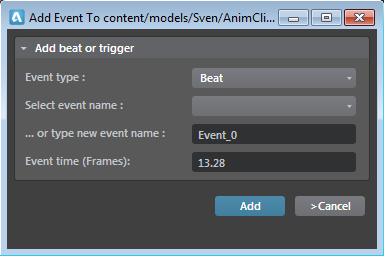

# Add beats and flow events to animation clips

Beats are used to synchronize transitions between animations.

Suppose that a character has a running animation and a jump animation that starts with the right leg extended forward and proceeds into a long jump.

If we transition between the two animations with a simple crossfade blend we can get very strange results, depending on where the character is in the running animation (for example, if the running animation has the left foot forward and we blend that to an animation with the right foot forward).

Using beats, you can create a beat called left when the left foot is forward and right when the right foot is forward. Then you can specify that the transition should wait for a synchronized beat before transitioning. This means that when the transition is taken, the running animation continues to play until it hits the right beat, which is matched by a corresponding right beat in the jump animation. Only then, when the animations are synchronized, are they blended.

## To add new beats or flow events:

1. Open the ~{ Anim Clip Editor }~.

2. Right-click on the timeline, and select **Add Beat > New Beat** or **Add Flow Event > New Flow Event**.

3. In the options that appear, set the following:

(All events that you add – you right-click to create the event type/marker type.)

## To add existing beats or flow events:

1. In the ~{ Anim Clip Editor }~ timeline, right-click on the frame where you want to add the beat or the flow event, click **Add Beat > Existing** or  **Add Flow Event > Existing** and select one of the existing beat or flow events.

  The beat or the flow event is set to the timeline and upon selection, you can view its properties in the **Property Editor**.

## To modify the beats or flow events on the timeline:

1. Click the beat or the flow event on the **Anim Clip** editor timeline.

2. In the **Property Editor**, select a different flow event in the **Name** field or set a new time.

## Example: Use beats to 'edit' the length of an animation clip

You can use beats to effectively trim an animation loop to only a certain section of the clip.

To do this, you essentially exit early from a state by placing a beat and using the Sync_Beat_Wait_Until_Beat transition mode. You'll need to also add the same beat on the next animation you are transitioning to.

You can also add an anim event in the state (in the **Animation Controller** Editor) and transition on this event.
