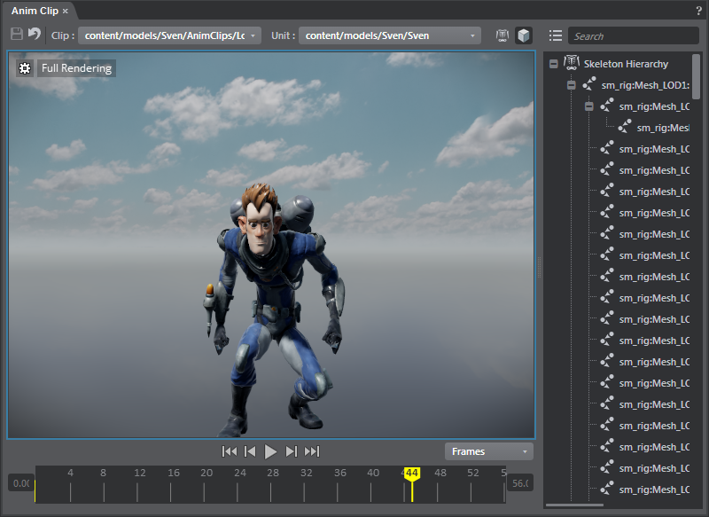

# Anim Clip Editor

- **Window > Animation > Anim Clip**

This editor lets you modify animation clips.

Double-click a clip in the **Asset Browser** to load it in the editor.

<dl>

<dt>Event type</dt>

<dd>Set to beat, or flow event.</dd>

<dt>Event name<dt>

<dd>Enter a name for this event.</dd>

<dt>Event time (Frames or Seconds)</dt>

<dd>Enter an exact frame value (or time in seconds depending on the toggle option) where you want the beat or flow event to occur. (By default the value is set to the frame where you right-click.)</dd>

</dl>
---
Related topics:
- ~{Add beats and flow events to animation clips}~
---
