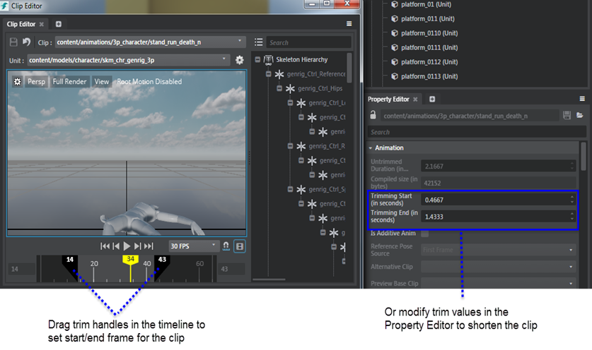

# Trim animation clips

You can trim animation clips in the ~{ Animation Clip Editor }~ to edit the length of the animation frames.

To trim an animation,

1. Do either of the following:

    + On the animation **Clip Editor** timeline, drag the trim handles to set new start/end frame for the clip.
    + Modify the **Trimming Start** and **Trimming End** values in the **Property Editor**.

      

2. Save the animation clip.
3. The **Asset Preview** now plays the trimmed clip. The animation **Clip Editor** still contains the full length of the animation, and you can restore the clip or retrim as desired.

---
Related topics:
- ~{Animation clip properties}~
- ~{Import animation clips}~
---
